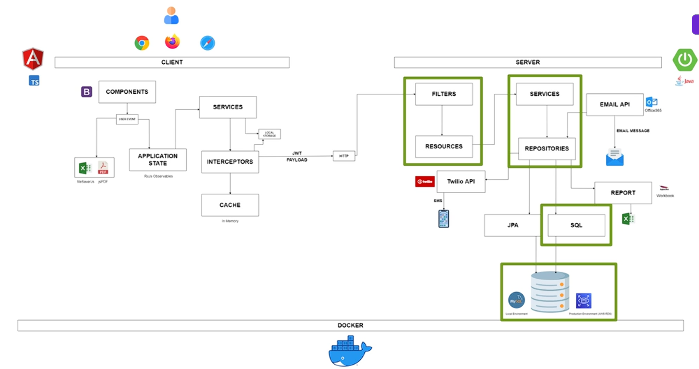

# Angular Spring Boot Full Stack Application

A full-stack application combining **Angular 21** (frontend) and **Spring Boot 4** (backend) with JWT authentication, refresh tokens, two-factor authentication, role-based access control, customer management, and invoicing.

---



*High-level architecture: Angular client · Spring Boot server · MySQL, containerized with Docker. Full breakdown in [documentation/architecture.md](documentation/architecture.md).*

## Tech Stack

| Layer | Technology |
|---|---|
| Frontend | Angular 21, Bootstrap 5, ngx-toastr |
| Backend | Spring Boot 4, Spring Security 7, Hibernate 7 |
| Database | MySQL 8.4 |
| Auth | JWT (access + refresh tokens), 2FA via SMS (Twilio — stubbed in dev, code logged) |
| Runtime | Java 21, Node 22 |
| Container | Docker (multi-stage build) |

---

## Documentation

In-depth guides live in [`documentation/`](documentation/):

| Guide | What it covers |
|-------|----------------|
| [Getting Started](documentation/getting-started.md) | Fast path: setup → running → first login |
| [Architecture](documentation/architecture.md) | Tiers, layers, request lifecycle, frontend |
| [API Reference](documentation/api-reference.md) | Every REST endpoint, grouped by controller |
| [Security](documentation/security.md) | JWT, refresh rotation, MFA, federation, RBAC |
| [Database](documentation/database.md) | Schema, tables, relationships, reference data |
| [Configuration](documentation/configuration.md) | Env vars, profiles, `application.yml` |
| [Deployment](documentation/deployment.md) | Docker, Compose, Azure CI/CD, cloud |
| [Developer Guide](documentation/developer-guide.md) | End-to-end deep dive + how to extend |

## Prerequisites

| Tool | Version | Required for |
|---|---|---|
| Java | 21+ | Running the backend |
| Maven | 3.8+ | Building the backend |
| Node.js | 22 LTS | Running the frontend |
| Docker | 24+ | MySQL container (local mode) or full stack (docker mode) |
| Git Bash / WSL | any | Running `start.sh` on Windows |

---

## Quick Start

### 1. Clone and configure

```bash
git clone <repo-url>
cd angularSpringBootFullStack
```

Copy the committed template and fill in your values:

```bash
# Git Bash / WSL
cp .env.example .env

# PowerShell
Copy-Item .env.example .env
```

Open `.env` and set at minimum (see the full **Environment Variables Reference** below for every variable):

```dotenv
MYSQL_ROOT_PASSWORD=your-root-password
MYSQL_DATABASE=db2
MYSQL_PASSWORD=your-app-password
JWT_SECRET=<random-base64-string-at-least-32-chars>
MAIL_USERNAME=your-gmail@gmail.com
MAIL_PASSWORD=your-16-char-gmail-app-password
```

Generate a JWT secret (pick one):
```bash
# Git Bash / macOS / Linux
openssl rand -base64 48

# PowerShell
[Convert]::ToBase64String((1..48 | % { Get-Random -Max 256 }))
```

> **Gmail App Password**: Google requires an App Password (not your account password) for SMTP.
> Generate one at <https://myaccount.google.com/apppasswords>. It's 16 lowercase characters.

---

### 2. Run the application

Everything is controlled by a single script at the project root. Open `start.sh` and check the two toggles at the top — `ENV` (`local` | `docker`) and `DB` (`local` | `aiven`) — then run:

```bash
chmod +x start.sh
./start.sh
```

There are two modes. Change `ENV=local` to `ENV=docker` at the top of `start.sh` to switch:

---

#### Mode 1: `local` (recommended for development)

```
ENV=local   ← default
```

- Spring Boot runs natively via Maven (hot-restart via Spring DevTools)
- Angular runs via `ng serve` (instant hot-reload)

In local mode a second toggle, **`DB`** (top of `start.sh`), chooses the database:

| `DB` value | Behaviour | Requires |
|---|---|---|
| `local` (default) | Starts a MySQL **Docker container** and waits for it to be healthy. No local MySQL install needed. | Docker running |
| `aiven` | **Skips the Docker container** and connects local Spring Boot directly to **Aiven cloud MySQL** — handy for developing against real cloud data. | `AIVEN_DB_*` vars set in `.env` (see reference below) |

**Access the app at: `http://localhost:4200`**

What happens when you run `./start.sh`:
1. Loads `.env` into the shell environment
2. **If `DB=local`:** starts the MySQL Docker container and waits for it to be healthy. **If `DB=aiven`:** overrides the datasource to Aiven cloud MySQL and skips Docker entirely
3. Starts Spring Boot (`mvn spring-boot:run`) in background
4. Starts Angular dev server (`ng serve`) in background
5. Press **Ctrl+C** to stop all services cleanly

---

#### Mode 2: `docker` (full Docker Compose)

```
ENV=docker
```

- Builds the multi-stage Docker image (Angular compiled into the Spring Boot JAR)
- Starts MySQL + the application container via Docker Compose
- No hot-reload — use this to test the production build locally

**Access the app at: `http://localhost:8090`** (or `APP_PORT` in `.env`)

```bash
# To rebuild and restart from scratch:
docker compose down -v
./start.sh
```

---

## Environment Variables Reference

All configuration lives in `.env` at the project root. IntelliJ loads it via **Run > Edit Configurations > Spring Boot > Env file**. The `start.sh` script sources it automatically.

| Variable | Description | Default (dev fallback) |
|---|---|---|
| `MYSQL_HOST` | Database hostname | `127.0.0.1` |
| `MYSQL_PORT` | Database port | `3306` |
| `MYSQL_DATABASE` | Schema name | `db2` |
| `MYSQL_USERNAME` | DB user | `root` |
| `MYSQL_PASSWORD` | DB password | *(required)* |
| `MYSQL_ROOT_PASSWORD` | MySQL root password (Docker only) | *(required for Docker)* |
| `JWT_SECRET` | HMAC-SHA signing key (min 32 chars) | *(required)* |
| `CONTAINER_PORT` | Port Spring Boot listens on | `8080` |
| `APP_PORT` | Host port mapped to container (Docker mode) | `8090` |
| `MAIL_USERNAME` | Gmail address for outgoing email | *(required)* |
| `MAIL_PASSWORD` | Gmail App Password | *(required)* |
| `MAIL_HOST` | SMTP host | `smtp.gmail.com` |
| `MAIL_PORT` | SMTP port | `587` |
| `VERIFY_EMAIL_HOST` | Reserved for future use — verification links are currently built from `UI_APP_URL`, not this value | `http://localhost:8080` |
| `UI_APP_URL` | Angular app URL — used for CORS **and** as the base for email verification links | `http://localhost:4200` |
| `SPRING_ACTIVE_PROFILES` | Spring profile (`dev` or `prod`) | `dev` |

> **Never commit `.env`** — it is gitignored. The sanitized **`.env.example`** (placeholders only) is the committed template; `.gitignore` excludes `.env` / `.env.*` but whitelists the example via `!.env.example`. Copy it to `.env` and fill in real values.

#### Local-against-Aiven mode (`DB=aiven`)

These are read **only** when you set `DB=aiven` at the top of `start.sh` (see Mode 1 above). The script uses them to assemble the JDBC URL and point local Spring Boot at Aiven cloud MySQL instead of the Docker container.

| Variable | Description |
|---|---|
| `AIVEN_DB_HOST` | Aiven MySQL hostname |
| `AIVEN_DB_PORT` | Aiven MySQL port |
| `AIVEN_DB_NAME` | Schema name |
| `AIVEN_DB_USERNAME` | Aiven DB user |
| `AIVEN_DB_PASSWORD` | Aiven DB password |

> **SMS 2FA is stubbed:** `TWILIO_FROM_NUMBER`, `TWILIO_ACCOUNT_SID`, and `TWILIO_AUTH_TOKEN` exist in `.env` for the SMS-based 2FA flow, but the actual send is commented out in `NotificationServiceImpl.sendTwoFactorCode` to avoid Twilio charges — when 2FA is enabled the code is just **logged to the server console**, not delivered. (Account-verification and password-reset emails *do* send for real via `JavaMailSender`; those are not 2FA.) Separately, `SPRING_DATASOURCE_URL` / `SPRING_DATASOURCE_USERNAME` / `SPRING_DATASOURCE_PASSWORD` can override the assembled MySQL datasource directly (this is the override path Docker mode and the Aiven path rely on).

---

## Project Structure

```
angularSpringBootFullStack/
├── src/                        # Spring Boot backend
│   └── main/
│       ├── java/               # Controllers, services, repositories, entities
│       └── resources/
│           ├── application.yml         # Shared Spring config
│           ├── application-dev.yml     # Dev profile (local defaults)
│           └── application-prod.yml    # Prod profile (no defaults — all vars required)
├── tesseraapp/            # Angular 21 frontend
│   └── src/app/
│       ├── features/           # auth, home, customers, invoices, profile
│       ├── service/            # HTTP services (UserService, CustomerService)
│       ├── interceptor/        # JWT injection, error handling
│       └── guard/              # Route authentication guards
├── Dockerfile                  # Multi-stage: Node 22 → Maven 21 → JRE 21 Alpine
├── docker-compose.yml          # MySQL + app services
├── start.sh                    # Unified startup script (ENV: local | docker, DB: local | aiven)
├── .env                        # Your local secrets (gitignored; not committed)
└── .env.example                # Sanitized template — copy to .env and fill in values
```

---

## Spring Profiles

| Profile | Activated by | Behaviour |
|---|---|---|
| `dev` | Default (`SPRING_ACTIVE_PROFILES=dev`) | All vars have safe local fallbacks. App starts without a full `.env`. |
| `prod` | `SPRING_ACTIVE_PROFILES=prod` or Docker ENTRYPOINT flag | No fallbacks. Missing env var = startup failure. Used in Docker mode. |

---

## Docker Architecture

The Dockerfile uses a **three-stage multi-stage build**:

1. **`node:22-alpine`** — builds the Angular app (`ng build --configuration production`), outputs to `dist/tesseraapp/browser/`
2. **`maven:3.9-eclipse-temurin-21`** — copies Angular dist into `src/main/resources/static/`, packages Spring Boot JAR with `-Pprod`
3. **`eclipse-temurin:21-jre-alpine`** — runs the JAR as a non-root user, exposes port 8080

In Docker mode the Angular app is served by Spring Boot as static files — no separate frontend server.

---

## Cloud Deployment

The app is structured for cloud deployment:

- All secrets are environment variables — set them via your cloud platform's config (ECS task definitions, Cloud Run env vars, Kubernetes Secrets, etc.)
- The Docker image is self-contained and stateless
- Health check endpoint: `GET /actuator/health`

**Recommended platforms** (in order of setup simplicity):

| Platform | Notes |
|---|---|
| Railway | Simplest — git push, MySQL plugin, env vars in dashboard |
| Render | Similar to Railway, free tier (spins down on inactivity) |
| Fly.io | Docker-native, good free tier, uses your Dockerfile directly |
| Google Cloud Run | Serverless containers, scales to zero, generous free tier |

**Pre-cloud checklist:**
- [ ] Set `useSSL=true` in `SPRING_DATASOURCE_URL` for managed cloud databases
- [ ] Use a managed database (RDS, Cloud SQL, Aiven) instead of the Docker MySQL container
- [ ] Set all required prod env vars via the platform (no `.env` file in cloud)
- [ ] Apply `src/main/resources/schema.sql` to the managed database before first launch (schema is script-managed; the previous Flyway setup was removed)

---

## API Reference

> This is a summary of the most common endpoints. For the **complete, authoritative reference** — including TOTP MFA (`/user/totp/*`), session management (`/user/sessions`), federated login (`/oauth2/*`), and admin user management (`/admin/user/*`) — see **[documentation/api-reference.md](documentation/api-reference.md)**.

### Authentication

| Method | Endpoint | Auth required | Description |
|---|---|---|---|
| POST | `/user/register` | No | Create account |
| POST | `/user/login` | No | Get access + refresh tokens |
| GET | `/user/verify/account/{key}` | No | Activate account via email link |
| GET | `/user/verify/code/{email}/{code}` | No | Complete 2FA login |
| GET | `/user/refresh/token` | Refresh token | Get new access token |
| GET | `/user/resetpassword/{email}` | No | Trigger password reset email |
| GET | `/user/verify/password/{key}` | No | Validate reset link |
| PUT | `/user/new/password` | No | Set new password after reset |

### User Profile

| Method | Endpoint | Description |
|---|---|---|
| GET | `/user/profile` | Get authenticated user profile + audit log |
| GET | `/user/events` | Paginated audit events |
| PATCH | `/user/update` | Update profile fields |
| PATCH | `/user/update/password` | Change password |
| PATCH | `/user/update/settings` | Toggle enabled / locked |
| PATCH | `/user/update/togglemfa` | Toggle 2FA |
| PATCH | `/user/update/image` | Upload profile picture |

### Customers

| Method | Endpoint | Description |
|---|---|---|
| GET | `/customer/list` | Paginated customer list + stats |
| GET | `/customer/stats` | Dashboard totals |
| GET | `/customer/get/{id}` | Single customer |
| GET | `/customer/search` | Search by name |
| POST | `/customer/create` | Create customer |
| PUT | `/customer/update/{id}` | Update customer |
| GET | `/customer/download/report` | Export customers as XLSX |

### Invoices

| Method | Endpoint | Description |
|---|---|---|
| GET | `/customer/invoice/list` | Paginated invoices |
| GET | `/customer/invoice/get/{id}` | Single invoice |
| POST | `/customer/invoice/create` | Create standalone invoice |
| POST | `/customer/invoice/addtocustomer/{customerId}` | Create and link to customer |
| GET | `/customer/invoice/download/report` | Export invoices as XLSX |

---

## Example API Calls

### Register

```bash
curl -X POST http://localhost:8080/user/register \
  -H "Content-Type: application/json" \
  -d '{"firstName":"John","lastName":"Doe","email":"john@example.com","password":"P@ssw0rd123"}'
```

### Login

```bash
curl -X POST http://localhost:8080/user/login \
  -H "Content-Type: application/json" \
  -d '{"email":"john@example.com","password":"P@ssw0rd123"}'
```

### Access protected endpoint

```bash
curl -X GET http://localhost:8080/user/profile \
  -H "Authorization: Bearer <access_token>"
```

### Refresh token

```bash
curl -X GET http://localhost:8080/user/refresh/token \
  -H "Authorization: Bearer <refresh_token>"
```

---

## JWT Token Structure

**Access token** (valid 30 minutes):
```json
{
  "sub": "1",
  "authorities": ["READ:USER", "UPDATE:USER"],
  "iss": "BOBBYLON_LLC",
  "aud": "BOBS_MANAGEMENT",
  "exp": 1715000000,
  "iat": 1714995600
}
```

**Refresh token** (valid 5 days) — intentionally has no `authorities` to prevent misuse.

---

## Troubleshooting

**`Could not resolve placeholder 'JWT_SECRET'` (or `MYSQL_USERNAME`, etc.)**
A **required** environment variable isn't set. This affects **prod/CI**, not local dev — the dev profile (`application-dev.yml`) ships literal defaults, so `mvn spring-boot:run` boots without `.env` (a running MySQL is still required). For prod, set the variable via the platform config, `start.sh`, or an exported `.env`.

**`Communications link failure` / `No such host is known (mysql)`**
`MYSQL_HOST` is set to `mysql` (Docker service name) but you're running outside Docker. Check `.env` has `MYSQL_HOST=127.0.0.1`.

**`Circular placeholder reference`** *(no longer expected)*
Historically the profile YAMLs declared each variable self-referentially (`VAR: ${VAR:default}`), which loops when the env var is absent. They now use plain literals (dev) / direct env reads (prod), so this error should not occur. If you reintroduce a `${VAR:default}` whose key and placeholder name are identical, the loop returns — use a literal value instead.

**Angular shows blank page after `docker compose up`**
The multi-stage build may have failed silently. Run `docker compose logs app` to check. Run `docker compose up --build` with `--progress=plain` to see full Maven output.

**MySQL container not becoming healthy**
Check `docker compose logs mysql`. Common causes: wrong `MYSQL_ROOT_PASSWORD`, port 3306 already in use locally.

---

## Legacy: Previous Azure Deployment

> This deployment is no longer actively maintained. Kept here as a reference in case any of these resources need to be revisited or migrated.

**Live URL (may be inactive):** `https://angularspringbootfullstack-ehd6dkevc3edgxer.centralus-01.azurewebsites.net`

### Azure Resources (subscription: `Azure subscription 1`, resource group: `bobsresourcegroup`)

| Resource | Name | Purpose |
|---|---|---|
| Container Registry | `bobsAngularApp` | Stores Docker images |
| App Service | `angularSpringBootFullStack` | Runs the container |
| ACR Login Server | `bobsangularapp-cnh8fzfxasa6feav.azurecr.io` | Image registry endpoint |

### Database: Aiven MySQL (free tier)

| Setting | Value |
|---|---|
| Host | `bobbylonsdb-bobbylon.a.aivencloud.com` |
| Port | `11275` |
| Schema | `db2` |
| User | `avnadmin` |

To recreate the schema from scratch, run `src/main/resources/schema.sql` via MySQL Workbench connected to Aiven. Seed data (roles + events) is included in that file.

### App Service Environment Variables

Set in **Portal > App Service > Configuration > Environment Variables > App Settings:**

| Name | Value |
|---|---|
| `SPRING_DATASOURCE_URL` | `jdbc:mysql://bobbylonsdb-bobbylon.a.aivencloud.com:11275/db2?useSSL=true&requireSSL=true` |
| `SPRING_DATASOURCE_USERNAME` | `avnadmin` |
| `SPRING_DATASOURCE_PASSWORD` | *(Aiven password — check Aiven dashboard)* |

### Azure DevOps Pipeline (`azure-pipelines.yml`)

Triggered automatically on every push to `master`. Two stages:

1. **Build and Push to ACR** — Docker multi-stage build, pushes image tagged with build ID + `latest`
2. **Deploy to App Service** — Pulls new image from ACR and restarts the App Service

**Service Connections** (Azure DevOps > Project Settings > Service Connections):

| Name | Type | Points to |
|---|---|---|
| `bobsDockerRegistryServiceConnection` | Docker Registry | `bobsAngularApp` ACR |
| `bobsAzureServiceConnection` | Azure Resource Manager | `Azure subscription 1` |

### How to Redeploy to Azure

```bash
git add .
git commit -m "your message"
git push
# Pipeline triggers automatically — monitor at Azure DevOps > Pipelines
```

---

## License

Released under the [MIT License](LICENSE) © 2026 Bobby Oliver. See [`LICENSE`](LICENSE) for full terms.

## Disclaimer

Images used in this project are from Unsplash.com. This project is for educational purposes only and is not intended for commercial use. Based on the "Full Stack Spring Boot API with Angular (ADVANCED)" course on Udemy by Junior (GetArrays).
