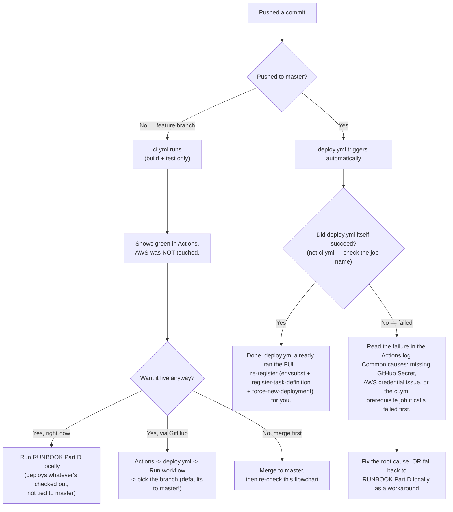

# TesseraApp — AWS Deploy Runbook

**Version:** 1.1
**Last Updated:** 2026-08-08
**Status:** Final
**Audience:** anyone who needs to deploy or redeploy this app to AWS without asking the person who built it.

## Overview

This is the **linear, do-this-in-order** procedure. It assumes nothing and skips no step. Follow it top to bottom and you get a running deployment.

Its companion, [`README.md`](README.md), is the **reference**: what each AWS resource is for, and a long troubleshooting log of real errors hit building this. When something here fails, that is where you look. This file tells you *what to do*; that one tells you *why it broke*.

- **Deploying a code change to an already-working environment?** Skip to [Part D](#part-d--redeploy-the-90-second-loop).
- **Standing it up from nothing?** Start at Part A.
- **"Do I even need to run anything, or did GitHub Actions already do it?"** — see the flowchart right below.

## Do I need to run Part D manually, or is CI enough?

This is the single most common point of confusion, so it gets its own answer before anything else:
**a green checkmark in GitHub's Actions tab does not, by itself, mean AWS was touched.** Two
different workflows both show up there, and only one of them deploys.



**The one thing worth memorizing:** when `deploy.yml` itself succeeds, it is *always* equivalent to
the full "re-register the task definition" path in Part D below — it runs the exact same
`envsubst` + `register-task-definition` + `force-new-deployment` sequence as a GitHub Actions job,
every time, whether or not `aws/task-definition.json` actually changed. You never need to run
anything manually after a genuinely successful `deploy.yml` run. Part D exists for everything
*outside* that happy path: local testing before a push, a branch that hasn't reached `master` yet,
or working around a broken workflow.

## Table of contents

- [What already exists](#what-already-exists)
- [Part A — One-time prerequisites](#part-a--one-time-prerequisites-your-machine)
- [Part B — One-time AWS infrastructure](#part-b--one-time-aws-infrastructure)
- [Part C — One-time application setup](#part-c--one-time-application-setup-the-part-people-forget)
- [Part D — Redeploy: the 90-second loop](#part-d--redeploy-the-90-second-loop)
- [Part E — Verify a deployment](#part-e--verify-a-deployment)
- [Part F — Known limitations right now](#part-f--known-limitations-right-now)
- [Part G — Clean rebuild from zero](#part-g--clean-rebuild-from-zero)
- [Part H — Reading the logs](#part-h--reading-the-logs)
- [Appendix — Every environment variable](#appendix--every-environment-variable)

---

## What already exists

The deployment is live. These are the real, current values — you do not need to invent any of them.

| Thing | Value |
|---|---|
| **Public app URL** | **`https://tesseraapp.dev`** — use this one. Also reachable at `https://d3911jyxcju4q4.cloudfront.net` (identical backend, same distribution) — but GitHub login only works on `tesseraapp.dev` now, see [Part F](#part-f--known-limitations-right-now). WebAuthn/passkeys and Google/Microsoft login work on either, since both are HTTPS. |
| Domain registrar | Porkbun, `tesseraapp.dev`, registered 2026-08-08, $8.75/yr |
| ACM certificate (domain) | `us-east-1`, covers `tesseraapp.dev` + `www.tesseraapp.dev` |
| CloudFront distribution | `E1WWY6FHSKI84P` (created by [`setup-cloudfront.sh`](setup-cloudfront.sh); domain added per [B1.6](#b16-point-a-real-domain-at-cloudfront-optional--once-you-own-one)) |
| ALB DNS (origin behind CloudFront, plain HTTP, not the public URL) | `http://tessera-app-alb-1750339159.us-east-1.elb.amazonaws.com` |
| Region | `us-east-1` |
| ECS cluster | `tessera-app-cluster` |
| ECS service | `tessera-app-service` |
| Task definition family | `tessera-app` |
| ECR repository | `tessera-app` |
| S3 bucket (profile images) | `tessera-app-images` |
| Database | **Aiven MySQL, database `db3`** |
| Spring profile | `prod` |
| Secrets Manager prefix | `tessera-app/` |
| CloudWatch log group | `/ecs/tessera-app` |

> **`db3`, never `defaultdb`.** `defaultdb` is the empty database Aiven auto-creates with every service. Point a task at it and the app boots perfectly, serves the SPA perfectly, and fails every single sign-in — because the schema may well be there but there is not one user row in it. This has cost real hours. Verify with the command in [Part E](#part-e--verify-a-deployment).

---

## Part A — One-time prerequisites (your machine)

### A1. Install the tooling

| Tool | Verify with | Windows install |
|---|---|---|
| AWS CLI v2 | `aws --version` | `winget install Amazon.AWSCLI` |
| `jq` | `jq --version` | `winget install jqlang.jq` |
| Docker Desktop | `docker info` | `winget install Docker.DockerDesktop` |
| Git Bash | you're in it | ships with Git for Windows |
| MySQL client | `mysql --version` | ships with MySQL Server; on this machine: `C:\Program Files\MySQL\MySQL Server 8.0\bin` |

**Run every command in this runbook from Git Bash or WSL, never PowerShell.** These are shell scripts. In PowerShell `chmod` does not exist and `./aws/setup.sh` silently does nothing, which looks exactly like success.

**Docker Desktop must be actually running**, not just installed — watch for "Engine running" in the system tray. If it isn't, the image build fails with `failed to connect to the docker API at npipe://…`. This is the single most common false start.

### A2. Configure AWS credentials

```bash
aws configure          # access key, secret key, region us-east-1, output json
aws sts get-caller-identity    # must print your account id

# Do this too — see below. One line, saves you a lot of irritation.
aws configure set cli_pager ""
```

**Turn the pager off.** AWS CLI v2 pipes every response through a pager (`more` on Windows, `less` elsewhere). `more` advances **one line per Enter**, so a command like `aws ecs update-service` — which returns the entire service object — leaves you holding Enter for a minute to get back to a prompt. If you're stuck in it right now, press **`q`**.

`aws configure set cli_pager ""` writes `cli_pager =` to `~/.aws/config` and disables it permanently. Per-shell (`export AWS_PAGER=""`) and per-command (`--no-cli-pager`) alternatives exist, but the config setting is the one you want: **a pager in a script is not a nuisance, it is a hang.** It blocks waiting for a keypress that never arrives, which in CI looks like a job that times out with no error message. That is why every AWS command in this runbook ends in `--query … --output text` or `>/dev/null` — it is not stylistic.

> ⚠️ **Do not use root account keys.** The identity currently configured on the original dev machine is the account root, which is a standing risk: a leaked root key is total account compromise, and it cannot be scoped. Create the limited `tessera-app-deploy` IAM user documented in [`README.md` → GitHub Actions secrets](README.md#github-actions-secrets-to-configure) and use that instead. The policy there grants exactly ECR push + ECS register/update + `iam:PassRole` on the two task roles + `secretsmanager:DescribeSecret` — nothing else.

### A3. Get the repo and make the scripts executable

```bash
git clone <repo-url>
cd angularSpringBootFullStack
chmod +x aws/setup.sh aws/secrets-setup.sh aws/push-to-ecr.sh
```

`chmod +x` sets a bit on the file. It persists. You do not need to re-run it before every invocation.

---

## Part B — One-time AWS infrastructure

**If the resources in [What already exists](#what-already-exists) are present, skip to Part C.** This section is for building a fresh environment (a new account, a second region, a teammate's own sandbox).

### B1. Run the bootstrap script

`aws/setup.sh` performs all nine infrastructure steps — IAM roles, S3 bucket, ECR repo, Secrets Manager entries, ECS cluster, security groups, ALB, target group, ECS service — and prints your ALB DNS name at the end.

```bash
AWS_REGION=us-east-1 ./aws/setup.sh \
  --domain      tessera-app-alb-1750339159.us-east-1.elb.amazonaws.com \
  --aiven-host  <your-service>.aivencloud.com \
  --aiven-port  <your-port> \
  --aiven-db    db3 \
  --aiven-user  avnadmin
```

Three things people get wrong here:

1. **`--domain` is the hostname only**, no scheme. The script prepends `http://` itself. On a fresh environment you don't have the ALB DNS name yet — run once with any placeholder, read the real name from the script's own Step 7 output, then re-run.
2. **`--aiven-db` must be `db3`.** See the warning above.
3. **`--aiven-host` must be your real Aiven hostname.** The `mysql-xyz.aivencloud.com` in the docs is illustrative and has been pasted verbatim before, producing a crash-loop with `UnknownHostException` after everything else reported healthy. Get it from **Aiven console → your service → Overview → Connection information**.

Omit `--aiven-password` and the script prompts, keeping it out of your shell history.

### B1.5. Front the ALB with CloudFront (required for federated login and passkeys)

**Do this before registering anything with Google/GitHub/Microsoft, and before testing WebAuthn.**
The ALB from B1 only ever serves plain `http://` — Step 8 in [`README.md`](README.md) (an ACM
certificate + `:443` listener on the ALB itself) needs a domain you can prove you own, which this
project does not have. CloudFront gives you HTTPS immediately, for free, on an AWS-issued
`*.cloudfront.net` certificate, with no domain required.

```bash
chmod +x aws/setup-cloudfront.sh
./aws/setup-cloudfront.sh
```

It is idempotent — re-running finds the existing distribution instead of creating a second one.
It prints a `*.cloudfront.net` URL when done; that URL is now **the** public app URL for every
purpose below (federation registration, `APP_DOMAIN`, testing in a browser). The trade-off is a
random hostname you cannot customize — fine for a course project, not for a real product (see
`deploy-https.sh` for the real-domain path later).

**Immediately after this runs, two task-definition values must change to match**, or federated
login breaks with `redirect_uri=http://…` even though the front door is now HTTPS (see
[Part F](#part-f--known-limitations-right-now) for why: the ALB overwrites `X-Forwarded-Proto`,
so Spring cannot derive the right scheme on its own):

| Variable | Set to |
|---|---|
| `APP_DOMAIN` (fills both `UI_APP_URL` and `OAUTH2_REDIRECT_BASE_URL`) | the CloudFront URL, e.g. `https://d3911jyxcju4q4.cloudfront.net` |
| `TRUSTED_PROXY_COUNT` | `2` (CloudFront adds a hop in front of the ALB's own hop) |

Apply these via the "re-register the task definition" sequence in [Part D](#part-d--redeploy-the-90-second-loop), then verify:

```bash
curl -si "https://<your-cloudfront-domain>/oauth2/authorization/github" | grep -i location
# redirect_uri= MUST start with https://
```

### B1.6. Point a real domain at CloudFront (done — `tesseraapp.dev`, 2026-08-08)

This is the procedure actually used to attach `tesseraapp.dev` (Porkbun, $8.75/yr) to the live
distribution — not a hypothetical, and not scripted the way B1.5 is. `deploy-https.sh` is a **different** procedure: it
puts a cert directly on the **ALB**. This section is the CloudFront equivalent, and is the one to
use, since CloudFront (B1.5) is this project's actual public front door.

1. **Request an ACM certificate — must be `us-east-1`, no exceptions.** CloudFront only ever reads
   certificates from that region regardless of where your ALB/ECS/everything else lives — a cert
   requested in any other region silently will not appear as attachable to the distribution.
   ```bash
   aws acm request-certificate \
     --domain-name <your-domain> \
     --subject-alternative-names www.<your-domain> \
     --validation-method DNS \
     --region us-east-1 \
     --query CertificateArn --output text
   ```
2. **Fetch the DNS validation records** ACM generates (poll — they populate asynchronously, a few seconds after request):
   ```bash
   aws acm describe-certificate --certificate-arn <arn> --region us-east-1 \
     --query 'Certificate.DomainValidationOptions[?ValidationMethod==`DNS`].ResourceRecord' --output json
   ```
3. **Add both CNAME records at your registrar's DNS panel** (Namecheap: Advanced DNS; Porkbun: DNS Records tab; any registrar works the same way in principle). The **Host** field excludes the base domain — enter only the part before it (e.g. `_abc123` for the apex record, `_def456.www` for the `www` one). Paste the **Value**/**Answer** exactly as ACM gave it, trailing dot included. TTL: Automatic/lowest available.
4. **Wait for `ISSUED`** — poll `describe-certificate`'s `Certificate.Status`. Typically a few minutes once the records are live, occasionally up to ~30.
   ```bash
   aws acm describe-certificate --certificate-arn <arn> --region us-east-1 --query 'Certificate.Status' --output text
   ```
5. **Add the domain as an Alternate Domain Name on the existing CloudFront distribution**, attach the now-issued cert:
   ```bash
   DIST_ID=<your-distribution-id>   # e.g. E1WWY6FHSKI84P
   aws cloudfront get-distribution-config --id "$DIST_ID" > /tmp/cf-config.json
   ETAG=$(jq -r '.ETag' /tmp/cf-config.json)
   jq '.DistributionConfig
       | .Aliases = {Quantity: 2, Items: ["<your-domain>", "www.<your-domain>"]}
       | .ViewerCertificate = {
           ACMCertificateArn: "<cert-arn>", SSLSupportMethod: "sni-only",
           MinimumProtocolVersion: "TLSv1.2_2021", Certificate: "<cert-arn>", CertificateSource: "acm"
         }' /tmp/cf-config.json | jq '.DistributionConfig' > /tmp/cf-new-config.json
   aws cloudfront update-distribution --id "$DIST_ID" --if-match "$ETAG" \
     --distribution-config "$(cat /tmp/cf-new-config.json)"
   ```
   CloudFront propagation to all edge locations takes a few minutes after this, even though the API call returns immediately.
6. **Point the domain's DNS at CloudFront**, not the ALB. Most registrars can't put a CNAME on a bare apex domain — use an `ALIAS`/`ANAME` record if the registrar offers one (Porkbun and Namecheap both do), or point `www` at CloudFront via plain CNAME and redirect the apex to `www`:
   ```
   ALIAS/ANAME  <your-domain>      →  <distribution>.cloudfront.net
   CNAME        www.<your-domain>  →  <distribution>.cloudfront.net
   ```
7. **Re-point the app at the new origin and restart** — same two variables as the CloudFront-no-domain step, just pointed at the real domain now:
   ```bash
   # APP_DOMAIN = https://<your-domain>  (fills both UI_APP_URL and OAUTH2_REDIRECT_BASE_URL)
   # then the full re-register + force-new-deployment sequence in Part D
   ```
8. **Add the new domain's callback to every OAuth app** (Part B2/B3) — `https://<your-domain>/login/oauth2/code/{provider}`. Google and Microsoft: add it *alongside* the CloudFront-URL entry, they accept a list. GitHub: swap the *production* app's one callback over, since it can only hold one.
9. **Verify:**
   ```bash
   curl -sI https://<your-domain>/actuator/health | head -1
   curl -si "https://<your-domain>/oauth2/authorization/google" | grep -i location   # https:// redirect_uri
   ```

### B2. Create an OAuth app with each provider and register the callback URL

**Do this after B1.5** — you need the CloudFront URL first, since it's what you register as the
callback. All commands below assume `https://d3911jyxcju4q4.cloudfront.net`; substitute your own
CloudFront domain if it differs.

#### Google

Requires `https` for anything but `localhost` — CloudFront is what makes this possible at all.

1. [console.cloud.google.com](https://console.cloud.google.com/) → if you don't have a project yet, create one (top-left project dropdown → **New Project**, any name).
2. Left sidebar **APIs & Services → Credentials** → **+ Create Credentials → OAuth client ID**.
3. First time through, it makes you configure the **OAuth consent screen** first: User type = External, app name = TesseraApp (or anything), your email for support/developer contact. No special scopes needed.
4. Back on Credentials: Application type = **Web application**. Under **Authorized redirect URIs**, add **both** (Google accepts a list, so one app serves local dev and the deployed environment):
   ```
   http://localhost:8080/login/oauth2/code/google
   https://d3911jyxcju4q4.cloudfront.net/login/oauth2/code/google
   ```
5. Click **Create** — a popup shows the **Client ID** and **Client Secret** once. Copy both now.

#### Microsoft (Entra)

Requires `https` for anything but `localhost`.

1. [entra.microsoft.com](https://entra.microsoft.com/) → **App registrations** → your app (or **New registration** if none exists yet).
2. Left sidebar **Authentication** → under **Platform configurations**, add a **Web** platform if none exists — **not** SPA or mobile, that distinction matters (see below).
3. Under that Web platform's **Redirect URIs**, add both:
   ```
   http://localhost:8080/login/oauth2/code/microsoft
   https://d3911jyxcju4q4.cloudfront.net/login/oauth2/code/microsoft
   ```
4. Still on the Authentication page, confirm **Allow public client flows** is **No**. If it's Yes, Entra treats the app as a public client and rejects the (correct) `client_secret_post` auth this app uses, with `AADSTS90023: Public clients can't send a client secret` — a portal setting, not a code bug; the Spring config is already right.
5. Save.
6. Client **ID** and **tenant ID** are on the app's **Overview** page.
7. Client **secret**: **Certificates & secrets → Client secrets → New client secret**. Copy the **Value** column immediately — it is shown once and is unrecoverable after you navigate away. (*Federated credentials* on that same page is workload-identity for CI/CD, unrelated to this app — ignore it.)

#### GitHub — the one with a real gotcha

**First, ignore "GitHub Apps" entirely** — GitHub's Developer Settings has two different sections,
**GitHub Apps** and **OAuth Apps**. This project uses Spring Security's OAuth2 Client module,
which only speaks the classic **OAuth App** protocol. GitHub Apps is a different integration model
(installation-based, used for bots/CI tools) and is not relevant here — don't create or edit
anything there.

**Second, a real constraint you will hit:** a single GitHub OAuth App holds **exactly one**
Authorization callback URL — no list, no comma-separated field, unlike Google and Microsoft above.
So one app **cannot** serve both `localhost` and the deployed CloudFront URL. You need **two
separate OAuth Apps**:

1. **Settings → Developer settings → OAuth Apps → New OAuth App** (or reuse an existing one you already have for local dev):
   - Homepage URL: `http://localhost:4200`
   - Authorization callback URL: `http://localhost:8080/login/oauth2/code/github`
   - This is your **local-dev app**. Keep its Client ID/Secret for your local `.env` only.
2. **New OAuth App** again, a second time, for production:
   - Homepage URL: `https://d3911jyxcju4q4.cloudfront.net`
   - Authorization callback URL: `https://d3911jyxcju4q4.cloudfront.net/login/oauth2/code/github`
   - Register → copy the **Client ID** shown immediately → click **Generate a new client secret** → copy it (shown once).
   - **This second app's credentials are the ones that go into AWS Secrets Manager** (B3 below) — not the local-dev app's.

If GitHub login on the deployed app ever fails with `redirect_uri_mismatch` after this, the most
likely cause is that Secrets Manager still holds the *local-dev* app's credentials instead of the
production app's — check which app the `client_id` in the live authorize redirect actually
belongs to:
```bash
curl -si "https://d3911jyxcju4q4.cloudfront.net/oauth2/authorization/github" | grep -i location
```

### B3. Fill in the real secret values

`setup.sh` creates every secret with a `CHANGE_ME` placeholder so the task definition can reference a real ARN. **Replace them before the first deploy** — several are load-bearing in non-obvious ways. Use the real values from B2 for the six OAuth secrets (the *production* GitHub app, not the local-dev one):

```bash
R="--region us-east-1"
aws secretsmanager update-secret $R --secret-id tessera-app/db-password           --secret-string '<aiven password>'
aws secretsmanager update-secret $R --secret-id tessera-app/mail-username         --secret-string '<gmail address>'
aws secretsmanager update-secret $R --secret-id tessera-app/mail-password         --secret-string '<16-char gmail app password>'
aws secretsmanager update-secret $R --secret-id tessera-app/jwt-secret            --secret-string "$(openssl rand -base64 48)"
aws secretsmanager update-secret $R --secret-id tessera-app/google-client-id      --secret-string '<from B2>'
aws secretsmanager update-secret $R --secret-id tessera-app/google-client-secret  --secret-string '<from B2>'
aws secretsmanager update-secret $R --secret-id tessera-app/github-client-id      --secret-string '<from B2, the PRODUCTION app>'
aws secretsmanager update-secret $R --secret-id tessera-app/github-client-secret  --secret-string '<from B2, the PRODUCTION app>'
aws secretsmanager update-secret $R --secret-id tessera-app/microsoft-client-id     --secret-string '<from B2>'
aws secretsmanager update-secret $R --secret-id tessera-app/microsoft-client-secret --secret-string '<from B2>'

# SMS 2FA — all three below come from console.twilio.com, not from B2 above:
#   Account SID + Auth Token: console.twilio.com → Develop (left sidebar) → API keys & tokens →
#     "API keys and auth tokens" → Auth Tokens. Both the Account SID and the Primary Auth Token
#     are shown there together; the token is masked behind a "View"/eye icon you click to reveal.
#     (Account Settings → Security also surfaces the Account SID, but Auth Tokens live under
#     Develop, not Security — confirmed 2026-08-08 against the live console.)
#   From-number: Phone Numbers → Manage → Active Numbers → click the number you bought — copy it
#     exactly as shown (already E.164-formatted, e.g. +18084315852). Must be A2P 10DLC (or
#     toll-free) verified for SMS or Twilio will reject sends even with correct credentials. This
#     number/its A2P campaign is now only the VoiceUtils fallback path (see the Verify Service SID
#     below) — TWILIO_ACCOUNT_SID/TWILIO_AUTH_TOKEN are shared with Verify, so this section still
#     has to be filled in either way.
aws secretsmanager update-secret $R --secret-id tessera-app/twilio-sid          --secret-string '<Account SID, starts with AC>'
aws secretsmanager update-secret $R --secret-id tessera-app/twilio-token        --secret-string '<Auth Token>'
aws secretsmanager update-secret $R --secret-id tessera-app/twilio-from-number  --secret-string '<+1XXXXXXXXXX>'

# ECS only resolves secrets at container START — a value change here does nothing to the
# currently running task until you restart it:
aws ecs update-service $R --cluster tessera-app-cluster --service tessera-app-service --force-new-deployment
```

### Wiring Twilio Verify into production (optional, additive)

**Status as of 2026-08-12: fully done except the actual deploy.**

1. ✅ Verify Service created in console.twilio.com — SID `VAb30518dae8f392c259a41974ae40f966`. Its
   Messaging Configuration was left on Twilio's default sender (the existing `twilio-from-number`
   was never attached), so it isn't riding that number's own A2P 10DLC campaign.
2. ✅ `TWILIO_VERIFY_SERVICE_SID` wired into `aws/task-definition.json` (`_variables` + env entry)
   and both secret-resolution `for` loops (`aws/setup.sh` and `.github/workflows/deploy.yml`).
3. ✅ Secret created and confirmed live in Secrets Manager:
   `arn:aws:secretsmanager:us-east-1:468670609216:secret:tessera-app/twilio-verify-service-sid-l71jLM`.
4. ⬜ **Not yet redeployed.** All of the above — plus the rest of today's `TwilioVerifyUtils` /
   `NotificationServiceImpl` / `UserRepoImpl` code — is still sitting uncommitted on the local
   `MastersProjectSRSImpl` branch. `deploy.yml` deploys whatever's actually on GitHub (push to
   `master`, or manual `workflow_dispatch` against a pushed ref), so nothing here reaches AWS until
   it's committed and pushed. `--force-new-deployment` alone would not be enough even once pushed —
   this is a *new* env entry baked into a task definition revision, not a rotated value, so it needs
   a fresh `register-task-definition`, which the normal `deploy.yml` run performs.

If the values already exist in a local `.env`, copy them across without ever printing them:

```bash
set -a; source .env; set +a
aws secretsmanager create-secret --region us-east-1 \
  --name tessera-app/microsoft-client-id --secret-string "$MICROSOFT_CLIENT_ID"
```

**Why mail credentials matter more than they look:** risk-based step-up (FR-TPF-1) **withholds tokens until the emailed code is entered**. Leave mail credentials as `CHANGE_ME` and any account the risk engine flags becomes unreachable — the user is not rejected, they are simply never sent the code they are being asked for.

**Why a provider's secrets decide whether it exists:** `OAuth2ClientConfig#federatedProviderCatalog` skips any provider with a blank client id, and the login screen renders exactly what `GET /oauth2/providers` returns. A provider configured in `.env` but not in Secrets Manager appears locally and is silently absent when deployed.

**A placeholder like `CHANGE_ME_ACxxxxxxx` passes `SMSUtils.isConfigured()` silently** (2026-08-08 — confirmed live: `tessera-app/twilio-sid` held exactly this after the local `.env` had a real SID for weeks). `isConfigured()` only checks that the value is non-blank, not that it's real, so a half-edited placeholder degrades to the same "log the code instead of sending" fallback as a wholly-blank value, with no error anywhere pointing at Secrets Manager specifically. If SMS 2FA silently reverts to console-logging in production, check the *shape* of all three Twilio secrets, not just whether they're set — see [README.md → Checking secret values](README.md#checking-and-updating-secret-values-from-the-cli).

**A UUID is never a valid value here.** Google, GitHub, and Microsoft each assign their own client ID format (`NNN-xxx.apps.googleusercontent.com`, `Ov23li…`/40-hex, and a GUID respectively) — a randomly generated UUID pasted in by mistake will pass validation (it's a non-blank string, so the provider button renders) but fails at the provider with `invalid_client`, because no such app was ever registered. Every value here must come from actually completing B2 for that provider — there is no shortcut.

**To check what's currently stored without exposing it in a chat, ticket, or log**, see [`README.md` → Checking secret values](README.md#checking-and-updating-secret-values-from-the-cli).

---

## Part C — One-time application setup (the part people forget)

Infrastructure being healthy does not mean the app is usable. These three steps are inside the database, and nothing automates them.

### C1. Apply the schema to `db3`

The app **never** creates its own schema: `spring.sql.init.mode: never`, and the `prod` profile runs `ddl-auto: validate`, which verifies the JPA tables and **fails startup** on drift rather than silently altering anything. So `schema.sql` is applied by hand, exactly once per database.

```bash
# CA cert from Aiven console → Service → Overview → CA Certificate
mysql --host=<your-service>.aivencloud.com --port=<port> --user=avnadmin --password \
      --ssl-ca=aiven-ca.pem --ssl-mode=REQUIRED \
      db3 < src/main/resources/schema.sql
```

It is idempotent — `CREATE TABLE IF NOT EXISTS`, no `DROP`s — so re-running is safe and is the correct fix when a column is missing. As of 2026-08-07 this includes the new `passkeycredentials` table and `users.using_passkey` column (passkey / WebAuthn support) — no separate migration step, just re-run the same file.

> **Run the whole file, not the parts you think you need.** `schema.sql` carries seed data as well as DDL: the roles and their authority strings, the events catalogue, and the services catalogue. A database with the tables but not the seeds boots fine and then behaves strangely — most visibly, the services catalogue is empty and the page tells you to add entries via an admin panel.

### C2. Give yourself an admin role

`UserRepoImpl` grants every newly registered account **`ROLE_USER`**, which holds `READ:USER` / `READ:CUSTOMER` and nothing else. That is correct and deliberate — but it means the first account you register on a fresh database cannot see the Admin menu, the user directory, the roles matrix, the security overview, or the services admin screen. Nothing is broken; you simply have not granted yourself anything.

```sql
SELECT id, name FROM roles;                       -- find ROLE_SUPER_ADMIN's id
SELECT id, email FROM users;                      -- find your own id

UPDATE userroles
   SET role_id = (SELECT id FROM roles WHERE name = 'ROLE_SUPER_ADMIN')
 WHERE user_id = (SELECT id FROM users WHERE email = 'you@example.com');
```

**Then sign out and back in.** Authorities are baked into the JWT at issuance; your existing token still says `ROLE_USER` and will keep saying so until it is reissued.

### C3. Confirm the proxy settings are in the task definition

Both are already in `aws/task-definition.json`. Confirm they survived into the running revision — each fails *silently*, which is what makes them worth checking rather than assuming:

| Variable | Value | What breaks at the default |
|---|---|---|
| `FORWARD_HEADERS_STRATEGY` | `framework` | `{baseUrl}` in the OAuth2 redirect-uri template resolves to the container's own `http://<task-ip>:8080`. Every federated sign-in dies on `redirect_uri_mismatch` while working perfectly on localhost. |
| `TRUSTED_PROXY_COUNT` | `1` | `X-Forwarded-For` is ignored and every user appears to be the load balancer. The rate limiter throttles the whole tenant as one caller, and the anomaly detector's `NEW_NETWORK` signal can never fire — so step-up looks present and does nothing. |

---

## Part D — Redeploy: the 90-second loop

This is the loop you will actually use day to day.

**This loop deploys whatever branch is checked out locally, not `master` specifically —
it builds the image from your current working tree, full stop.** That is a real difference
from GitHub Actions: `deploy.yml` only triggers on a push to `master` (or an explicit
`workflow_dispatch` where you pick the branch), so a push to a feature branch runs `ci.yml`
(build + test) and nothing else — it will show green in the Actions tab without deploying
anything. If you see a successful Actions run against your feature branch and AWS still
looks stale, that is almost certainly `ci.yml`, not a deploy; use this loop (or a
`workflow_dispatch` with the branch explicitly selected — the dropdown defaults to
`master`, so change it) to actually ship a non-master branch.

```bash
cd /path/to/angularSpringBootFullStack

# 0. Docker Desktop must be running.

# 1. Build the image from your CURRENT working tree and push it to ECR.
#    Multi-stage: Angular is compiled and baked into the Spring Boot jar.
AWS_REGION=us-east-1 ./aws/push-to-ecr.sh latest

# 2. Roll the service onto the new image.
aws ecs update-service \
  --cluster tessera-app-cluster \
  --service tessera-app-service \
  --force-new-deployment \
  --region us-east-1

# 3. Watch it converge (Ctrl-C once runningCount reaches 1 and stays).
aws ecs describe-services --cluster tessera-app-cluster --services tessera-app-service \
  --region us-east-1 --query 'services[0].{running:runningCount,desired:desiredCount,status:status}'
```

**Step 2 is enough only when the image tag is unchanged.** ECS pulls `:latest` fresh on each new task, so a code change needs no new task-definition revision.

**⚠ This 3-step loop does NOT pick up a new or changed environment variable or secret —
ever, even after "1. Build" pushes an image containing code that reads one.** Step 2 restarts
the service on whatever task-definition revision is *already registered*; it does not
re-read `aws/task-definition.json`. Shipping code that reads a **new** env var/secret through
this loop alone produces exactly the confusing failure mode of "the new code is running, but
it behaves as if the feature is unconfigured" — silent, no error, nothing in the logs points
at the cause. **If your change added or renamed anything in `aws/task-definition.json`, skip
straight to the re-register sequence below; the 90-second loop is not enough this time,**
regardless of how small the code change feels.

**You must re-register the task definition when you change a task-definition value** — an environment variable, a secret reference, CPU/memory. Those are baked into the revision, not read live:

```bash
export AWS_ACCOUNT_ID=$(aws sts get-caller-identity --query Account --output text)
export AWS_REGION=us-east-1
export ECR_IMAGE_URI="${AWS_ACCOUNT_ID}.dkr.ecr.${AWS_REGION}.amazonaws.com/tessera-app:latest"
export AIVEN_HOST=<your-service>.aivencloud.com
export AIVEN_PORT=<port>
export AIVEN_DB=db3
export AIVEN_USER=avnadmin
export S3_BUCKET=tessera-app-images
# The PUBLIC origin — the CloudFront distribution, not the ALB. It fills both UI_APP_URL and
# OAUTH2_REDIRECT_BASE_URL in the template, so this one export covers both. Do not put the ALB
# hostname here: OAuth redirect URIs built from it are http:// and Google and Entra reject them.
export APP_DOMAIN=https://d3911jyxcju4q4.cloudfront.net

# Resolve every secret's COMPLETE ARN — the random suffix is required. A bare name or a
# hand-built ARN is ambiguous to ECS, which falls back to an SSM Parameter Store lookup
# and fails with AccessDeniedException on ssm:GetParameters.
for s in JWT_SECRET:jwt-secret DB_PASSWORD:db-password MAIL_USERNAME:mail-username \
         MAIL_PASSWORD:mail-password TWILIO_SID:twilio-sid TWILIO_TOKEN:twilio-token \
         TWILIO_FROM_NUMBER:twilio-from-number TWILIO_VERIFY_SERVICE_SID:twilio-verify-service-sid \
         GOOGLE_CLIENT_ID:google-client-id \
         GOOGLE_CLIENT_SECRET:google-client-secret GITHUB_CLIENT_ID:github-client-id \
         GITHUB_CLIENT_SECRET:github-client-secret MICROSOFT_CLIENT_ID:microsoft-client-id \
         MICROSOFT_CLIENT_SECRET:microsoft-client-secret; do
  export "${s%%:*}_ARN=$(aws secretsmanager describe-secret --secret-id "tessera-app/${s##*:}" \
                          --query ARN --output text --region us-east-1)"
done

# Strip the _comment/_variables documentation keys — register-task-definition validates
# strictly and rejects unknown keys. Inline the JSON rather than using file:// — a native
# aws.exe on Git Bash resolves file:// URIs unreliably even when the file exists.
FILLED="$(envsubst < aws/task-definition.json | jq 'del(._comment, ._variables)')"

# GUARD — do not skip this. envsubst replaces an UNSET variable with an empty string and
# exits 0, so a forgotten export produces a structurally valid task definition carrying a
# silently empty value. ECS then accepts the revision and every task fails to place.
BAD=$(echo "$FILLED" | jq '
  [ .containerDefinitions[0].environment[]?          | select(.value    == "") ]
+ [ .containerDefinitions[0].secrets[]?              | select(.valueFrom== "") ]
+ [ .containerDefinitions[0].logConfiguration.options | to_entries[] | select(.value == "") ]
| length')
if [ "$BAD" -ne 0 ]; then
  echo "ABORT: $BAD empty value(s) after envsubst — an export is missing:"
  echo "$FILLED" | jq '.containerDefinitions[0]
    | {env: [.environment[]?|select(.value=="")|.name],
       secrets: [.secrets[]?|select(.valueFrom=="")|.name],
       logs: [.logConfiguration.options|to_entries[]|select(.value=="")|.key]}'
  exit 1
fi

aws ecs register-task-definition --cli-input-json "$FILLED" --region us-east-1

aws ecs update-service --cluster tessera-app-cluster --service tessera-app-service \
  --task-definition tessera-app --force-new-deployment --region us-east-1
```

#### Shortcut: derive the next revision from the live one

The sequence above rebuilds the revision *from the template*, which means every `export` has to be
right — including `AIVEN_HOST`, `AIVEN_PORT` and the twelve secret ARNs. When you only want to change
**one or two values** and the currently deployed revision is otherwise correct, it is safer to start
from what is already running: nothing can be silently dropped, because you never re-supply it.

```bash
R="--region us-east-1"

# 1. Pull the LIVE revision (whatever the service is actually running — use its own describe-services
#    output for this, not a hardcoded number; the newest registered revision is not necessarily deployed).
LIVE=$(aws ecs describe-services $R --cluster tessera-app-cluster --services tessera-app-service \
        --query 'services[0].taskDefinition' --output text)
aws ecs describe-task-definition $R --task-definition "$LIVE" \
  --query 'taskDefinition' --output json > .temp/live.json

# 2. Strip the server-populated read-only fields — register-task-definition rejects them — and
#    apply the change. `.temp/` is gitignored.
jq 'del(.taskDefinitionArn, .revision, .status, .requiresAttributes,
        .compatibilities, .registeredAt, .registeredBy, .deregisteredAt)
    | .containerDefinitions[0].environment = (
        [ .containerDefinitions[0].environment[]
          | if   .name == "UI_APP_URL"          then .value = "https://d3911jyxcju4q4.cloudfront.net"
            elif .name == "TRUSTED_PROXY_COUNT" then .value = "2"
            else . end ]
        + [ {"name":"OAUTH2_REDIRECT_BASE_URL","value":"https://d3911jyxcju4q4.cloudfront.net"} ] )' \
  .temp/live.json > .temp/next.json

# 3. Register and roll.
aws ecs register-task-definition $R --cli-input-json "$(cat .temp/next.json)"
aws ecs update-service $R --cluster tessera-app-cluster --service tessera-app-service \
  --task-definition tessera-app --force-new-deployment
```

**Adding a brand-new secret this way** (rather than changing an existing value) is a different `jq`
operation — you're appending to `.secrets`, not rewriting `.environment` in place. Written idempotently
(safe to re-run: it replaces any existing entry of the same name instead of duplicating it), so a
retry after a typo never leaves two conflicting entries:

```bash
R="--region us-east-1"
LIVE=$(aws ecs describe-services $R --cluster tessera-app-cluster --services tessera-app-service \
        --query 'services[0].taskDefinition' --output text)
aws ecs describe-task-definition $R --task-definition "$LIVE" \
  --query 'taskDefinition' --output json > .temp/live.json

# Create the secret itself first if it doesn't exist yet:
#   aws secretsmanager create-secret --name tessera-app/<name> --secret-string '<value>' --region us-east-1

jq --arg name "MY_NEW_SECRET" \
   --arg arn  "$(aws secretsmanager describe-secret --secret-id tessera-app/my-new-secret \
                  --query ARN --output text --region us-east-1)" \
   'del(.taskDefinitionArn, .revision, .status, .requiresAttributes,
        .compatibilities, .registeredAt, .registeredBy, .deregisteredAt)
    | .containerDefinitions[0].secrets |=
        (map(select(.name != $name)) + [{name: $name, valueFrom: $arn}])' \
  .temp/live.json > .temp/next.json

# Diff before registering — confirm exactly one line changed and nothing else moved:
diff <(jq '.containerDefinitions[0].secrets' .temp/live.json) <(jq '.containerDefinitions[0].secrets' .temp/next.json)

aws ecs register-task-definition $R --cli-input-json "$(cat .temp/next.json)"
aws ecs update-service $R --cluster tessera-app-cluster --service tessera-app-service \
  --task-definition tessera-app --force-new-deployment
```

Remember to also add the new env-var name to `aws/task-definition.json`'s `_variables`/`environment`
block and **all three** copies of the ARN-resolution `for` loop (`aws/setup.sh`,
`.github/workflows/deploy.yml`, and this file's own re-register sequence above) — otherwise the
next *templated* re-register (not this shortcut) silently drops it again.

> ⚠️ **On Git Bash, pass the JSON with `"$(cat file)"`, not `file://`.** A native `aws.exe` resolves
> `file://` URIs unreliably under MSYS — the same path hazard `setup.sh` documents at its top — and
> the failure is confusing rather than obvious: you get `Error parsing parameter 'cli-input-json':
> Invalid JSON received` even though the file is perfectly valid JSON, because the CLI never read it.
> The `"$(cat …)"` form sidesteps path translation entirely. It is well inside Windows' command-length
> limit; the filled task definition is under 6 KB.
>
> **Also beware wrapped line continuations.** If a long `file://…` path gets split across lines
> without a trailing `\`, bash runs the remainder as separate commands and you will see
> `No such file or directory` for a path fragment alongside the parsing error above. Two errors, one
> cause.

#### Worked example — adding `TWILIO_VERIFY_SERVICE_SID` this way (run 2026-08-14)

Real run against the live service, from a machine with no way to commit/push (so going through
`deploy.yml` wasn't an option) — confirms the shortcut works end to end and the diff really does
come back as exactly one line:

```bash
SCRATCH="/c/Users/bobby/AppData/Local/Temp/claude/.../scratchpad"   # any writable, gitignored dir
mkdir -p "$SCRATCH"
set -e

LIVE=$(aws ecs describe-services --cluster tessera-app-cluster --services tessera-app-service \
        --region us-east-1 --query 'services[0].taskDefinition' --output text)
echo "Live task definition: $LIVE"                    # arn:...:task-definition/tessera-app:15

aws ecs describe-task-definition --task-definition "$LIVE" --region us-east-1 \
  --query 'taskDefinition' --output json > "$SCRATCH/td-live.json"

jq --arg arn "arn:aws:secretsmanager:us-east-1:468670609216:secret:tessera-app/twilio-verify-service-sid-l71jLM" \
   'del(.taskDefinitionArn, .revision, .status, .requiresAttributes, .compatibilities,
        .registeredAt, .registeredBy, .deregisteredAt)
    | .containerDefinitions[0].secrets |=
        (map(select(.name != "TWILIO_VERIFY_SERVICE_SID")) + [{name:"TWILIO_VERIFY_SERVICE_SID", valueFrom:$arn}])' \
  "$SCRATCH/td-live.json" > "$SCRATCH/td-new.json"

# Diff before registering — this is the step that matters. A clean run shows ONLY the new
# secret appended; anything else in the diff means the wrong revision was pulled or a prior
# edit is still sitting in the live task definition unaccounted for.
diff <(jq '.containerDefinitions[0].secrets' "$SCRATCH/td-live.json") \
     <(jq '.containerDefinitions[0].secrets' "$SCRATCH/td-new.json") || true
```

Confirmed clean against `tessera-app:15` — the diff showed exactly the one new
`TWILIO_VERIFY_SERVICE_SID` entry appended, nothing else moved. That confirms the JSON is safe to
register; it does **not** by itself register or roll anything. Finish it with the two commands from
the template above (substitute `$SCRATCH/td-new.json` for `.temp/next.json`):

```bash
aws ecs register-task-definition --region us-east-1 --cli-input-json "$(cat "$SCRATCH/td-new.json")"
aws ecs update-service --cluster tessera-app-cluster --service tessera-app-service \
  --task-definition tessera-app --force-new-deployment --region us-east-1
```

Then verify with Part E below — specifically 1b, which confirms the *running* revision (not just
the newest registered one) actually carries the secret.

**Rotating a secret's value needs no new revision** — the reference is to the secret, not its contents — but it *does* need a task restart, because ECS resolves secrets at container start:

```bash
aws secretsmanager update-secret --region us-east-1 \
  --secret-id tessera-app/jwt-secret --secret-string "$(openssl rand -base64 48)"
aws ecs update-service --cluster tessera-app-cluster --service tessera-app-service \
  --force-new-deployment --region us-east-1
```

**Cold start is ~80–85 seconds** on 512 CPU / 1024 MB (JVM + Spring context + Hibernate + S3 client). The service's health-check grace period is 300s to accommodate that. If you see tasks looping on `Target.FailedHealthChecks`, the grace period is too short — not the app failing.

---

## Part E — Verify a deployment

Run these in order; each isolates a different failure.

```bash
# 1. Which task definition is the service ACTUALLY running, and against which database?
#    (`--task-definition tessera-app` alone gives the newest revision, not the deployed one.)
aws ecs describe-task-definition \
  --task-definition "$(aws ecs describe-services --cluster tessera-app-cluster \
      --services tessera-app-service --query 'services[0].taskDefinition' --output text)" \
  --query "taskDefinition.containerDefinitions[0].environment[?starts_with(name,'MYSQL')]" \
  --output table
#    → MYSQL_DATABASE must be db3.

# 1b. Does the RUNNING revision actually reference the secret you think it does? A code change
#     that reads a new env var can be live in the container image while the task definition it's
#     running under still has no idea the secret exists — see the 90-second-loop warning in Part D.
#     Swap TWILIO_VERIFY_SERVICE_SID for whichever secret you're chasing.
aws ecs describe-task-definition \
  --task-definition "$(aws ecs describe-services --cluster tessera-app-cluster \
      --services tessera-app-service --query 'services[0].taskDefinition' --output text)" \
  --query "taskDefinition.containerDefinitions[0].secrets[?name=='TWILIO_VERIFY_SERVICE_SID']" \
  --output json
#    → [] means it never reached the task definition — re-register (Part D), don't just
#      restart. A populated result with the wrong-looking ARN means the secret itself is stale.

# 2. Is it up? Use the CloudFront URL, not the ALB — see Part F for why the ALB URL is a dead
#    end for federated login and passkeys even when the app itself responds fine on it.
curl -s https://d3911jyxcju4q4.cloudfront.net/actuator/health
#    → {"status":"UP"}

# 3. Which federated providers actually reached the container?
curl -s https://d3911jyxcju4q4.cloudfront.net/oauth2/providers

# 3b. For each provider, confirm the redirect actually carries a real client_id (not CHANGE_ME,
#     not a UUID — see B3's note on why a UUID silently passes but always fails at the provider)
#     and an https:// redirect_uri:
for p in google github microsoft; do
  echo "=== $p ==="
  curl -s -D - -o /dev/null "https://d3911jyxcju4q4.cloudfront.net/oauth2/authorization/$p" | grep -i location
done

# 4. Recent logs (startup failures, ddl-auto validation errors, the [NET] line).
#
#    MSYS2_ARG_CONV_EXCL is REQUIRED on Git Bash and is not optional decoration. MSYS rewrites
#    any bare argument starting with "/" into a Windows path before handing it to the native
#    aws.exe, so "/ecs/tessera-app" arrives as "C:/Program Files/Git/ecs/tessera-app" and AWS
#    rejects it: "Value at 'logGroupName' failed to satisfy constraint: Member must satisfy
#    regular expression pattern: [\.\-_/#A-Za-z0-9]+" — note that pattern allows no colon and
#    no space, which is what the mangled path introduced. On Linux/macOS the prefix is a no-op.
MSYS2_ARG_CONV_EXCL='/ecs/tessera-app' \
  aws logs tail /ecs/tessera-app --since 10m --region us-east-1

# The three lines worth grepping for on any fresh deploy:
MSYS2_ARG_CONV_EXCL='/ecs/tessera-app' \
  aws logs tail /ecs/tessera-app --since 15m --region us-east-1 \
  | grep -E "Started Angular|\[NET\]|Federated login providers"

# 5. Is the rollout actually converging, or stuck? Right after register-task-definition +
#    force-new-deployment, the service briefly carries BOTH the old and new revision as separate
#    deployment entries — that is normal, not stuck. It has converged once this returns exactly 1.
aws ecs describe-services --cluster tessera-app-cluster --services tessera-app-service \
  --region us-east-1 --query 'services[0].deployments[*].{status:status,taskDef:taskDefinition,running:runningCount,desired:desiredCount,rolloutState:rolloutState}'

# 5b. If a new task never reaches running:1, find out why rather than waiting indefinitely —
#     STOPPED tasks carry the actual reason (image pull failure, health check failure, out of
#     memory, etc.), which the deployment summary above never shows.
aws ecs list-tasks --cluster tessera-app-cluster --region us-east-1 --desired-status STOPPED \
  --query 'taskArns[:3]' --output json
# then, for each ARN returned:
aws ecs describe-tasks --cluster tessera-app-cluster --region us-east-1 --tasks <task-arn> \
  --query 'tasks[*].{taskDef:taskDefinitionArn,lastStatus:lastStatus,stoppedReason:stoppedReason,stopCode:stopCode}'
```

A healthy boot looks like this — check all three:

```
[NET] trusted-proxy-count=1 — the client address is read from X-Forwarded-For ...
Federated login providers configured: [google, github, microsoft]
Started AngularSpringBootFullStackApplication in 86.503 seconds
```

`trusted-proxy-count=0` means the anomaly detector and rate limiter are silently degraded (Part C3).
A short provider list means a `*_CLIENT_ID` never reached the container (Part B3). ~85s is the
expected cold start, not a problem.

Then, in a browser:

| Check | Confirms |
|---|---|
| Sign in with a password account | `JWT_SECRET`, the datasource, `db3` seed data |
| Count the provider buttons on the login screen | which `*_CLIENT_ID`s reached the container — this number *is* `/oauth2/providers` |
| Complete one federated sign-in | `FORWARD_HEADERS_STRATEGY` took effect; `redirect_uri_mismatch` means it did not |
| Register a throwaway account, click the emailed link | mail credentials, the HTML template, and that the link lands on `/verify/account/:key` rather than raw JSON |
| Navigate to a protected URL while signed out | a styled 401 page, not raw JSON |
| Grep the boot log for `[NET] trusted-proxy-count=` | it is **not** `0` |
| Open the services catalogue | `schema.sql` seeds were applied (Part C1) |
| Open the Admin menu | your account has a staff role (Part C2) |

---

## Part F — Known limitations right now

**The ALB still serves plain HTTP — but it is no longer the public entrance.** As of August 4, 2026 a CloudFront distribution (`E1WWY6FHSKI84P`, `Deployed`) fronts the ALB and terminates TLS on its auto-issued certificate, so the app's public origin is **`https://d3911jyxcju4q4.cloudfront.net`**. Created by [`setup-cloudfront.sh`](setup-cloudfront.sh) (idempotent). Step 8 of [`README.md`](README.md) — an ACM certificate and a `:443` listener on the ALB itself — is still undone, because it requires a domain you can prove ownership of; [`deploy-https.sh`](deploy-https.sh) is written and ready for that day.

The ALB remains reachable on plain `http://` — CloudFront does not close it. To force all traffic through CloudFront, restrict the ALB security group to the managed prefix list `com.amazonaws.global.cloudfront.origin-facing`.

⚠️ **CloudFront alone is not enough: the ALB overwrites `X-Forwarded-Proto`.** CloudFront sets it to `https`; the ALB then replaces it with its own listener protocol (`http`). Spring derives `{baseUrl}` — and therefore the OAuth `redirect_uri` — from that header, so it emitted `redirect_uri=http://…` even through the HTTPS front door, which Google and Entra reject. `FORWARD_HEADERS_STRATEGY=framework` does **not** save you; it honours the header faithfully, and the header is wrong. The fix is `OAUTH2_REDIRECT_BASE_URL`, which pins the redirect origin instead of deriving it. **Verify after any change to the front door:**

```bash
curl -si "https://d3911jyxcju4q4.cloudfront.net/oauth2/authorization/github" | grep -i location
# the redirect_uri= parameter MUST start with https://
```

| Affected | Effect |
|---|---|
| Google federated login | ✅ **Live** — real credentials from a Web application OAuth client (B2/B3), registered for both the CloudFront URL and `tesseraapp.dev`. Verify with the B3b command above; `client_id` should end in `.apps.googleusercontent.com`, never a bare UUID |
| GitHub federated login | ✅ **Live on `tesseraapp.dev` only.** Three OAuth Apps exist in total by now: `localhost` (local dev), the original CloudFront-URL production app (now orphaned — its credentials were swapped out of Secrets Manager once the domain went live, so it no longer works), and the current `tesseraapp.dev` production app, whose credentials are what's actually live. If this regresses, check which app's `client_id` the live redirect carries — see B2's GitHub section |
| Microsoft federated login | ✅ **Live** — credentials were already real; the blocker was the redirect URI missing from the Entra app's Web platform, now added for both the CloudFront URL and `tesseraapp.dev` |
| WebAuthn / passkeys | ✅ Live and confirmed working — any HTTPS origin (CloudFront URL or `tesseraapp.dev`) is a secure context, which `navigator.credentials` requires. **Still completely inert on the plain-HTTP ALB URL** — `isWebAuthnSupported()` reports false there regardless of what's deployed, since `http://` (other than `localhost`) is never a secure context |
| HSTS | Now meaningful over the CloudFront origin |

After a front-door change, always: set `APP_DOMAIN`/`UI_APP_URL` **and** `OAUTH2_REDIRECT_BASE_URL` to the new origin, set `TRUSTED_PROXY_COUNT=2` (CloudFront adds a hop), re-register the task definition, force a new deployment, and add the new callback URLs in every provider console.

**Security state is per-instance.** The brute-force counter, the rate limiter's buckets, and `ProviderLinkTicketService` all live in the task's memory. Harmless at `desiredCount: 1`; a real bypass the moment a second task runs, because an attacker routed to the other instance gets a fresh budget. Tracked in [`documentation/FUTURE-ENHANCEMENTS.md`](../documentation/FUTURE-ENHANCEMENTS.md) §3.1.

**SMS 2FA sends for real once Twilio credentials are populated in Secrets Manager** (2026-08-08 — `NotificationServiceImpl.sendTwoFactorCode()` now calls the real `SMSUtils.sendSMS`, no longer commented out). If any of `TWILIO_ACCOUNT_SID` / `TWILIO_AUTH_TOKEN` / `TWILIO_FROM_NUMBER` is left as a placeholder, it degrades to logging the code to CloudWatch instead (see [H2](#h2-reading-them)) — the same lockout risk applies in that unconfigured state: anyone without AWS access who enables SMS 2FA would be stuck at the code-entry screen with no self-service recovery. Verify the three secrets are real before pointing anyone besides yourself at SMS 2FA on a live/public demo.

**A production boot against a `schema.sql`-only database with `ddl-auto: validate` has never been exercised end to end.** Only the offline `JpaSchemaSyncTest` has run, and it catches entity/DDL drift but not a schema the app has never actually started against. Tracked in `FUTURE-ENHANCEMENTS.md` §2.3.

---

## Part G — Clean rebuild from zero

For proving the procedure actually works end to end, or handing a teammate their own sandbox.

### G0. What you must NOT delete

| Keep | Why |
|---|---|
| **The Aiven database (`db3`)** | It holds every user, role, customer and invoice. Deleting the AWS side costs you nothing permanent; deleting `db3` costs you the application's entire state. **Nothing in this teardown touches Aiven.** |
| **Your local `.env`** | The only copy of several credential values that are otherwise unrecoverable — notably the Entra client secret, whose Value cannot be re-read from the portal after creation. |

### G1. Tear down, in dependency order

Resources have to go in this order; a cluster will not delete while a service exists, and a bucket will not delete while it holds objects.

```bash
R="--region us-east-1"

# 1. Drain and delete the ECS service (scale to 0 first, or the delete is rejected).
aws ecs update-service $R --cluster tessera-app-cluster --service tessera-app-service --desired-count 0 >/dev/null
aws ecs wait services-stable $R --cluster tessera-app-cluster --services tessera-app-service
aws ecs delete-service $R --cluster tessera-app-cluster --service tessera-app-service --force >/dev/null

# 2. Deregister every task-definition revision (they linger as INACTIVE; harmless but noisy).
for arn in $(aws ecs list-task-definitions $R --family-prefix tessera-app --query 'taskDefinitionArns[]' --output text); do
  aws ecs deregister-task-definition $R --task-definition "$arn" >/dev/null
done

# 3. Cluster.
aws ecs delete-cluster $R --cluster tessera-app-cluster >/dev/null

# 4. Empty, then delete, the S3 bucket. Delete refuses on a non-empty bucket.
aws s3 rm s3://tessera-app-images --recursive
aws s3 rb s3://tessera-app-images

# 5. ECR repository (--force deletes the images inside it too).
aws ecr delete-repository $R --repository-name tessera-app --force >/dev/null

# 6. CloudWatch log group.
aws logs delete-log-group $R --log-group-name /ecs/tessera-app

# 7. ALB, listeners and target group. Listeners go with the load balancer; the target group
#    must be deleted separately and only AFTER the ALB, or it is reported as still in use.
ALB=$(aws elbv2 describe-load-balancers $R --names tessera-app-alb --query 'LoadBalancers[0].LoadBalancerArn' --output text)
aws elbv2 delete-load-balancer $R --load-balancer-arn "$ALB"
TG=$(aws elbv2 describe-target-groups $R --names tessera-app-tg --query 'TargetGroups[0].TargetGroupArn' --output text)
aws elbv2 delete-target-group $R --target-group-arn "$TG"

# 8. IAM roles — detach/delete policies first; a role with attachments will not delete.
aws iam delete-role-policy --role-name tessera-app-task-role --policy-name S3ImageStorage
aws iam delete-role --role-name tessera-app-task-role
aws iam detach-role-policy --role-name ecsTaskExecutionRole --policy-arn arn:aws:iam::aws:policy/service-role/AmazonECSTaskExecutionRolePolicy
aws iam detach-role-policy --role-name ecsTaskExecutionRole --policy-arn arn:aws:iam::aws:policy/SecretsManagerReadWrite
aws iam delete-role --role-name ecsTaskExecutionRole
```

> **Security groups** created by `setup.sh` can only be deleted once nothing references them — the
> ALB's ENIs take a few minutes to disappear after step 7. If `DependencyViolation` comes back, wait
> and retry; it is not a stuck state.

### G2. Secrets — the trap that will cost you a week if you get it wrong

**Do not run a plain `delete-secret` if you intend to rebuild soon.** Secrets Manager defaults to a
**7-to-30-day recovery window**, during which the secret still exists in a `PendingDeletion` state
and **its name cannot be reused**. `setup.sh` will then fail to create `tessera-app/jwt-secret`
because the name is taken by something you cannot see in the console's default view.

The right move is usually **to leave the secrets alone entirely.** They cost $0.40/month each, they
hold the values you would otherwise have to hunt down again (including the unrecoverable Entra
secret), and `setup.sh` skips any that already exist. A clean rebuild of the *infrastructure* does
not require destroying the *credentials*.

If you genuinely want them gone and recreatable immediately:

```bash
for s in jwt-secret db-password mail-username mail-password twilio-sid twilio-token \
         twilio-from-number google-client-id google-client-secret github-client-id \
         github-client-secret microsoft-client-id microsoft-client-secret; do
  aws secretsmanager delete-secret --region us-east-1 \
    --secret-id "tessera-app/${s}" --force-delete-without-recovery >/dev/null
done
```

`--force-delete-without-recovery` is **irreversible and immediate**. Confirm your `.env` still holds
every value before running it.

### G3. Rebuild

```bash
# Infrastructure — Part B.
AWS_REGION=us-east-1 ./aws/setup.sh \
  --domain      <placeholder-then-rerun-with-the-real-ALB-DNS> \
  --aiven-host  <your-service>.aivencloud.com \
  --aiven-port  <port> \
  --aiven-db    db3 \
  --aiven-user  avnadmin

# Image — Part D.
AWS_REGION=us-east-1 ./aws/push-to-ecr.sh latest

# The new ALB has a NEW DNS name. G1's teardown does NOT delete the CloudFront distribution
# (it's not in that list), so it's now silently pointing at a dead origin — update it:
#   CloudFront console → your distribution → Origins → edit the origin domain to the new ALB DNS
# Then re-run setup.sh with the new ALB DNS as --domain so UI_APP_URL/APP_DOMAIN stay correct.
# The apps registered with Google/Microsoft (Part B2) still work unchanged, since the CloudFront
# URL itself did not change — only GitHub needs no action either, for the same reason.
```

**`schema.sql` and your admin-role grant (Part C) do NOT need re-running** — they live in `db3`,
which this teardown never touched. That is the whole reason for the split: infrastructure is
disposable, the database is not.

### G4. Confirm

Run every check in [Part E](#part-e--verify-a-deployment). A rebuild is only proven when a real
sign-in works against the new ALB, not when the resources merely exist.

---

## Part H — Reading the logs

### H1. Where the logs actually are

There is **no log file anywhere** — not in the container, not on a volume, not on a host you
can reach. That is correct for Fargate, not an oversight: a file written inside the container
is destroyed when the task stops, which is exactly the moment you most want to read it.

```
Spring Boot (Logback console appender)
   │  src/main/resources/logback-spring.xml (added 2026-08-15): prod/qa/stage render one
   │  JSON object per line (LogstashEncoder); dev/local keep Boot's plain human-readable
   │  console line unchanged. Still no logging.file.* anywhere — stdout only, either way.
   ▼
Container stdout/stderr   (Dockerfile: ENTRYPOINT ["java","-jar","app.jar"], no redirection)
   ▼
ECS awslogs driver        (task-definition.json → logConfiguration)
   ▼
CloudWatch Logs
   ├─ Group:     /ecs/tessera-app
   ├─ Region:    us-east-1
   ├─ Stream:    ecs/tessera-app/<task-uuid>   ← one per task, so one per restart
   └─ Retention: 7 days                        ← set by setup.sh; see H5
```

ECS treats logging as a hard dependency: if the awslogs driver cannot initialise, the task does
not start at all. That is why a missing `AWS_REGION` surfaces as `ResourceInitializationError`
rather than as silently missing logs.

**JSON logs, why now (2026-08-15).** Every deployed event line is now one JSON object —
`@timestamp`, `level`, `logger_name`, `thread_name`, `message`, plus `stack_trace` on exceptions
— instead of one plain-text line. `CloudWatch Logs Insights` always keeps `@message` as the full
raw line regardless of format, so **every existing query on this page still works unchanged**
(`filter @message like /\[AUTH-GRANT\]|.../ ` still matches, because that text is still a literal
substring of the line — it is just wrapped in `{"message":"..."}` now). What JSON actually buys is
the ability to query the *structured* fields directly instead of pattern-matching text — see the
new example in H2. Local `dev`/`local` runs are deliberately untouched: nobody reads a laptop
console through Logs Insights, and a human scanning a terminal wants the old colored line, not
JSON. See `src/main/resources/logback-spring.xml` for the profile-conditional config and
`logstash-logback-encoder` in `pom.xml`.

### H2. Reading them

**Live tail** — the day-to-day loop. `MSYS2_ARG_CONV_EXCL` is mandatory on Git Bash (see Part E
for why the log-group name gets mangled without it):

```bash
MSYS2_ARG_CONV_EXCL='/ecs/tessera-app' \
  aws logs tail /ecs/tessera-app --since 15m --follow --region us-east-1
```

Run it in one window while you `--force-new-deployment` in another to watch a boot in real time.

**Finding a 2FA code when Twilio/Verify is unconfigured.** `NotificationServiceImpl.sendTwoFactorCode()`
picks one of three paths, in order: Twilio Verify (SMS, falling back to a Verify voice call) when
`TWILIO_VERIFY_SERVICE_SID` is populated; otherwise a hand-built `VoiceUtils` call when
`TWILIO_ACCOUNT_SID`/`TWILIO_AUTH_TOKEN`/`TWILIO_FROM_NUMBER` are populated; otherwise the code is
logged instead of anything being sent. That last case is the only one CloudWatch can help with — a
Verify challenge's code is never known to this application at all (Twilio generates and owns it), so
a user stuck at the code-entry screen with Verify configured has to be helped via the Twilio Console
(Verify → Services → your service → the number's verification attempts), not this log:

```bash
MSYS2_ARG_CONV_EXCL='/ecs/tessera-app' \
  aws logs tail /ecs/tessera-app --since 10m --region us-east-1 | grep "Twilio is not configured"
```

**Logs Insights** — CloudWatch console ▸ Logs Insights. Always scope to the log group:

```
SOURCE logGroups(namePrefix: ["/ecs/tessera-app"]) START=-3600s END=0s
| fields @timestamp, @message
| sort @timestamp desc
| limit 100
```

```
-- Auth and RBAC decisions (AuthDiagnosticsLogger's four tags)
SOURCE logGroups(namePrefix: ["/ecs/tessera-app"]) START=-86400s END=0s
| fields @timestamp, @message
| filter @message like /\[AUTH-GRANT\]|\[AUTH-DENY\]|\[AUTH-LOCK\]|\[RBAC-DENY\]/
| sort @timestamp desc
| limit 50
```

```
-- Crash-loop detector: a healthy service is ONE stream with many events.
-- Ten streams of ~200 events each = ten tasks that booted and died.
SOURCE logGroups(namePrefix: ["/ecs/tessera-app"]) START=-3600s END=0s
| stats count(*) as events by @logStream
| sort events asc
```

```
-- Structured-field query (JSON logs only, i.e. any deploy after 2026-08-15): filters on the
-- real `level` field instead of pattern-matching @message, and counts by logger — the kind of
-- query the plain-text format could only do with a fragile regex against the whole line.
SOURCE logGroups(namePrefix: ["/ecs/tessera-app"]) START=-3600s END=0s
| filter level = "ERROR"
| stats count(*) as errors by logger_name
| sort errors desc
```

### H3. Why you can't find the startup block

**`| sort @timestamp desc | limit 100` returns the 100 most recent events.** The boot sequence
happens once, when the task starts — possibly days ago. On a service that has been up a while it
is nowhere near the most recent 100 lines, so a descending query will *never* show it no matter
how far back `START` goes.

To read a boot, go to the **beginning of a stream** instead — each stream starts at container
start, so its first lines are always the banner and startup:

```bash
# Newest stream name, then its first 100 lines in order.
STREAM=$(MSYS2_ARG_CONV_EXCL='/ecs/tessera-app' aws logs describe-log-streams \
  --log-group-name /ecs/tessera-app --order-by LastEventTime --descending \
  --max-items 1 --query 'logStreams[0].logStreamName' --output text --region us-east-1)

MSYS2_ARG_CONV_EXCL='/ecs/tessera-app' aws logs get-log-events \
  --log-group-name /ecs/tessera-app --log-stream-name "$STREAM" \
  --start-from-head --limit 100 --region us-east-1 \
  --query 'events[].message' --output text
```

Or in Insights, `sort @timestamp asc` with a window that contains a deploy.

### H4. Local console vs AWS — what exists and what cannot

Running `./start.sh` puts **three** output sources in one terminal. Only one of them exists on ECS,
which is why the deployed logs feel sparse even though nothing is being dropped.

| Local console output | On AWS | Why |
|---|---|---|
| Spring Boot startup: banner, `Starting AngularSpringBootFullStackApplication`, active profile, Spring Data scan, Tomcat init, HikariPool, Hibernate `HHH…` + Database info, `Started … in Ns` | ✅ **Present** | Identical INFO logging — both profiles inherit the one `logging:` block in the base `application.yml`. If you can't see it, read H3. |
| `[NET] trusted-proxy-count=…`, `Federated login providers configured: […]` | ✅ Present | The two boot markers worth grepping on every deploy (Part E). |
| `[AUTH-GRANT]` / `[AUTH-DENY]`, `NewUserEvent received`, `Opened refresh session family` | ✅ Present | Runtime logging, unchanged. |
| `spring.jpa.open-in-view` WARN | ✅ Present | — |
| **Vite / Angular dev server** | ❌ Cannot exist | Angular is compiled into the jar at image-build time. There is no Angular *process* in prod — Tomcat serves static files. |
| **Maven** (`[INFO] --- spring-boot:run`, compiling, reactor summary) | ❌ Cannot exist | The jar is prebuilt in the image; Maven is not in the runtime layer. |
| **devtools**: `Restarting due to N class path changes`, `[restartedMain]` thread, `GracefulShutdown` on reload, `CONDITION EVALUATION DELTA` | ❌ Cannot exist | `spring-boot-devtools` is `<optional>true</optional>` / `runtime` scope, excluded from the packaged jar, and self-disables when it detects `java -jar`. Hot-restart in production would be a liability. Prod threads are `[main]` and `[nio-8080-exec-N]`, never `[restartedMain]`. |
| **`DemoDataSeeder`** | ❌ Dev only | Seeder runs on the `dev` profile. |
| **Hibernate SQL** | ⚠️ Off by default, but **reachable** | `application-prod.yml` pins `show-sql: false`, which closes the *System.out* path only. The `org.hibernate.SQL` **logger** at DEBUG is a separate SLF4J path that `show-sql` does not affect — so `LOG_LEVEL_HIBERNATE=DEBUG` **or** `DEBUG_REPORT=true` will put query text in CloudWatch under the prod profile. See [H6](#h6-turning-verbosity-up-on-a-deployed-task). |
| **ANSI colour** | ❌ No TTY | Spring Boot auto-detects a terminal to decide on colour; a container has none. Same text, plain. |

Two consequences worth internalising:

- **Prod logs matter more than dev logs.** `application-prod.yml` sets `expose-details: false`, which
  strips `devMessage` and the raw exception `reason` out of the HTTP response. That detail does not
  disappear — it lives *only* in CloudWatch now.
- **`PID 1`** in every prod line (`INFO 1 ---`) confirms Java is PID 1, as the `ENTRYPOINT` intends.
  Locally you see the real OS PID.

### H5. Free tier — the two things that actually cost

CloudWatch's free tier is **always-free**, not a 12-month trial: 5 GB ingestion, 5 GB archived
storage, 5 GB scanned by Logs Insights, 10 custom metrics, 10 alarms, 3 dashboards — per month.

**1. Retention.** `awslogs-create-group: true` creates a group with retention **Never Expire**.
Ingestion for one task stays far under 5 GB, but archived storage then grows forever against a
separate allowance, and you find out months later. `setup.sh` now creates the group explicitly and
sets **7 days**. Override with `LOG_RETENTION_DAYS=14 ./aws/setup.sh …`, or on an existing group:

```bash
MSYS2_ARG_CONV_EXCL='/ecs/tessera-app' \
  aws logs put-retention-policy --log-group-name /ecs/tessera-app \
    --retention-in-days 7 --region us-east-1
```

**2. Query scope.** Logs Insights bills on **bytes scanned**, and scanned bytes are determined
*only* by log groups × time range:

- `| limit 100` does **not** reduce cost — it truncates results after the scan.
- `| filter …` does **not** reduce cost either — same reason.
- `SOURCE logGroups(namePrefix: [], …)` with an **empty** prefix scans **every** log group in the
  account. Always name the group.

Start at 1 hour and widen only when you need to. Seven days is what your *retention* should be,
not your default query window.

**Do not enable Container Insights.** It is a one-click checkbox on the ECS cluster and it looks
like exactly what you want, but it publishes dozens of custom metrics per task and blows past the
10-free-custom-metric allowance immediately. On free tier, use log-based metric filters instead:

```bash
MSYS2_ARG_CONV_EXCL='/ecs/tessera-app' \
aws logs put-metric-filter --region us-east-1 \
  --log-group-name /ecs/tessera-app \
  --filter-name auth-lockouts \
  --filter-pattern '"[AUTH-LOCK]"' \
  --metric-transformations metricName=AuthLockouts,metricNamespace=TesseraApp,metricValue=1
```

### H6. Turning verbosity up on a deployed task

Log levels are environment-driven (`application.yml` → `logging.level`), so you can raise them
without a code change or a rebuild. Defaults are `INFO`, so nothing changes until you set one.

| Variable | Default | Use it when |
|---|---|---|
| `LOG_LEVEL_APP` | `INFO` | Something is wrong in **our** code. Cheapest, most targeted knob — start here. |
| `LOG_LEVEL_SECURITY` | `INFO` | You need to know *why* a request was rejected — which matcher matched, which authority was missing. |
| `LOG_LEVEL_WEB` | `INFO` | A route 404s in the deployed jar but works locally (SPA forwarding only applies in prod). |
| `LOG_LEVEL_HIBERNATE` | `INFO` | JPA/entity problems. ⚠️ DEBUG **does** print SQL — `show-sql: false` does not stop it (see below). |
| `DEBUG_REPORT` | `false` | "Did `S3ImageStorageService` actually activate, or did it fall back to local?" Prints the auto-configuration report at startup — the prod-available substitute for devtools' condition delta. **Broader than it sounds — see the note below.** |

> ### ⚠️ `show-sql: false` does NOT prevent SQL from being logged
>
> These are **two independent mechanisms**, and conflating them is the trap:
>
> | Mechanism | What turns it on | What prod does |
> |---|---|---|
> | `spring.jpa.show-sql=true` | Hibernate writes to **System.out**, prefixed `Hibernate: ` | Pinned **false** in `application-prod.yml` |
> | Logger `org.hibernate.SQL` at **DEBUG** | Hibernate logs the same statements via **SLF4J/Logback** | **Not covered by `show-sql` at all** |
>
> So **`LOG_LEVEL_HIBERNATE=DEBUG` *or* `DEBUG_REPORT=true` puts query text into CloudWatch even
> under the prod profile.** Statements carry `?` placeholders rather than bound values, so what
> leaks is the **schema** — tables, columns, join shape — not row data. Still a map of the system.
>
> **Observed for real on 2026-08-02:** `DEBUG_REPORT=true` on revision 10 produced **546
> `org.hibernate.SQL` events in 15 minutes** of ordinary browsing (~390 MB/month projected, ~8% of
> the free tier). Reverted in revision 11 the same day.
>
> **`DEBUG_REPORT=true` is not only a boot report.** Spring Boot's debug mode switches a selection
> of core loggers — embedded container, **Hibernate**, Spring Boot internals — to DEBUG. The report
> itself is ~930 lines once per boot; the mode then adds ~2-3 DEBUG lines per ALB health check
> indefinitely, *plus* all the Hibernate SQL above.
>
> The report's header is **`CONDITIONS EVALUATION REPORT`** — plural. Grepping for the singular
> form silently finds nothing.
>
> For the report *without* debug mode's other effects, leave `DEBUG_REPORT=false` and set
> `logging.level.org.springframework.boot.autoconfigure.logging.ConditionEvaluationReportLogger=DEBUG`.

These are plain `environment` entries, so they are baked into a task-definition **revision**:

```bash
# 1. Edit the value in aws/task-definition.json
# 2. Re-register (full export + guard sequence in Part D)
# 3. aws ecs update-service … --force-new-deployment
```

> ⚠️ `LOG_LEVEL_SECURITY=DEBUG` logs the entire Spring Security filter chain **for every request**.
> It is by far the fastest way to spend the 5 GB/month ingestion allowance, and it prints request
> detail. Diagnose with it, then put it back to `INFO`.

---

## Appendix — Every environment variable

Set in `aws/task-definition.json`. Plain values are in `environment`; the rest are `secrets` resolved from Secrets Manager at container start.

| Variable | Source | Value / note |
|---|---|---|
| `SPRING_ACTIVE_PROFILES` | env | `prod` |
| `CONTAINER_PORT` | env | `8080` |
| `MYSQL_HOST` / `MYSQL_PORT` | env | Aiven host and port |
| `MYSQL_DATABASE` | env | **`db3`** |
| `MYSQL_USERNAME` | env | `avnadmin` |
| `MAIL_HOST` / `MAIL_PORT` | env | `smtp.gmail.com` / `587` |
| `UI_APP_URL` | env | the app's public origin, **no trailing slash** — drives email links, the prod CORS default, **and** the WebAuthn relying-party id/origin for passkeys (host and full URL respectively). No separate config needed for passkeys to work in prod; `WEBAUTHN_RP_ID`/`WEBAUTHN_ORIGIN` exist as overrides only, for a future split-origin deployment |
| `IMAGE_STORAGE_TYPE` | env | `s3` |
| `AWS_S3_BUCKET` / `AWS_REGION` | env | `tessera-app-images` / `us-east-1` |
| `FORWARD_HEADERS_STRATEGY` | env | `framework` — see C3 |
| `TRUSTED_PROXY_COUNT` | env | `1` — see C3 |
| `MICROSOFT_TENANT_ID` | env | `common` (not sensitive) |
| `LOG_LEVEL_APP` / `LOG_LEVEL_SECURITY` / `LOG_LEVEL_WEB` / `LOG_LEVEL_HIBERNATE` | env | All `INFO`. Raise one to `DEBUG` to diagnose, then put it back — see [H6](#h6-turning-verbosity-up-on-a-deployed-task) |
| `DEBUG_REPORT` | env | `false`. `true` prints the auto-configuration report at startup — see [H6](#h6-turning-verbosity-up-on-a-deployed-task) |
| `LOG_RETENTION_DAYS` | `setup.sh` only | `7`. Not read by the app; consumed by `setup.sh` when it sets CloudWatch retention — see [H5](#h5-free-tier--the-two-things-that-actually-cost) |
| `JWT_SECRET` | secret | `openssl rand -base64 48` |
| `MYSQL_PASSWORD` | secret | Aiven password |
| `MAIL_USERNAME` / `MAIL_PASSWORD` | secret | Gmail address + 16-char app password |
| `TWILIO_ACCOUNT_SID` / `TWILIO_AUTH_TOKEN` / `TWILIO_FROM_NUMBER` | secret | Shared with Verify below; on their own (no Verify Service SID) this is the `VoiceUtils` fallback path — a spoken call once all three are populated, each incurring a Twilio cost; leave as placeholders and 2FA degrades to a logged code instead |
| `TWILIO_VERIFY_SERVICE_SID` | secret, wired and created — **live in Secrets Manager as of 2026-08-12** | Optional — when set, 2FA goes through Twilio Verify (SMS, falling back to a Verify voice call) instead of the `VoiceUtils` path above; A2P-10DLC-exempt for OTP traffic. Only remaining step is getting the code that reads it onto GitHub and deployed — see "Wiring Twilio Verify into production" above |
| `GOOGLE_CLIENT_ID` / `GOOGLE_CLIENT_SECRET` | secret | omit to hide the Google button |
| `GITHUB_CLIENT_ID` / `GITHUB_CLIENT_SECRET` | secret | omit to hide the GitHub button |
| `MICROSOFT_CLIENT_ID` / `MICROSOFT_CLIENT_SECRET` | secret | omit to hide the Microsoft button |

`IMAGE_STORAGE_PATH` is deliberately absent: its default lives in the **base** `application.yml`, so a missing value does **not** fail fast under `prod` — it silently writes to `~/tesseraapp/images` inside the container, which vanishes on restart. Irrelevant while `IMAGE_STORAGE_TYPE=s3`; set it explicitly if you ever switch back to local storage.

## Related documents

- [`aws/README.md`](README.md) — AWS reference + troubleshooting log of real errors
- [`GUIDE.md` §7.8](../documentation/GUIDE.md#7-security-model) — local-vs-AWS parity table for every security control
- [`GUIDE.md` §3](../documentation/GUIDE.md#3-configuration) — every environment variable, with dev defaults
- [`GUIDE.md` §9](../documentation/GUIDE.md#9-database) — schema ownership and the `db3` migration
- [`documentation/FUTURE-ENHANCEMENTS.md`](../documentation/FUTURE-ENHANCEMENTS.md) — the single source of truth for planned and deferred work
