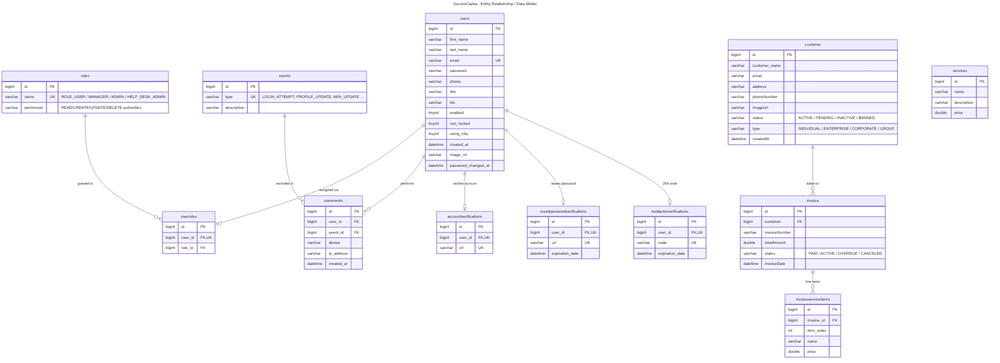
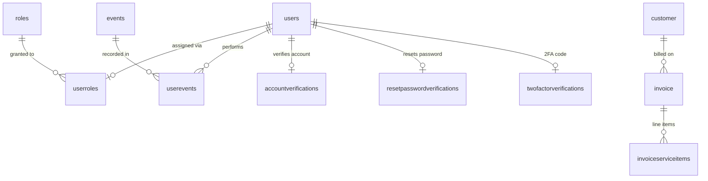
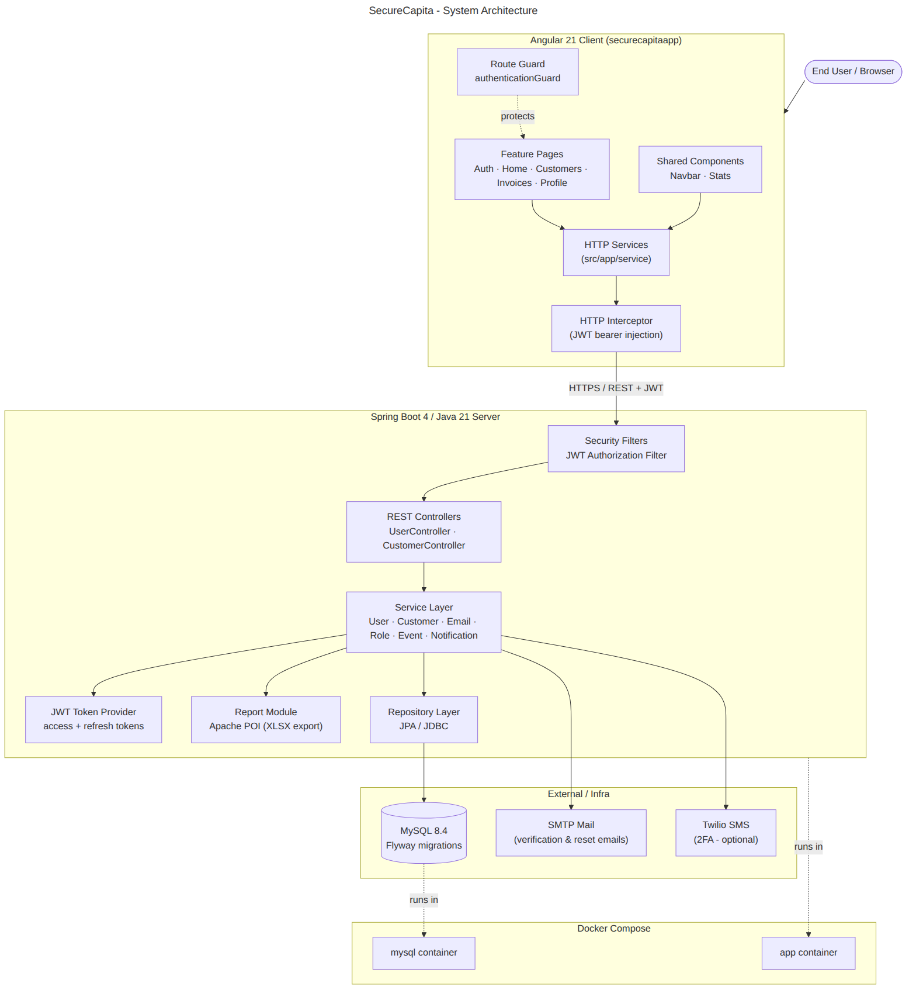
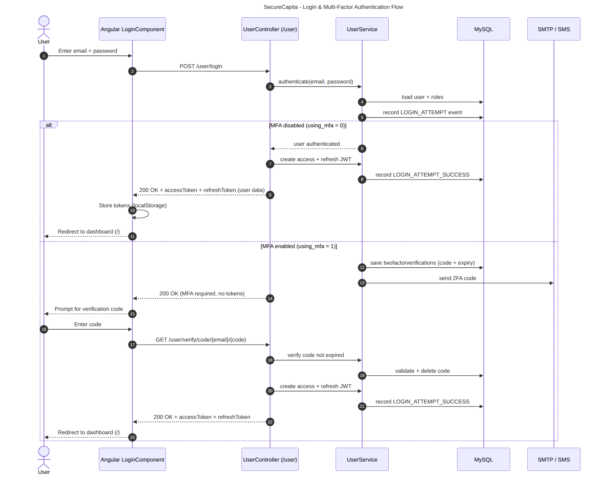
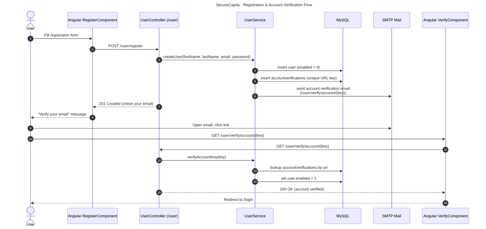
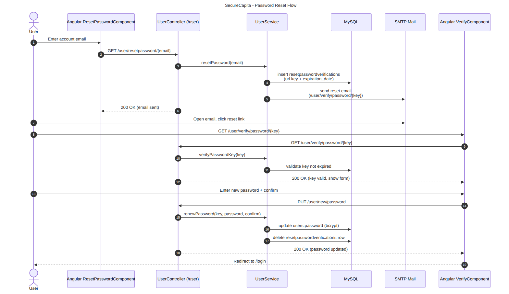
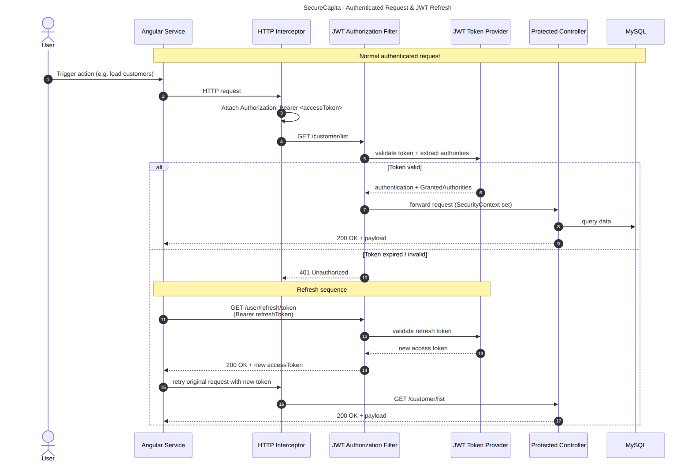
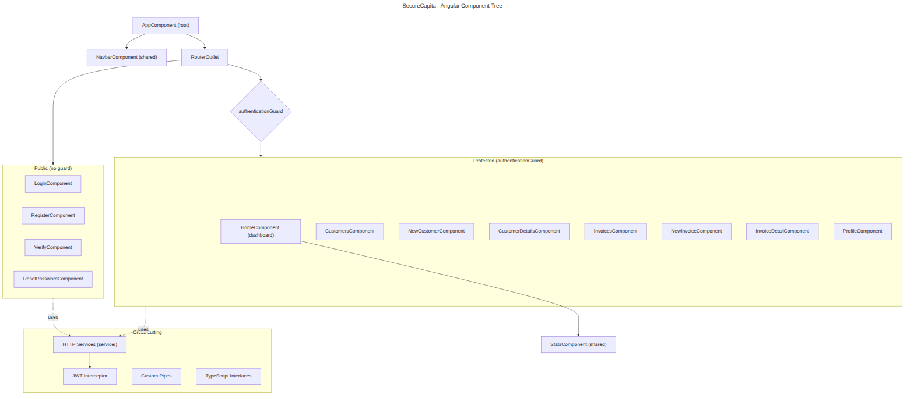
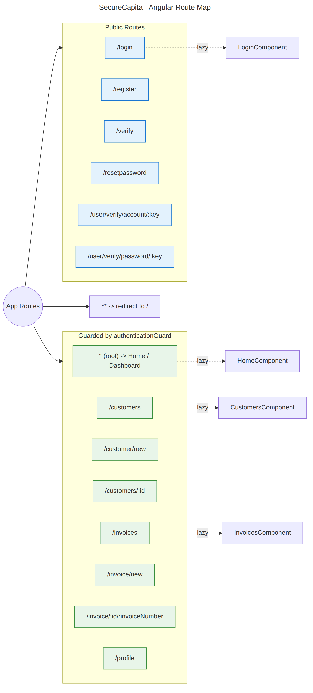
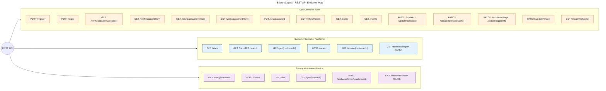

# SecureCapita — Visual Documentation

Visual reference for the Angular + Spring Boot full-stack invoicing application.

Every diagram exists in three forms:

- **Mermaid source** — `src/*.mmd` (editable, version-controlled, renders on GitHub)
- **SVG** — `img/*.svg` (crisp, scalable, transparent background)
- **PNG** — `img/*.png` (2× scale, white background, for slides/docs)

To regenerate after editing a source file:

```bash
npm install -g @mermaid-js/mermaid-cli   # one-time, provides `mmdc`
./render.sh                              # renders all src/*.mmd -> img/
```

---

## 1. Entity Relationship / Data Model

The MySQL schema: identity (`users` ↔ `roles` ↔ `events`), account lifecycle
verifications, and the invoicing core (`customer` → `invoice` → `invoiceserviceitems`),
plus the standalone `services` catalog.



<details><summary>Mermaid source</summary>



Full source: [`src/er-data-model.mmd`](src/er-data-model.mmd)
</details>

---

## 2. System Architecture

Request path from the browser through the Angular client (guard → services →
JWT interceptor), across REST to the Spring Boot layers (security filter →
controllers → services → token provider / report / repository), down to MySQL,
mail, and SMS — all packaged via Docker Compose.



Source: [`src/architecture.mmd`](src/architecture.mmd)

---

## 3. Authentication & Sequence Flows

### 3a. Login & Multi-Factor Authentication

`POST /user/login`; if `using_mfa` is set, a code is emailed and exchanged at
`GET /user/verify/code/{email}/{code}` for access + refresh JWTs.



Source: [`src/auth-login-flow.mmd`](src/auth-login-flow.mmd)

### 3b. Registration & Account Verification

`POST /user/register` creates a disabled user and emails a unique verification
link (`/user/verify/account/{key}`) that flips `enabled = 1`.



Source: [`src/auth-registration-verification.mmd`](src/auth-registration-verification.mmd)

### 3c. Password Reset

`GET /user/resetpassword/{email}` emails a time-limited link; the new password
is submitted via `PUT /user/new/password`.



Source: [`src/auth-password-reset.mmd`](src/auth-password-reset.mmd)

### 3d. Authenticated Request & JWT Refresh

The interceptor attaches the bearer token; the JWT authorization filter validates
it. On expiry, `GET /user/refresh/token` issues a fresh access token and the
request is retried.



Source: [`src/auth-jwt-request.mmd`](src/auth-jwt-request.mmd)

---

## 4. Frontend Maps

### 4a. Angular Component Tree

Root → navbar + router; public auth components vs. guard-protected feature
components; shared services / interceptor / pipes as cross-cutting concerns.



Source: [`src/frontend-component-tree.mmd`](src/frontend-component-tree.mmd)

### 4b. Route Map

Public routes (blue) vs. `authenticationGuard`-protected routes (green), with
lazy-loaded standalone components and the wildcard redirect.



Source: [`src/frontend-route-map.mmd`](src/frontend-route-map.mmd)

### 4c. REST API Endpoint Map

All endpoints grouped by controller: `UserController` (`/user`),
`CustomerController` (`/customer`), and the invoice sub-routes
(`/customer/invoice`).



Source: [`src/api-endpoint-map.mmd`](src/api-endpoint-map.mmd)

---

_Generated with [mermaid-cli](https://github.com/mermaid-js/mermaid-cli). Edit the
`.mmd` sources and re-run `./render.sh` to keep the images in sync._
