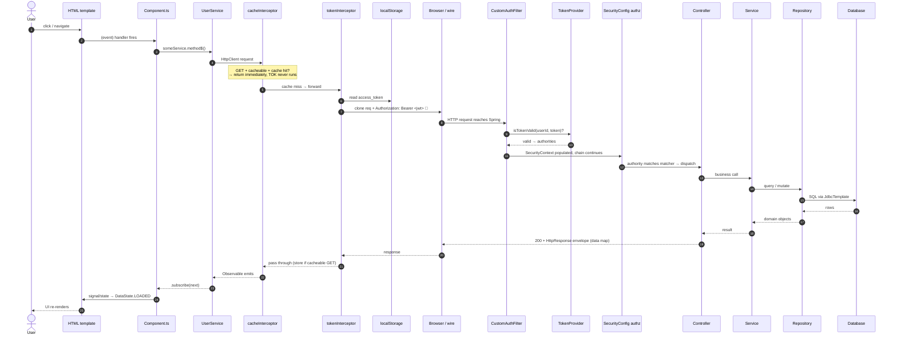
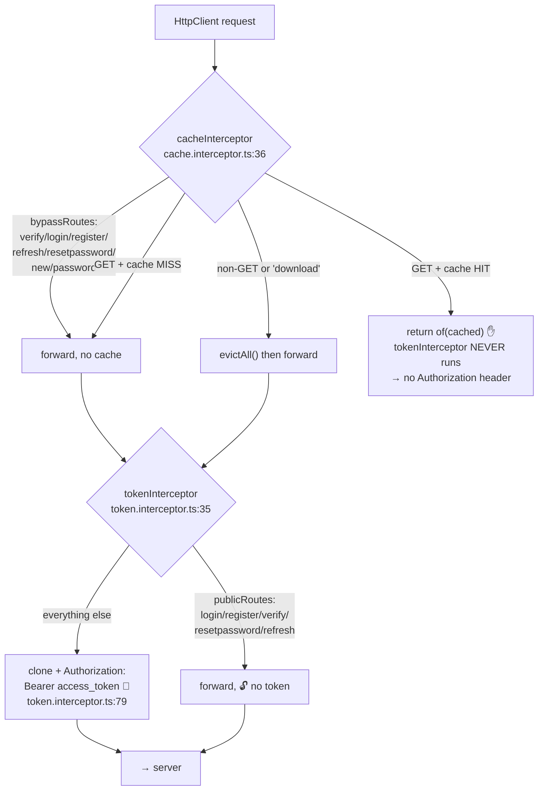
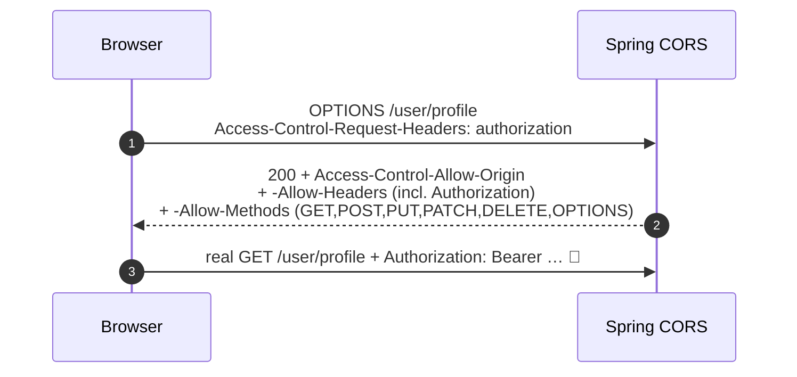
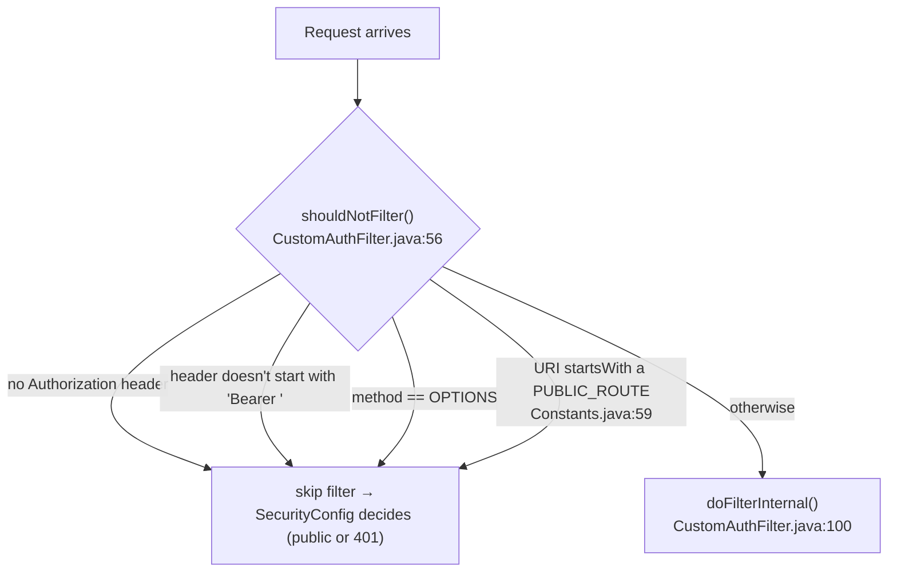
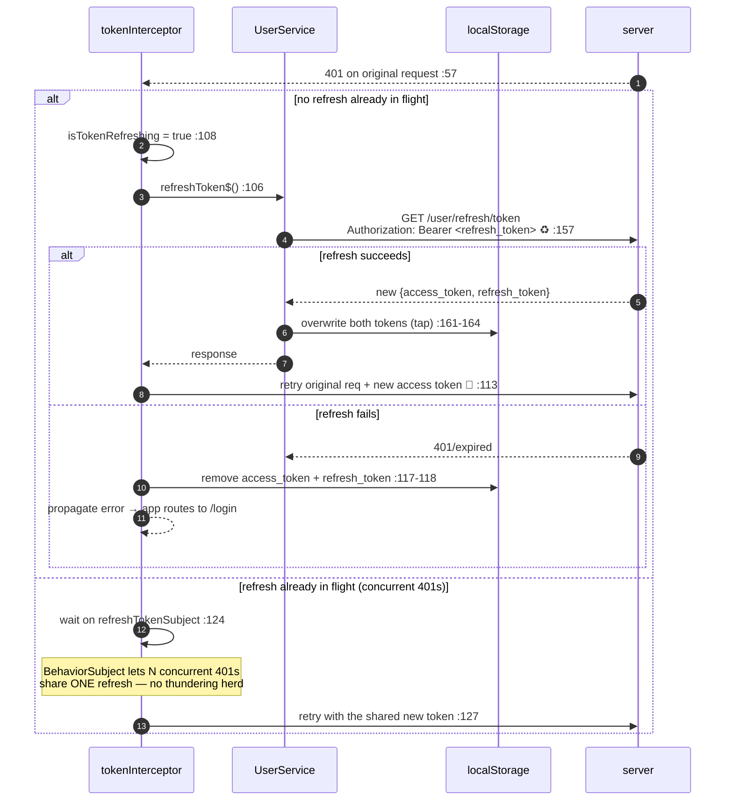
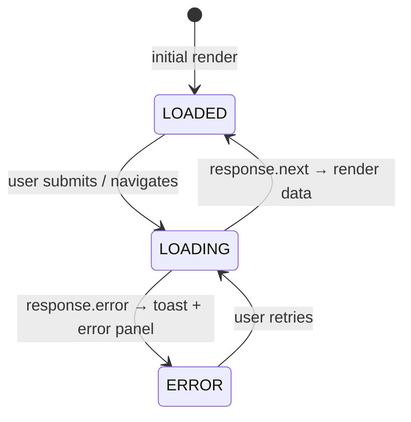

# 00 · Anatomy of a Request

> The shared machinery every flow rides on. Read this once; the per-flow docs assume it
> and only call out where they diverge. All lifeline names are defined in the
> [README cast table](./README.md#the-shared-cast-sequence-diagram-lifelines).

A single authenticated request — say the Profile page loading `GET /user/profile` — touches
**eleven** distinct pieces of code across the two tiers before the user sees a pixel change.
This document walks all eleven in order, then details the JWT anatomy, the authorization
matcher table, and the error/refresh paths that the happy path doesn't show.

---

## 1. The 30,000-foot view



Everything below is a zoom-in on one of these hops.

---

## 2. Frontend egress: how a request leaves the browser

### 2.1 Component → service

Components never call `HttpClient` directly. They call a method on a service that returns a
typed `Observable` of the standard envelope. Example
(`securecapitaapp/src/app/service/user.service.ts:117`):

```ts
profile$ = (): Observable<CustomHttpResponseInterface<ProfileInterface>> =>
  this.http.get<...>(`${this.server}/user/profile`).pipe(tap(console.log), catchError(this.handleError));
```

`this.server` is `environment.apiUrl` (`securecapitaapp/src/environments/environment.ts`) — the
hardcoded API base. `handleError` (`user.service.ts:419`) normalizes every failure into one
`Error` carrying the server's `reason` string, so components handle errors uniformly.

### 2.2 The interceptor chain — order is load-bearing

Both interceptors are registered, **in this order**, at
`securecapitaapp/src/app/app.config.ts:49`:

```ts
provideHttpClient(withInterceptors([cacheInterceptor, tokenInterceptor]))
```



**Why the order matters (a real correctness/security property):** because `cacheInterceptor`
runs *first*, a cache hit returns via `of(cachedResponse)` (`cache.interceptor.ts:81`) **without
ever calling `next()`** — so `tokenInterceptor` is skipped and no `Authorization` header is
attached to a request that never leaves the browser. The two interceptors also keep *separate*
bypass lists for *different* reasons:

- `cacheInterceptor.bypassRoutes` (`cache.interceptor.ts:47`) — these endpoints return
  *non-cacheable* data (a login returns a token, not a resource) or are flows where stale data
  would be harmful (password reset).
- `tokenInterceptor.publicRoutes` (`token.interceptor.ts:49`) — these are hit *before* a token
  exists, so attaching one is pointless or wrong. Note `refresh` is here because the refresh call
  sends the **refresh** token explicitly, not the access token (see §6).

> ⚠️ **`logOut()` evicts the cache for a reason.** `UserService.logOut()`
> (`user.service.ts:405`) clears both tokens *and* calls `httpCache.evictAll()`. Without that,
> a second user signing in within the same SPA session (no full page reload) could be served the
> first user's cached `/user/profile` — a cross-session leak. The login POST is in `bypassRoutes`,
> so it would never trigger the normal mutation-based eviction.

---

## 3. The wire: CORS preflight & headers

For any "non-simple" cross-origin request (anything with an `Authorization` header, or a
`PATCH`/`PUT`/`DELETE`), the browser first sends an **`OPTIONS` preflight**. Two things in the
backend handle this:

1. **`CustomAuthFilter.shouldNotFilter`** (`filter/CustomAuthFilter.java:56`) returns `true` for
   `OPTIONS` (`request.getMethod().equalsIgnoreCase("OPTIONS")`) — so the JWT filter never runs on
   a preflight.
2. **`SecurityConfig#corsConfigurationSource`** (`configuration/SecurityConfig.java:206`) answers
   the preflight with the allowed origins/headers/methods.



Allowed origins are `http://localhost:4200`, `http://localhost:3000`, and
`https://angularsecureapp.org` (`SecurityConfig.java:209-213`). The config both **allows** the
`Authorization`/`Jwt-Token` request headers and **exposes** them as response headers
(`SecurityConfig.java:214-234`) so the SPA can read a refreshed token. `allowCredentials(true)`
is set because the frontend sends an `Authorization` header.

---

## 4. Backend ingress: the JWT filter

`CustomAuthFilter` extends `OncePerRequestFilter` and is registered **before**
`UsernamePasswordAuthenticationFilter` (`SecurityConfig.java:181`), so a JWT is validated and an
`Authentication` is placed in the `SecurityContext` *before* the authorization rules run.

### 4.1 Should the filter even run?



> ⚠️ **Two public lists, kept in lockstep on purpose.** `PUBLIC_ROUTES`
> (`Constants.java:59`, used here by the *filter*) and `PUBLIC_URLS` (`Constants.java:16`, used by
> `SecurityConfig`'s *authorization* rules) are deliberately duplicated. The Javadoc at
> `Constants.java:52-57` spells out the trap: if a route is permitted by the filter chain but
> *not* skipped here, a stale `Authorization: Bearer` header from the client would make the filter
> try to parse it and fail with a 401 *before the request ever reaches the public controller*.
> When you add a public endpoint, add it to **both** lists.

### 4.2 What the filter does when it runs

```mermaid
sequenceDiagram
    autonumber
    participant FILT as CustomAuthFilter
    participant TP as TokenProvider
    participant USVC as UserService
    participant SC as SecurityContextHolder
    FILT->>FILT: token = getToken(req)  (strip "Bearer ")  :144
    FILT->>TP: getSubject(token, req) → userId  :157
    Note over TP: verify signature + issuer + exp;<br/>remap library errors → 401/400 :285
    FILT->>TP: isTokenValid(userId, token)?  :105
    TP->>USVC: getUserById(userId).getPasswordChangedAt()
    Note over TP: reject if expired OR issued BEFORE<br/>last password change :240
    TP-->>FILT: true
    FILT->>TP: getAuthorities(token)  :106
    alt authorities EMPTY (refresh token sent to a non-refresh route)
        TP-->>FILT: []
        FILT->>SC: clearContext()  :109
        Note over SC: stays unauthenticated →<br/>SecurityConfig returns 401
    else access token (has authorities)
        TP-->>FILT: [READ:USER, …]
        FILT->>TP: getAuthentication(userId, authorities, req)  :111
        FILT->>SC: setAuthentication(authToken)  :112
    end
    FILT->>FILT: filterChain.doFilter() — ALWAYS continues  :119
```

Three properties worth internalizing, because they recur in many flows:

1. **The filter never short-circuits.** Even on an invalid token it clears the context and calls
   `filterChain.doFilter()` (`CustomAuthFilter.java:119`). The *authorization* layer (§5) and the
   `CustomAuthenticationEntryPoint` (§7) produce the actual 401 — not the filter.
2. **A refresh token can pass verification but cannot authenticate.** `TokenProvider.getJWTVerifier()`
   intentionally does **not** require the `authorities` claim (`TokenProvider.java:201-203`), so a
   refresh token verifies. But `getAuthorities` returns `[]` for it, and the filter then *clears*
   the context (`:107-109`). This is how one filter safely serves both token types: a refresh token
   is powerless everywhere except `/user/refresh/token` (which is public and reads the token itself).
3. **`passwordChangedAt` is a global kill-switch.** `isTokenValid` rejects any token *issued before*
   the user's last password change (`TokenProvider.java:244-250`). Changing a password instantly
   invalidates every access/refresh token previously minted on every device.

---

## 5. Authorization: the matcher table

Once the `SecurityContext` holds (or doesn't hold) an `Authentication`, Spring evaluates the
`authorizeHttpRequests` rules **top-to-bottom, first match wins**
(`SecurityConfig.java:136-164`). Order is therefore as load-bearing as the interceptor order:

| Order | Matcher | Requirement |
| --- | --- | --- |
| 1 | `POST /user/register` | `permitAll` |
| 2 | `POST /user/login` | `permitAll` |
| 3 | `/actuator/**` | `permitAll` |
| 4 | `PUBLIC_URLS` (verify, reset, refresh, oauth2, …) | `permitAll` |
| 5 | `DELETE /user/delete/**` | `DELETE:USER` |
| 6 | `DELETE /customer/delete/**` | `DELETE:CUSTOMER` |
| 7 | `PATCH /admin/user/*/role/**` | `UPDATE:ROLE` |
| 8 | `PATCH /admin/user/*/settings` | `UPDATE:USER` |
| 9 | `/admin/**` | `UPDATE:USER` **or** `UPDATE:ROLE` |
| 10 | `/user/totp/**` | `authenticated` (any logged-in user) |
| 11 | `/user/sessions/**` | `authenticated` |
| 12 | `GET /**` | `READ:USER` **or** `READ:CUSTOMER` |
| 13 | `POST /**` | `UPDATE:USER` **or** `UPDATE:CUSTOMER` |
| 14 | `PUT /**` | `UPDATE:USER`/`UPDATE:CUSTOMER`/`UPDATE:ROLE` |
| 15 | anything else | `authenticated` |

Two subtleties the comments call out:

- **Specific admin matchers precede the catch-alls (7-9 before 12-14)** so role reassignment can
  demand `UPDATE:ROLE` specifically. `AdminUserController` *also* repeats these with
  `@PreAuthorize`, so URL-level and method-level enforcement stay in lockstep (defense in depth,
  `SecurityConfig.java:143-152`).
- **Self-service security endpoints (10-11) precede the catch-alls** so managing your *own* second
  factor or sessions needs only `authenticated`, not a staff authority — every handler scopes its
  work to the token's principal (`SecurityConfig.java:153-159`).

Authorities themselves come from the user's `Role.permission` string, split into
`SimpleGrantedAuthority` instances and embedded in the access token's `authorities` claim at issue
time (`TokenProvider.java:78, 91-95`).

---

## 6. JWT anatomy

Both tokens are signed with **HMAC512** using `${jwt.secret}` and share an issuer
(`BOBBYLON_LLC`) and audience (`BOBS_MANAGEMENT`). What differs is the claim set and lifetime:

| Claim | Access token | Refresh token |
| --- | --- | --- |
| `sub` (subject) | user **ID** (numeric, as string) | user **ID** |
| `authorities` | ✅ `["READ:USER", …]` | ❌ omitted (this is the whole trick — §4.2) |
| `sid` (`SESSION_FAMILY`) | ✅ session family | ✅ session family |
| `jti` | ❌ | ✅ row key of the `refreshsessions` record |
| `iat` / `exp` | issued-at / **30 min** (`ACCESS_TOKEN_EXPIRE_TIME = 1_800_000`) | issued-at / **5 days** (`REFRESH_TOKEN_EXPIRE_TIME = 432_000_000`) |

Source: `TokenProvider.createAccessToken` (`:72`), `createRefreshToken` (`:113`); constants at
`Constants.java:80-82`.

- **`sub` is the user ID, not the email.** The filter parses it back to `Long`
  (`CustomAuthFilter.getUserID`, `:156`) and every downstream lookup is by ID.
- **`sid` does not gate validation** — access tokens stay fully stateless. It exists so the
  sessions endpoint and the SPA (which decodes its own token) can mark *which* listed session is
  "this device" (`TokenProvider.java:64-66`). See [`12-sessions-and-devices.md`](./12-sessions-and-devices.md).
- **`jti` turns a stateless JWT into a revocable session token.** The refresh endpoint resolves it
  against the `refreshsessions` table for rotation and reuse detection. See
  [`05-token-refresh-sessions.md`](./05-token-refresh-sessions.md).

The SPA decodes its own access token client-side via `@auth0/angular-jwt`
(`user.service.ts:29`) for two **usability-only** checks — never trust these for security, the
backend re-checks everything:

- `isAuthenticated()` (`user.service.ts:369`) — token present and not expired → drives
  `authenticationGuard` (`guard/authentication.guard.ts:21`).
- `hasAnyAuthority(...)` (`user.service.ts:385`) — decodes the `authorities` claim → drives
  `adminGuard` and the navbar's admin links. A tampered token changes what *renders* but never
  what the API *permits* (`user.service.ts:376-384`).

---

## 7. The unhappy paths

### 7.1 Backend: 401 vs 403

Two custom handlers replace Spring's default HTML error pages with the JSON `HttpResponse`
envelope (wired at `SecurityConfig.java:182-184`):

| Situation | Handler | Status | Body `reason` |
| --- | --- | --- | --- |
| Not authenticated (no/expired/invalid token) on a protected route | `CustomAuthenticationEntryPoint` (`handler/CustomAuthenticationEntryPoint.java:53`) | **401** | "I don't think you are logged in :( Please login to access this resource!" |
| Authenticated but missing the required authority | `CustomAccessDeniedHandler` (`handler/CustomAccessDeniedHandler.java:52`) | **403** | "You don't have enough permission to access this resource!" |
| Exception *inside* the JWT filter (bad/expired token parsing) | `ExceptionUtils.processError` (`utils/ExceptionUtils.java:46`) | 401 / 400 / 500 | mapped per exception type |

`processError` is the filter's own serializer: `JWTVerificationException` → 401, known auth
exceptions (`ApiException`/`DisabledException`/`LockedException`/`BadCredentialsException`) → 400
with the message, anything else → a generic 500 so internals don't leak (`ExceptionUtils.java:46-58`).

Every error body is the same `HttpResponse` shape (`model/HttpResponse.java`), and the SPA's
`handleError` reads `error.error.reason` from it (`user.service.ts:425`).

### 7.2 Frontend: 401 → silent refresh → retry

This is the single most important branch in the app, and it lives in `tokenInterceptor`. When any
protected request comes back **401**, the interceptor attempts one silent refresh and retries the
original request once:



Key files: `token.interceptor.ts:55-62` (catch 401), `:101-129` (the refresh state machine),
`user.service.ts:153-167` (`refreshToken$`, which writes the new tokens into `localStorage` via
its `tap`). The module-level `isTokenRefreshing` flag + `refreshTokenSubject`
(`token.interceptor.ts:11-12`) are what make concurrent 401s collapse onto a single refresh call.

---

## 8. The return trip: how the UI changes

Components model their view as an explicit state machine using the `DataState` enum
(`securecapitaapp/src/app/enumeration/datastate.enum.ts`): `LOADING` → `LOADED` | `ERROR`. The
template (`*.component.html`) switches on the current state with `@if`/`*ngIf`:



Modern components (e.g. `LoginComponent`) hold this in an Angular **signal**
(`login.component.ts:29`) under `ChangeDetectionStrategy.OnPush`, so a `signal.set(...)` is what
triggers re-render — no manual change detection. Older feature pages use the same idea with an
RxJS `appState$` observable + the `async` pipe; both converge on "swap the template branch when
`dataState` changes." User-facing errors are also surfaced as toasts via `NotificationsService`
(ngx-toastr, configured in `app.config.ts:53`).

---

## What every per-flow doc adds on top of this

Each per-flow doc focuses on **its specifics**: which button in which template, which component
method, which `UserService`/service call, which controller method and service/repo path, what the
`data` map carries, and which `DataState` transitions the user sees. Where a flow touches the
machinery above (token attach, 401 refresh, authorization), it links back here instead of
re-explaining it.

→ Next: [`01-register-and-verify.md`](./01-register-and-verify.md)
