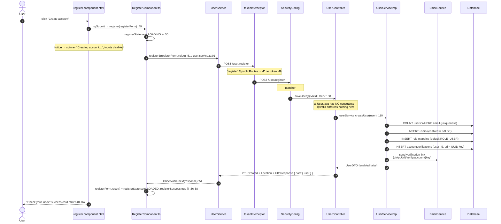
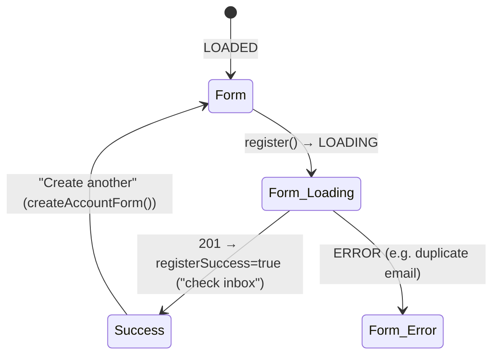
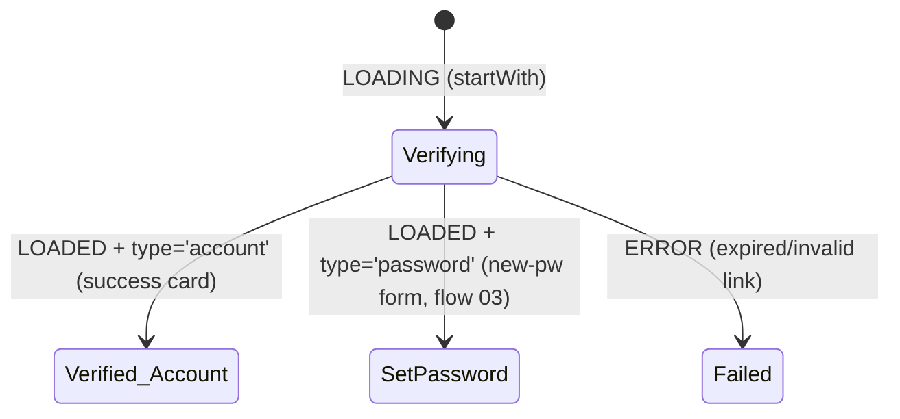

# 01 · Register / signup + account-email verification

> Assumes [`00-anatomy-of-a-request.md`](./00-anatomy-of-a-request.md). Two flows that bookend
> account creation: **A** creates a disabled account and emails a link; **B** is the user clicking
> that link to enable it.

**Routes:** `/register` → `RegisterComponent` · `/verify/account/:key` → `VerifyComponent`
**Endpoints:** `POST /user/register` (public) · `GET /user/verify/account/{key}` (public)

---

## A · Registration

### What the user does
1. Fills first name / last name / email / password (`register.component.html:91-136`).
2. Clicks **Create account** (`<button type="submit">`, `:125`); disabled while `LOADING` or the
   form is `invalid`/`pristine` (`:126`).
3. `(ngSubmit)="register(registerForm)"` (`:91`) → `RegisterComponent.register()`
   (`register.component.ts:49`).

### The full trace



### Where the real validation boundary is
- **Client-side only:** `firstName`/`lastName` `required minlength=2`, `email` `required type=email`,
  `password` `required minlength=4` (`register.component.html:96-122`). These gate the *button*,
  not the API — a direct `POST` bypasses them.
- **Server-side:** `saveUser` declares `@Valid User`, but `User.java` (`model/User.java`) has no
  Bean Validation annotations, so **no field validation runs**. The only enforced rule is email
  uniqueness inside `createUser` via `COUNT_USER_EMAIL_QUERY`.
- New accounts are created `enabled = false`; they cannot log in until flow B runs.

> 🔎 **Enumeration note.** Duplicate-email rejection at signup is one place the app *can* reveal that
> an email exists — unavoidable for a self-service signup that must prevent duplicates. This differs
> from login, which is deliberately enumeration-safe (see [`02 §D`](./02-login-and-mfa.md)).

### Registration UI state machine

`@if (!state.registerSuccess)` → form; `@if (state.registerSuccess)` → success card
(`register.component.html:72, 148`).

---

## B · Account-email verification

### What the user does
Clicks the emailed link → browser opens the SPA at `/verify/account/:key` (no `/user` prefix — that path belongs to the API and would be answered by the real controller once both are served from one origin)
(`app.routes.ts:32`). `VerifyComponent` fires the verification call automatically on load — there is
no button; the route param *is* the trigger.

```mermaid
sequenceDiagram
    autonumber
    actor U as User
    participant RT as Angular Router
    participant CMP as VerifyComponent.ts
    participant SVC as UserService
    participant CTRL as UserController
    participant SRV as UserServiceImpl
    participant DB as Database

    U->>RT: open emailed link /verify/account/{key}
    RT->>CMP: route activates → ngOnInit  :62
    CMP->>CMP: paramMap.switchMap → startWith(LOADING)  :63-83
    Note over CMP: getAccountType(url) → 'account'  :68,158
    CMP->>SVC: verifyAccount$(key, 'account')  :69 / user.service.ts:44
    SVC->>CTRL: GET /user/verify/account/{key}  🔓 public
    Note over CTRL: PUBLIC_URLS + PUBLIC_ROUTES → filter skipped
    CTRL->>CTRL: TimeUnit.SECONDS.sleep(3) (loading-state demo)  :186
    CTRL->>SRV: userService.verifyAccount(key)  :190
    SRV->>DB: SELECT user by accountverifications.url
    SRV->>DB: UPDATE users SET enabled = TRUE
    SRV-->>CTRL: User (isEnabled?)
    CTRL-->>SVC: 200 { message: "Account verified…" / "already verified…" }
    SVC-->>CMP: map → { LOADED, 'account', verifySuccess:true }  :70-76
    CMP->>CMP: verifyState.set(state)  :97
    Note over CMP: switchMap cancels stale calls;<br/>startWith re-shows spinner each cycle
    CMP-->>U: success card "Continue to sign in"  html:100-118
```

The idempotent message branch is decided server-side: `verifyAccount(...).isEnabled()` picks
"already verified" vs. "verified successfully" (`UserController.java:190`).

### Verify UI state machine (shared with password reset — see flow 03)

Template switches on `state.dataState` then `state.type` (`verify.component.html:76-200`).

---

## C · Failure paths

| Failure | Where | User sees |
| --- | --- | --- |
| Duplicate email | `createUser` uniqueness check | ERROR alert in form + toast |
| Malformed/blank fields via direct API | not caught server-side (no `@Valid` constraints) | depends on DB/service; client form blocks it in the UI |
| Expired / unknown verification key | `verifyAccount` service throws → `GlobalExceptionHandler` 400 | `catchError` → red "Verification Failed :(" card (`verify.component.ts:84-92`) |
| Already verified | not an error — handled gracefully | "already verified, please log in" success card |

---

## D · Wire-level detail

### D.1 · Registration request
```http
POST /user/register HTTP/1.1
Host: localhost:8080
Origin: http://localhost:4200
Content-Type: application/json
Accept: application/json

{ "firstName": "Ada", "lastName": "Lovelace", "email": "ada@example.com", "password": "S3cret!" }
```
Body = `registerForm.value` verbatim (`register.component.ts:51`). The TS call site type is
`UserInterface & { password: string }` so `password` is required at compile time even though the API
never returns it (`user.service.ts:91`).

### D.2 · Registration response (`201`)
```http
HTTP/1.1 201 Created
Location: http://localhost:8080/user/get/<userId>
Content-Type: application/json
```
```jsonc
{
  "timeStamp": "10:02:55.781",
  "data": { "user": { "id": 73, "firstName": "Ada", "lastName": "Lovelace",
                       "email": "ada@example.com", "enabled": false, "notLocked": true,
                       "using2FA": false, "usingTotp": false, "roleName": "ROLE_USER",
                       "permissions": "READ:USER,UPDATE:USER,READ:CUSTOMER,UPDATE:CUSTOMER" } },
  "message": "User created successfully for user: ada@example.com",
  "status": "CREATED",
  "statusCode": 201
}
```
The `Location` URI is built by `getUri()` (`UserController.java:127-129`).

### D.3 · Verification request / response
```http
GET /user/verify/account/abc-12ef-uuid HTTP/1.1
Host: localhost:8080
Accept: application/json
                                ← no Authorization (public; filter skips /user/verify/account prefix)
```
```jsonc
// 200 OK  (note: deliberate 3-second delay before the body, UserController.java:186)
{ "timeStamp": "…", "message": "Account verified successfully! You can now log in.",
  "status": "OK", "statusCode": 200 }
```

### D.4 · SQL executed

| Flow | Query constant | SQL |
| --- | --- | --- |
| register: uniqueness | `UserQuery.COUNT_USER_EMAIL_QUERY` | `SELECT COUNT(*) FROM users WHERE email = :email` |
| register: create | `UserQuery.INSERT_USER_QUERY` | `INSERT INTO users (first_name,last_name,email,password) VALUES (…)` |
| register: verify row | `UserQuery.INSERT_ACCOUNT_VERIFICATION_URL_QUERY` | `INSERT INTO accountverifications (user_id, url) VALUES (:userId, :url)` — `url` stores a **bare UUID**, not a link |
| verify: resolve key | `UserQuery.SELECT_USER_BY_ACCOUNT_QUERY` | `SELECT * FROM users WHERE id = (SELECT user_id FROM accountverifications WHERE url = :url)` |
| verify: enable | `UserQuery.UPDATE_USER_ENABLED_QUERY` | `UPDATE users SET enabled = :enabled WHERE id = :id` |

### D.5 · Password is hashed, never stored raw
`createUser` BCrypts the password before `INSERT` (the same `BCryptPasswordEncoder` bean
`SecurityConfig` uses to verify it at login). The `users.password` column only ever holds the hash;
`UserDTO` omits the field entirely so it can never serialize to JSON (`dto/UserDTO.java:47`).

---

## Cross-links
- The login this account can now perform → [`02-login-and-mfa.md`](./02-login-and-mfa.md)
- The *password-reset* half of `VerifyComponent` → [`03-password-reset.md`](./03-password-reset.md)
- The audit-event machinery (`NewUserEvent` → `NewUserEventListener` → `userevents`) → [`10-profile-and-account.md`](./10-profile-and-account.md)
