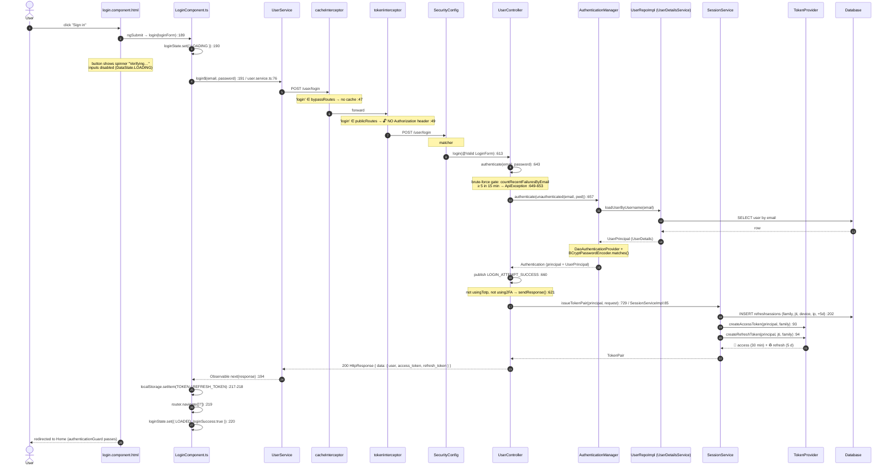
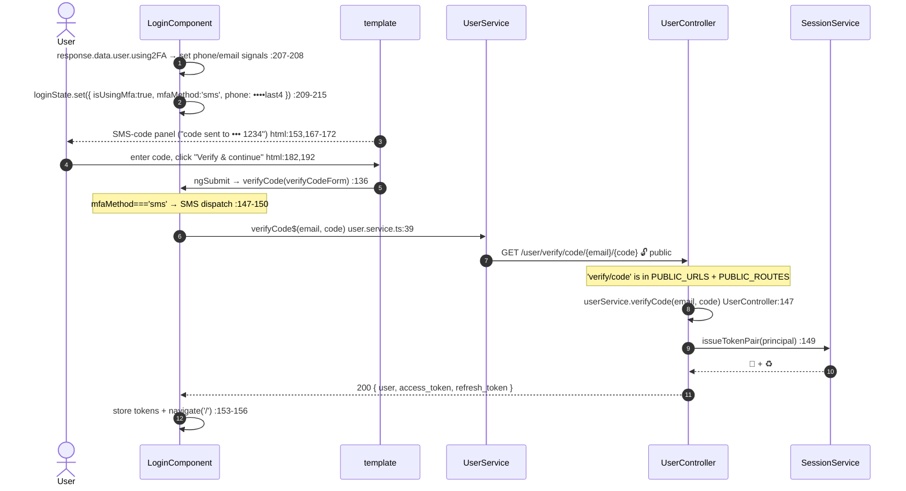
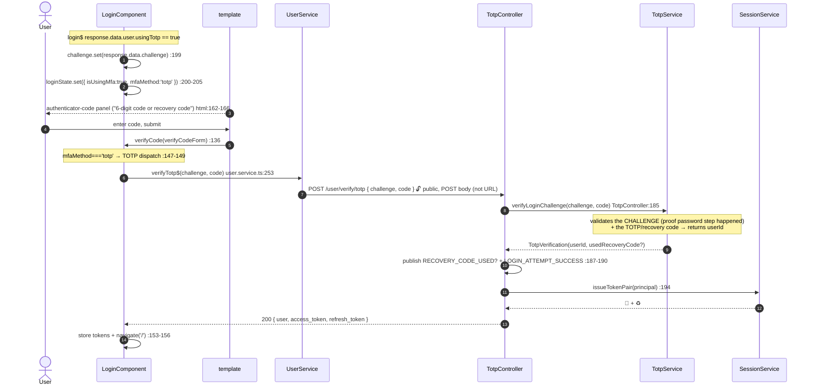
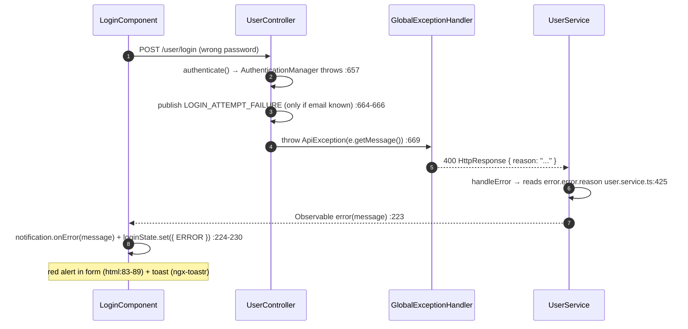
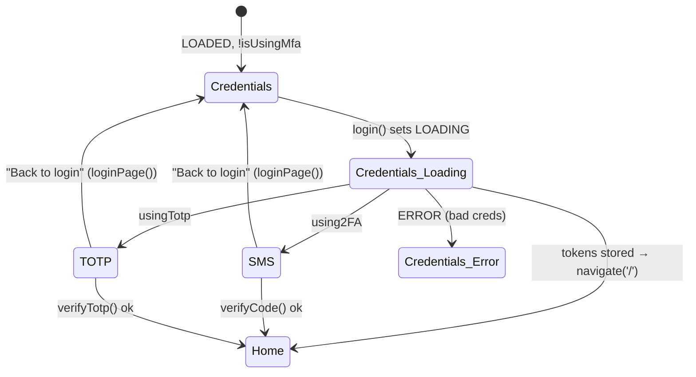

# 02 · Login (password) + SMS-MFA + TOTP

> Assumes you've read [`00-anatomy-of-a-request.md`](./00-anatomy-of-a-request.md). This doc
> details the login screen's three outcomes and only references the shared interceptor/filter
> machinery where it matters.

**Route:** `/login` → `LoginComponent`
(`securecapitaapp/src/app/features/auth/login/login.component.ts`, `.html`)
**Primary endpoints:** `POST /user/login` · `GET /user/verify/code/{email}/{code}` · `POST /user/verify/totp`

`POST /user/login` **always returns `200`**. What differs is the `data` map — that single fact is
the key to the whole screen. The component inspects the returned `user` and branches three ways
(`login.component.ts:195-221`):

| Backend condition | `data` carries | UI outcome |
| --- | --- | --- |
| `user.usingTotp == true` | `user` + `challenge` (no tokens) | swap to authenticator-code panel |
| `user.using2FA == true` | `user` only (SMS already sent) | swap to SMS-code panel |
| neither | `user` + `access_token` + `refresh_token` | store tokens, navigate to `/` |

---

## A · Password login, no MFA (the happy path)

### What the user does
1. Types email + password into the form (`login.component.html:91-121`).
2. Clicks **Sign in** (`<button type="submit">`, `login.component.html:110`). The button is
   disabled while `dataState === LOADING` or the form is `invalid`/`pristine` (`:111`).
3. `(ngSubmit)="login(loginForm)"` (`:91`) fires the component method with the `NgForm`.

### The full trace



### Where the credentials are actually checked
`authenticationManager.authenticate(...)` (`UserController.java:657`) delegates to the
`DaoAuthenticationProvider` configured in `SecurityConfig.authenticationManager`
(`SecurityConfig.java:257-262`). That provider:
1. loads the user through `UserRepoImpl` (the app's `UserDetailsService`), and
2. compares the submitted password against the stored BCrypt hash via the `BCryptPasswordEncoder`
   bean (`SecurityConfig.java:259`).

`setHideUserNotFoundExceptions(false)` (`SecurityConfig.java:260`) lets a missing user surface as a
distinct exception for the global handler — but note the **enumeration-safe** event handling: the
`LOGIN_ATTEMPT`/`LOGIN_ATTEMPT_FAILURE` audit events only fire when the email resolves to a real
user (`UserController.java:649-666`), so timing/audit behavior doesn't leak account existence.

### Token issuance is a single seam
Every successful authentication path in the app funnels through
`SessionService.issueTokenPair` (`SessionServiceImpl.java:85`) — login, SMS verify, and TOTP verify
all call it. It does three things atomically from the caller's view: mint a `family` + `jti`
(`:88-89`), `INSERT` a `refreshsessions` row stamped with device + IP + a 5-day expiry (`:202-209`),
and return the access/refresh pair carrying those ids in their `sid`/`jti` claims. That's why a
brand-new login immediately shows up in the Security Center device list
([`12-sessions-and-devices.md`](./12-sessions-and-devices.md)).

---

## B · SMS-MFA branch (`user.using2FA`)

When the authenticated user has SMS 2FA on, `UserController.login` calls `sendVerificationCode`
(`:621, 706`) which sends the code (Twilio — stubbed in dev) and returns the user **without
tokens**. The component reacts (`login.component.ts:206-215`):



**Why it's keyed by email and that's OK:** the code only exists because `authenticate()` already
verified the password and triggered the send. Possessing the SMS code *is* proof the first factor
passed. (Contrast with TOTP below.)

---

## C · TOTP branch (`user.usingTotp`) — the asymmetric one

A confirmed authenticator **supersedes** SMS (`UserController.java:617-621`: `usingTotp` is checked
first). Instead of tokens, the backend mints an opaque **challenge** and returns it
(`sendTotpChallenge`, `:686-696`):



The challenge is held in a private signal (`login.component.ts:53`) and submitted as a **POST body**
so it never reaches URL or proxy logs (`user.service.ts:241-256`). The route contains `verify`, so
`tokenInterceptor` correctly attaches no header (`token.interceptor.ts:49`). A recovery code is
accepted in place of a live TOTP code here — the same input box handles both.

> This branch is also reachable from **federated login**: an OAuth2 first factor for a TOTP-enrolled
> account bounces the browser to `/login?mfa=totp&challenge=...`, and `ngOnInit` jumps straight into
> this same panel (`login.component.ts:106-114`). See [`04-federated-oauth2.md`](./04-federated-oauth2.md).

---

## D · Failure paths



| Failure | Where | User sees |
| --- | --- | --- |
| Wrong password / unknown email | `authenticate()` catch → `ApiException` (`:663-670`) | generic error alert + toast (no hint about which was wrong — enumeration-safe) |
| Too many failures (≥ 5 in 15 min) | brute-force gate (`:649-653`) | "Too many failed login attempts. Please wait 15 minutes…" |
| Wrong MFA code | service throws → `GlobalExceptionHandler` → 400 | error panel stays on the MFA screen (`login.component.ts:158-168`) |
| Disabled / locked account | `DaoAuthenticationProvider` → `DisabledException`/`LockedException` → 400 | error alert |

The brute-force window/threshold are constants on the controller:
`BRUTE_FORCE_MAX = 5`, `BRUTE_FORCE_WINDOW_MINUTES = 15` (`UserController.java:87-89`). The check is
deliberately enumeration-safe — a known-but-rate-limited account and an unknown email both yield the
same generic message (`:646-653`).

---

## E · The login screen's UI state machine

`LoginComponent` holds all view state in one signal (`login.component.ts:29`,
`ChangeDetectionStrategy.OnPush`). The template (`login.component.html:69`) is a pure function of it:



- `@if (!state.loginSuccess && !state.isUsingMfa)` → credentials form (`html:72`)
- `@if (state.isUsingMfa)` → MFA form; the hint text itself switches on `mfaMethod === 'totp'`
  (`html:162-172`)
- `@if (state.dataState === DataState.ERROR)` → inline alert in either panel (`html:83, 174`)
- **Back to login** calls `loginPage()` which resets to `{ LOADED }` (`login.component.ts:177-181`)

---

## F · Wire-level detail (request / response / SQL / validation)

### F.1 · Password login — request on the wire

```http
POST /user/login HTTP/1.1
Host: localhost:8080                      ← environment.apiUrl (environment.ts:11)
Origin: http://localhost:4200
Content-Type: application/json
Accept: application/json
                                          ← NO Authorization header (public route, token.interceptor.ts:49)

{ "email": "ada@example.com", "password": "S3cret!" }
```

Preceded (for this cross-origin `POST application/json`) by an `OPTIONS` preflight that
`CustomAuthFilter.shouldNotFilter` skips and `corsConfigurationSource` answers — see
[`00 §3`](./00-anatomy-of-a-request.md#3-the-wire-cors-preflight--headers).

### F.2 · `@Valid LoginForm` constraints (`form/LoginForm.java`)

Bean Validation runs **before** the controller body; a violation returns `400` with the message
below and `login()` never executes.

| Field | Annotations | Message on violation |
| --- | --- | --- |
| `email` | `@NotEmpty`, `@Email` | "Email is required and can't be empty!" / "Email is not valid!" |
| `password` | `@NotEmpty` | "Password is required and can't be empty!" |

### F.3 · Success response — the three branches

The wrapper is `HttpResponse` with `@JsonInclude(NON_DEFAULT)` (`model/HttpResponse.java:32`), so
**default-valued wrapper fields are omitted** (e.g. an absent `reason`). The nested `user` is a
`UserDTO` with no such annotation, so it serializes **all** its fields — including `false` booleans.
Note the Jackson key names (`notLocked`, `using2FA`, `usingTotp`), not the Java field names.

**Branch A — no MFA (`200`):**
```jsonc
{
  "timeStamp": "10:14:88.123",
  "data": {
    "user": {
      "id": 42, "firstName": "Ada", "lastName": "Lovelace", "email": "ada@example.com",
      "phoneNumber": "+1 555 0100", "address": null, "title": "Engineer", "bio": null,
      "imageUrl": "http://localhost:8080/user/image/ada@example.com.png",
      "enabled": true, "notLocked": true,
      "using2FA": false, "usingTotp": false,
      "createdAt": "2026-06-01T09:00:00", "roleName": "ROLE_USER",
      "permissions": "READ:USER,UPDATE:USER,READ:CUSTOMER,UPDATE:CUSTOMER"
    },
    "access_token": "eyJhbGciOiJIUzUxMiJ9.<payload>.<sig>",     // 🔑 30 min
    "refresh_token": "eyJhbGciOiJIUzUxMiJ9.<payload>.<sig>"      // ♻️ 5 days
  },
  "message": "Login successful!",
  "devMessage": "AuthenticationManager succeeded; 30-min access token and 5-day refresh token issued via SessionService (tracked session).",
  "status": "OK",
  "statusCode": 200
}
```

**Branch B — SMS 2FA (`200`, no tokens):** `data` carries only `{ "user": { … "using2FA": true … } }`,
`message: "2FA verification code was sent!"` (`UserController.java:706-716`).

**Branch C — TOTP (`200`, no tokens):** `data` carries `{ "user": { … "usingTotp": true … },
"challenge": "8f1c…opaque-uuid" }`, `message: "Enter the code from your authenticator app."`
(`UserController.java:686-696`). The `challenge` is the only new field — see
`ProfileInterface.challenge` (`appstates.interface.ts:54`).

### F.4 · Error response (`400`)

`authenticate()` catches every auth failure and rethrows `ApiException`
(`UserController.java:663-670`), which the `GlobalExceptionHandler` renders as:
```jsonc
{ "timeStamp": "…", "reason": "Bad credentials", "status": "BAD_REQUEST", "statusCode": 400 }
```
The SPA's `handleError` reads `error.error.reason` (`user.service.ts:425`) → toast + inline alert.
The message is deliberately generic for unknown-email **and** wrong-password **and** rate-limited
cases (enumeration-safe, `UserController.java:646-666`).

### F.5 · SQL executed per branch (`NamedParameterJdbcTemplate`)

| Step | Query constant | SQL |
| --- | --- | --- |
| pre-check + load user | `UserQuery.SELECT_USER_BY_EMAIL_QUERY` | `SELECT * FROM users WHERE email = :email` |
| brute-force gate | `EventQuery.COUNT_RECENT_FAILURES_BY_EMAIL_QUERY` | `SELECT COUNT(*) … WHERE u.email=:email AND ev.type='LOGIN_ATTEMPT_FAILURE' AND uev.created_at >= :since` |
| audit events | `EventQuery.INSERT_EVENT_BY_USER_ID_QUERY` | `INSERT INTO userevents (user_id,event_id,device,ip_address) VALUES ((SELECT id FROM users WHERE email=:email),(SELECT id FROM events WHERE type=:type),:device,:ipAddress)` |
| open session (all 3 branches) | `SessionQuery.INSERT_SESSION_QUERY` | `INSERT INTO refreshsessions (user_id,family,jti,device,ip_address,expires_at) VALUES (…)` |
| **SMS verify** resolve code | `UserQuery.SELECT_USER_BY_USER_CODE_QUERY` | `SELECT * FROM users WHERE id = (SELECT user_id FROM twofactorverifications WHERE code = :code)` |
| **SMS verify** expiry / consume | `CHECK_2FA_CODE_EXPIRE_DATE` · `DELETE_2FA_CODE_BY_CODE_QUERY` | `SELECT expiration_date < NOW() …` · `DELETE FROM twofactorverifications WHERE code = :code` |
| **TOTP verify** resolve challenge | `TotpQuery.SELECT_USER_ID_BY_LIVE_CHALLENGE_QUERY` | `SELECT user_id FROM mfachallenges WHERE challenge = :challenge AND expiration_date > NOW()` |
| **TOTP verify** consume recovery (if used) | `TotpQuery.CONSUME_RECOVERY_CODE_QUERY` | `UPDATE totprecoverycodes SET used_at = NOW() WHERE user_id=:userId AND code_hash=:codeHash AND used_at IS NULL` |
| **TOTP verify** burn challenge | `TotpQuery.DELETE_MFA_CHALLENGE_BY_CHALLENGE_QUERY` | `DELETE FROM mfachallenges WHERE challenge = :challenge` |

### F.6 · Response headers the SPA relies on

The CORS config **exposes** `Authorization` and `Jwt-Token` (`SecurityConfig.java:225-234`) so the
browser is permitted to read them; tokens here travel in the JSON `data` map rather than headers,
but the exposure is what makes the refresh-token-in-header pattern (flow 05) possible.

```http
HTTP/1.1 200 OK
Content-Type: application/json
Access-Control-Allow-Origin: http://localhost:4200
Access-Control-Allow-Credentials: true
Access-Control-Expose-Headers: …, Authorization, Jwt-Token, File-Name
```

---

## Cross-links
- The token attach / 401-refresh machinery these tokens flow into → [`00-anatomy-of-a-request.md §6-7`](./00-anatomy-of-a-request.md)
- What happens to the session row after login → [`05-token-refresh-sessions.md`](./05-token-refresh-sessions.md) · [`12-sessions-and-devices.md`](./12-sessions-and-devices.md)
- The federated entry buttons on this screen → [`04-federated-oauth2.md`](./04-federated-oauth2.md)
- Enrolling the authenticator that triggers branch C → [`11-totp-enrollment.md`](./11-totp-enrollment.md)
