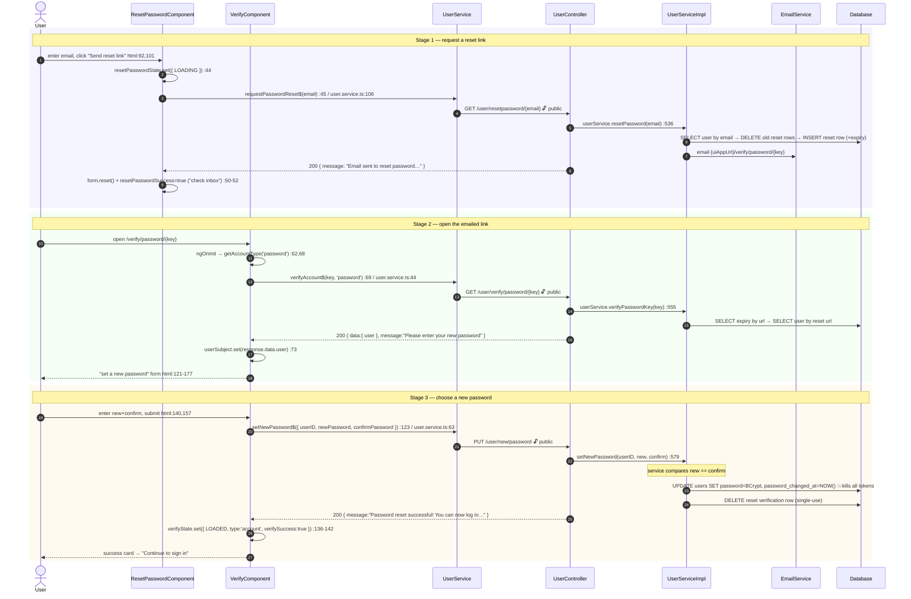
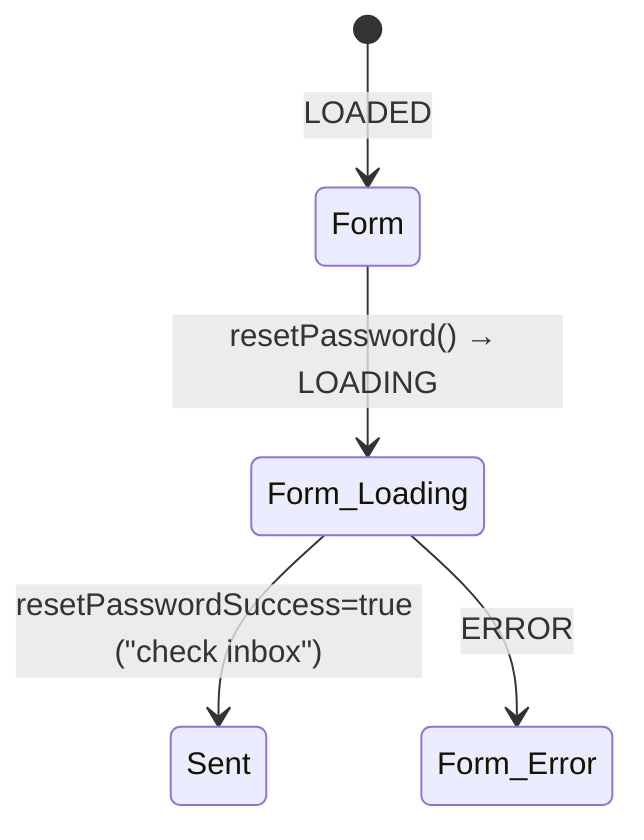

# 03 · Forgot password → reset link → set new password

> Assumes [`00-anatomy-of-a-request.md`](./00-anatomy-of-a-request.md). A three-stage flow across
> **two** components. All three endpoints are **public** — the user is locked out by definition and
> holds no token.

| Stage | Route / component | Endpoint |
| --- | --- | --- |
| 1 · Request a link | `/resetpassword` → `ResetPasswordComponent` | `GET /user/resetpassword/{email}` |
| 2 · Open the link | `/verify/password/:key` → `VerifyComponent` | `GET /user/verify/password/{key}` |
| 3 · Set new password | same `VerifyComponent` (password branch) | `PUT /user/new/password` |

---

## The full trace (all three stages)



### Why the `userID` travels in the body, not the URL
Stage 2 resolves the secret key to a `UserDTO` and the SPA stashes it in `userSubject`
(`verify.component.ts:73`). By stage 3 the *user's ID* is known, so `setNewPassword$` posts
`{ userID, newPassword, confirmPassword }` (`user.service.ts:63`) — the secret key and the new
password never appear together in any URL or proxy log. The `type:'account'` trick at
`verify.component.ts:136-137` deliberately renders the success *card* (not the empty form again),
so the user sees confirmation rather than a blank reset form.

---

## State machines

**Stage 1 (`ResetPasswordComponent`):**

**Stages 2-3 (`VerifyComponent`, password branch)** — the same machine documented in
[`01 §B`](./01-register-and-verify.md), entering through `type='password'` → `SetPassword`, then
on submit transitioning to the `account` success card.

---

## Failure paths

| Failure | Where | User sees |
| --- | --- | --- |
| Unknown email | `resetPassword` service | ⚠️ see enumeration note below |
| Expired / used reset link | `verifyPasswordKey` (`SELECT_EXPIRATION_BY_URL`) → throws → 400 | red "Verification Failed :(" card (`verify.component.ts:84-92`) |
| `newPassword` ≠ `confirmPassword` | `setNewPassword` service compares → throws → 400 | inline alert in the set-password form (`verify.component.html:132-138`) |
| Blank fields | `NewPasswordForm` `@NotEmpty`/`@NotNull` → 400 before controller body | inline alert |

> 🔎 **Enumeration note.** The controller's stage-1 response message is generic
> ("Email sent to reset password…", `UserController.java:540`). Whether the flow is *fully*
> enumeration-safe depends on `userService.resetPassword` not throwing differently for an unknown
> email — the project's stated policy is to never reveal account existence
> ([GUIDE.md §7](../GUIDE.md#7-security-model)). If an unknown email surfaces an error here, that's the spot to
> make it return the same generic success.

---

## Wire-level detail

### Stage 1 — request
```http
GET /user/resetpassword/ada@example.com HTTP/1.1
Host: localhost:8080
Accept: application/json
                                ← no Authorization (public; filter skips /user/resetpassword prefix)
```
```jsonc
// 200
{ "timeStamp":"…",
  "message":"Email sent to reset password. Please check your inbox. If you don't see it, please check your spam folder.",
  "status":"OK","statusCode":200 }
```

### Stage 2 — resolve link
```http
GET /user/verify/password/abc-uuid HTTP/1.1
Host: localhost:8080
```
```jsonc
// 200
{ "timeStamp":"…", "data": { "user": { "id":73, "email":"ada@example.com", … } },
  "message":"Please enter your new password", "status":"OK","statusCode":200 }
```

### Stage 3 — set password
```http
PUT /user/new/password HTTP/1.1
Host: localhost:8080
Content-Type: application/json

{ "userID": 73, "newPassword": "N3wS3cret!", "confirmPassword": "N3wS3cret!" }
```
`@Valid NewPasswordForm` (`form/NewPasswordForm.java`):

| Field | Annotation | Message |
| --- | --- | --- |
| `userID` | `@NotNull` | "The user ID is required" |
| `newPassword` | `@NotEmpty` | "The new password is required" |
| `confirmPassword` | `@NotEmpty` | "Confirmation password cannot be empty" |

```jsonc
// 200
{ "timeStamp":"…","message":"Password reset successful! You can now log in with your new password.",
  "status":"OK","statusCode":200 }
```

### SQL executed

| Stage | Query constant | SQL |
| --- | --- | --- |
| 1 | `UserQuery.SELECT_USER_BY_EMAIL_QUERY` | `SELECT * FROM users WHERE email = :email` |
| 1 | `UserQuery.DELETE_PASSWORD_VERIFICATION_BY_USER_ID_QUERY` | `DELETE FROM resetpasswordverifications WHERE user_id = :userId` |
| 1 | `UserQuery.INSERT_PASSWORD_VERIFICATION_QUERY` | `INSERT INTO resetpasswordverifications (user_id, url, expiration_date) VALUES (…)` |
| 2 | `UserQuery.SELECT_EXPIRATION_BY_URL` | `SELECT expiration_date < NOW() AS is_expired FROM resetpasswordverifications WHERE url = :url` |
| 2 | `UserQuery.SELECT_USER_BY_PASSWORD_URL_QUERY` | `SELECT * FROM users WHERE id = (SELECT user_id FROM resetpasswordverifications WHERE url = :url)` |
| 3 | `UserQuery.UPDATE_USER_PASSWORD_BY_ID_QUERY` | `UPDATE users SET password = :password, password_changed_at = NOW() WHERE id = :userId` |
| 3 | `UserQuery.DELETE_PASSWORD_VERIFICATION_BY_USER_ID_QUERY` | (cleanup — single-use link) |

---

## Cross-links
- **Why stage 3 logs the user out everywhere** → [`00 §4.2`](./00-anatomy-of-a-request.md) (`passwordChangedAt` kill-switch)
- The *authenticated* password change (different endpoint, reissues tokens instead of killing them) → [`10-profile-and-account.md`](./10-profile-and-account.md)
- The shared `VerifyComponent` account half → [`01-register-and-verify.md`](./01-register-and-verify.md)
