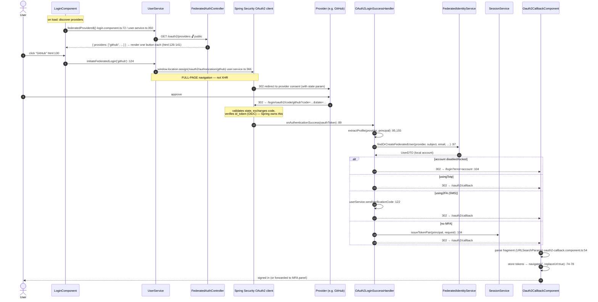
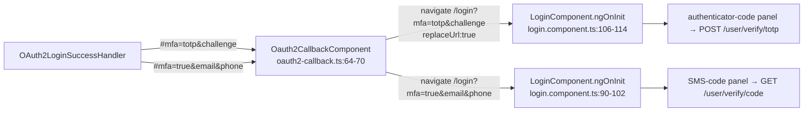
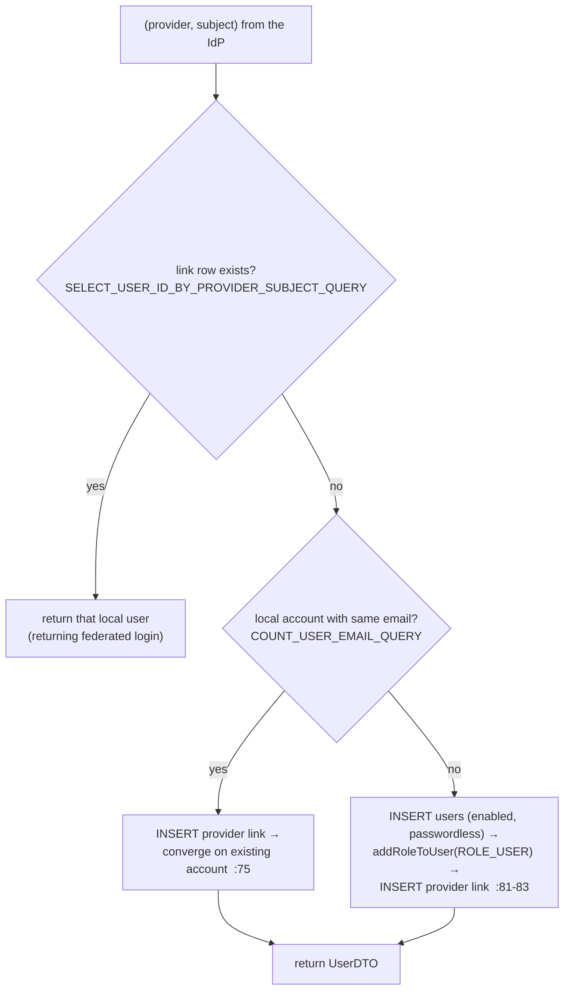

# 04 · Federated / OAuth2 login (Google · GitHub · Microsoft)

> Assumes [`00-anatomy-of-a-request.md`](./00-anatomy-of-a-request.md) and
> [`02-login-and-mfa.md`](./02-login-and-mfa.md) (the MFA panels this flow reuses). This is the only
> flow that is a **browser-redirect chain**, not an XHR — the whole window travels.

**SPA routes:** `/login` (buttons) · `/oauth2/callback` → `Oauth2CallbackComponent`
**Backend:** `GET /oauth2/providers` (discovery) · `/oauth2/authorization/{provider}` (Spring initiation) ·
`/login/oauth2/code/{provider}` (provider callback) → `OAuth2LoginSuccessHandler` — all public.

---

## A · The whole redirect chain



### Why a full-page redirect, not XHR
The OAuth2 Authorization Code flow is a chain of `302`s through a third-party origin (the provider's
consent screen). An XHR can't follow a cross-origin login redirect, so `initiateFederatedLogin`
deliberately does `window.location.assign(...)` (`user.service.ts:357-367`) — the entire browser
window makes the journey.

> **Stateless caveat (CON-3).** The app is otherwise stateless JWT, but the OAuth2 handshake briefly
> uses the container session to hold the CSRF `state` parameter between the outbound redirect and the
> callback (`SecurityConfig.java:170-173`). No `SecurityContext` is ever stored; the session plays no
> part after token issuance.

---

## B · The MFA handoff — reusing flow 02's screens

The success handler never issues tokens to an MFA account. It encodes the next step in the fragment;
the callback forwards it to `/login` as **query params**; `LoginComponent.ngOnInit` picks it up and
drops into the same panel a password login would have:



From there it is **exactly** flow 02 branches B/C — same `verifyCode()` dispatch, same
`issueTokenPair`. See [`02 §B-C`](./02-login-and-mfa.md).

---

## C · Find-or-create (FR-FED-3) — one identity across providers

`FederatedIdentityServiceImpl.findOrCreateFederatedUser` runs in a single `@Transactional` block
(`:58-59`) and resolves in three ordered steps:



The durable identity key is **(provider, subject)**, never the email
(`FederatedIdentityServiceImpl.java:63`). Three security-relevant properties:
- **Passwordless, enabled-at-birth** accounts: the provider already verified the email, so the
  in-house verification step is skipped (`OAuthQuery.INSERT_FEDERATED_USER_QUERY` sets `enabled=TRUE`,
  no password column).
- **Email-based linking is only safe for verified-email providers.** The code comments flag this
  explicitly (`FederatedIdentityServiceImpl.java:37-42`): any future provider that doesn't assert
  verified emails must NOT use this path, or it becomes an account-takeover vector.
- **Per-provider attribute shapes** are normalized in `extractProfile` (`:155-182`): Google/Microsoft
  are OIDC (`sub` claim); GitHub is plain OAuth2 (numeric `id`) and may synthesize a
  `@users.noreply.github.com` email when the user's is private.

---

## D · Failure paths

| Failure | Where | User sees |
| --- | --- | --- |
| Provider discovery fails | `federatedProviders$` error (`login.component.ts:78`) | buttons simply omitted; password login unaffected |
| Account disabled/locked | handler (`:102-105`) | redirect `/login?error=account` → "account is disabled or locked" toast (`login.component.ts:84-88`) |
| Provider denies / state mismatch | Spring `failureHandler` (`SecurityConfig.java:176-179`) | redirect `/login?error=federated` |
| Post-processing exception | handler catch (`:138-143`) | redirect `/login?error=federated` (coarse — no account disclosure) |
| Callback fragment has no tokens | `Oauth2CallbackComponent` (`:81-82`) | error toast → `/login` |

Every backend failure is a **redirect**, never a JSON error or stack page — the browser is mid-flow,
so the only sane recovery is the SPA login screen with a coarse `error` code (NFR-SEC-7).

---

## E · Wire-level detail

### E.1 · Discovery
```http
GET /oauth2/providers HTTP/1.1
Host: localhost:8080
```
```jsonc
// 200
{ "timeStamp":"…", "data": { "providers": ["github"] },
  "message":"Federated providers retrieved successfully.", "status":"OK","statusCode":200 }
```
An empty `providers` array (no real client credentials configured) hides the "or continue with"
section entirely (`login.component.html:126`).

### E.2 · Initiation & callback (browser-driven, no JSON)
```
Browser → GET http://localhost:8080/oauth2/authorization/github      (302 to provider)
Provider → GET http://localhost:8080/login/oauth2/code/github?code=…&state=…   (302 to handler)
Handler  → 302 Location: http://localhost:4200/oauth2/callback#access_token=…&refresh_token=…
```
Tokens ride the **fragment** (`#`), URL-encoded (`OAuth2LoginSuccessHandler.java:135-137`). The SPA
parses it with `new URLSearchParams(fragment)` (`oauth2-callback.component.ts:54`).

### E.3 · SQL executed (first federated login)

| Step | Query constant | SQL |
| --- | --- | --- |
| returning? | `OAuthQuery.SELECT_USER_ID_BY_PROVIDER_SUBJECT_QUERY` | `SELECT user_id FROM oauthproviderlinks WHERE provider=:provider AND provider_subject=:subject` |
| email already local? | `UserQuery.COUNT_USER_EMAIL_QUERY` | `SELECT COUNT(*) FROM users WHERE email = :email` |
| create account | `OAuthQuery.INSERT_FEDERATED_USER_QUERY` | `INSERT INTO users (first_name,last_name,email,enabled,image_url) VALUES (:firstName,:lastName,:email,TRUE,COALESCE(:imageUrl,DEFAULT(image_url)))` |
| assign role | `RoleQuery` (`addRoleToUser`) | `INSERT INTO userroles (user_id, role_id) …` |
| link identity | `OAuthQuery.INSERT_PROVIDER_LINK_QUERY` | `INSERT INTO oauthproviderlinks (user_id,provider,provider_subject) VALUES (:userId,:provider,:subject)` |
| issue session | `SessionQuery.INSERT_SESSION_QUERY` | `INSERT INTO refreshsessions (…)` |

Only `(provider, provider_subject)` is ever persisted from the IdP (FR-FED-6) — never provider
credentials or tokens.

---

## Cross-links
- The MFA panels this hands off to → [`02-login-and-mfa.md`](./02-login-and-mfa.md)
- The `issueTokenPair` seam (shared with every login) → [`02 §A`](./02-login-and-mfa.md) · [`05`](./05-token-refresh-sessions.md)
- Provider wiring at startup → `configuration/OAuth2ClientConfig.java`, `FederatedProviderCatalog`
