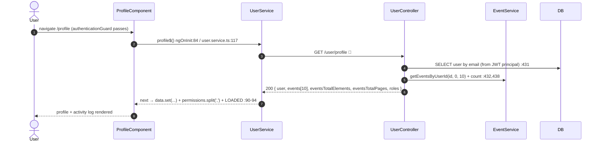
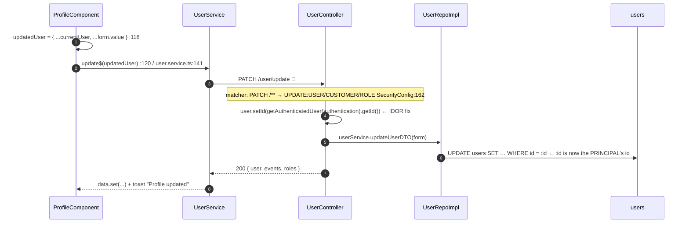
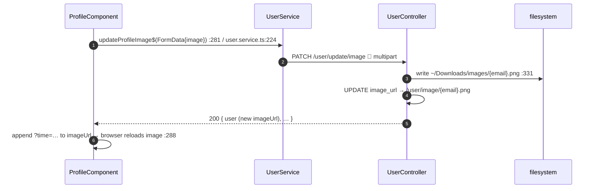

# 10 · Profile & account (view, update, password, settings, image, events)

> Assumes [`00-anatomy-of-a-request.md`](./00-anatomy-of-a-request.md). One page, several
> independent actions. All endpoints are **authenticated** and ride the standard
> 🔑 access-token + interceptor path.

**Route:** `/profile` → `ProfileComponent`. **Endpoints:** `GET /user/profile` · `GET /user/events`
· `PATCH /user/update` · `PATCH /user/update/password` · `PATCH /user/update/settings`
· `PATCH /user/update/image` · `PATCH /user/update/togglemfa`.

Every mutation returns the standard envelope **and** re-bundles `events` + `roles`, so the page
stays fully populated without follow-up GETs. State lives in one `profileState` signal plus an
`isLoading` signal; mutations keep `dataState = LOADED` and only flip `isLoading` so the form never
disappears mid-save (`profile.component.ts:47,67`).

---

## A · Load profile + audit events


Pagination turns call `GET /user/events?page=n` only (`goToEventsPage` → `userEvents$`,
`profile.component.ts:247`), patching just the `events` slice of the cached signal so user + roles
are preserved (`:253-256`).

Audit rows are written by a decoupled listener: anywhere the app publishes a `NewUserEvent`,
`NewUserEventListener.onNewUserEvent` writes a `userevents` row stamped with device + IP from the
live request (`listener/NewUserEventListener.java:42-46`). That's how login, password change, TOTP
enrollment, session revoke, and reuse detection all surface in this list.

---

## B · Update profile  ⚠️ (IDOR as written)



> ✅ **Resolved 2026-06-15 (was an IDOR).** `updateUser` now binds the target id to the authenticated
> principal — `user.setId(getAuthenticatedUser(authentication).getId())` in
> `UserController.updateUser` — so any `id` in the request body is overwritten and ignored, then
> `updateUserDTO` → `updateUserDetails` runs `UPDATE users … WHERE id = :id` against the *principal's*
> id (`UserServiceImpl.java:139-141`, `UserQuery.UPDATE_USER_DETAILS_QUERY`).
> **Previously** the principal-based assignment was commented out and the body's `id` flowed straight
> through; because the `PATCH /**` rule only requires the `UPDATE:USER` authority every `ROLE_USER`
> holds, a hand-crafted request with another user's `id` could have edited that user's profile. The
> Angular client always sent the caller's own `id`, so normal use was never affected — the fix makes
> the server *enforce* what the client already did, instead of trusting it.

`@Valid UpdateForm` (`form/UpdateForm.java`):

| Field | Annotation | Notes |
| --- | --- | --- |
| `firstName`, `lastName` | `@NotEmpty` | required |
| `email` | `@Email` | |
| `phoneNumber` | `@Pattern(^\+?[0-9. ()-]{7,25}$)` | optional, format-checked |
| `id` | — | ignored server-side — overwritten with the JWT principal's id (IDOR fix, see above) |
| `imageUrl`,`address`,`bio`,`title` | — | optional; `image_url` uses `COALESCE` so null preserves existing |

---

## C · Change password (authenticated) — the mirror of flow 03

```mermaid
sequenceDiagram
    autonumber
    participant CMP as ProfileComponent
    participant SVC as UserService
    participant CTRL as UserController
    participant US as UserService(be)
    participant SS as SessionService
    participant LS as localStorage
    participant DB as DB
    CMP->>CMP: client-side newPassword === confirmPassword?  :151
    CMP->>SVC: updatePassword$(form)  :153 / user.service.ts:182
    SVC->>CTRL: PATCH /user/update/password  🔑
    CTRL->>US: updatePassword(id, current, new, confirm)  :213
    Note over US: verify CURRENT pw (BCrypt) + new==confirm
    US->>DB: UPDATE users SET password=BCrypt, password_changed_at=NOW()  💥 kills ALL old JWTs
    CTRL->>SS: revokeAllSessions(id)  :218
    SS->>DB: UPDATE refreshsessions SET revoked=TRUE WHERE user_id
    CTRL->>SS: issueTokenPair(principal)  :219  ← fresh session for THIS browser
    CTRL-->>SVC: 200 { user, roles, events, access_token, refresh_token }
    SVC->>LS: tap → swap in new tokens  user.service.ts:188-192
    Note over CMP,LS: this browser stays signed in; every OTHER device is ejected
```

Contrast: flow 03 (forgot-password) also trips `passwordChangedAt` but there's no live session to
preserve, so it just kills everything. Here, `revokeAllSessions` + a fresh `issueTokenPair` keep the
acting browser alive while ejecting the rest. `@Valid UpdatePasswordForm`: `currentPassword`,
`newPassword`, `confirmPassword` all `@NotEmpty`.

---

## D · Account settings · E · Profile image · F · SMS MFA toggle

| Action | Endpoint / form | Mechanics |
| --- | --- | --- |
| **Settings** (enabled / notLocked) | `PATCH /user/update/settings`, `SettingsForm` (`enabled`,`notLocked` both `@NotNull`) | `UPDATE_USER_SETTINGS_QUERY`; returns user + roles + events (`UserController.java:254-273`) |
| **Profile image** | `PATCH /user/update/image`, `multipart/form-data` key `image` | file → `FormData` (`profile.component.ts:301-304`); saved to `~/Downloads/images/{email}.png` ⚠️ dev-only hardcoded path (`UserController.java:315-320`); served by public `GET /user/image/{file}`; client appends `?time=…` to bust the `` cache (`:288`) |
| **SMS MFA toggle** | `PATCH /user/update/togglemfa` | now lives in the **Security Center** (`SecurityCenterComponent.toggleSmsMfa`), not this page; flips `using_mfa` (`TOGGLE_USER_2FA_QUERY`); requires a phone number on the account |



---

## G · Failure paths

| Failure | Where | User sees |
| --- | --- | --- |
| Wrong current password | `updatePassword` service (BCrypt mismatch) → 400 | toast + form reset (`profile.component.ts:164-167`) |
| `new` ≠ `confirm` (password) | **client-side** guard — no request sent | silent form reset (`:171-173`) |
| Invalid phone format | `UpdateForm @Pattern` → 400 | error toast |
| Blank required field | `@NotEmpty`/`@NotNull` → 400 before controller | error toast |
| Image read/serve when file missing | `getProfileImage` propagates `IOException` ⚠️ | 500 (TODO: return 404, `UserController.java:358-363`) |

---

## H · Wire-level detail (selected)

### `GET /user/profile` → `200`
```jsonc
{ "data": { "user": { …UserDTO… },
            "events": [ { "id":9, "type":"LOGIN_ATTEMPT_SUCCESS", "description":"…",
                          "device":"Windows - Chrome - Desktop", "ipAddress":"203.0.113.5",
                          "createdAt":"2026-06-14T10:12:00" }, … ],
            "eventsTotalElements": 42, "eventsTotalPages": 5,
            "roles": [ { "name":"ROLE_USER", "permission":"READ:USER,UPDATE:USER,…" }, … ] },
  "message":"We have fetched your profile for you!", "status":"OK","statusCode":200 }
```

### `PATCH /user/update/password` → `200`
```http
PATCH /user/update/password    Authorization: Bearer 🔑
{ "currentPassword":"S3cret!", "newPassword":"N3w!", "confirmPassword":"N3w!" }
```
Response carries a **fresh** `access_token` + `refresh_token` (the only PATCH that does) — the SPA
swaps them into `localStorage` immediately (`user.service.ts:188-192`).

### SQL executed

| Action | Query constant | SQL |
| --- | --- | --- |
| profile | `SELECT_USER_BY_EMAIL_QUERY` | `SELECT * FROM users WHERE email = :email` |
| events page | `EventQuery.SELECT_EVENTS_BY_USER_ID_PAGINATED_QUERY` | `… JOIN events JOIN users … ORDER BY created_at DESC LIMIT :size OFFSET :offset` |
| update profile | `UPDATE_USER_DETAILS_QUERY` | `UPDATE users SET first_name=…, …, phone=…, title=… WHERE id=:id` |
| change password | `UPDATE_USER_PASSWORD_BY_ID_QUERY` | `UPDATE users SET password=:password, password_changed_at=NOW() WHERE id=:userId` |
| settings | `UPDATE_USER_SETTINGS_QUERY` | `UPDATE users SET enabled=:enabled, non_locked=:notLocked WHERE id=:userId` |
| image | `UPDATE_USER_IMAGE_URL_QUERY` | `UPDATE users SET image_url=:imageUrl WHERE id=:userId` |
| toggle SMS MFA | `TOGGLE_USER_2FA_QUERY` | `UPDATE users SET using_mfa=:using2FA WHERE email=:email` |

---

## Cross-links
- The reset counterpart of password change → [`03-password-reset.md`](./03-password-reset.md)
- Where SMS MFA toggle & TOTP now live → [`11-totp-enrollment.md`](./11-totp-enrollment.md)
- The `passwordChangedAt` kill-switch → [`00 §4.2`](./00-anatomy-of-a-request.md)
- Sessions ejected on password change → [`12-sessions-and-devices.md`](./12-sessions-and-devices.md)
