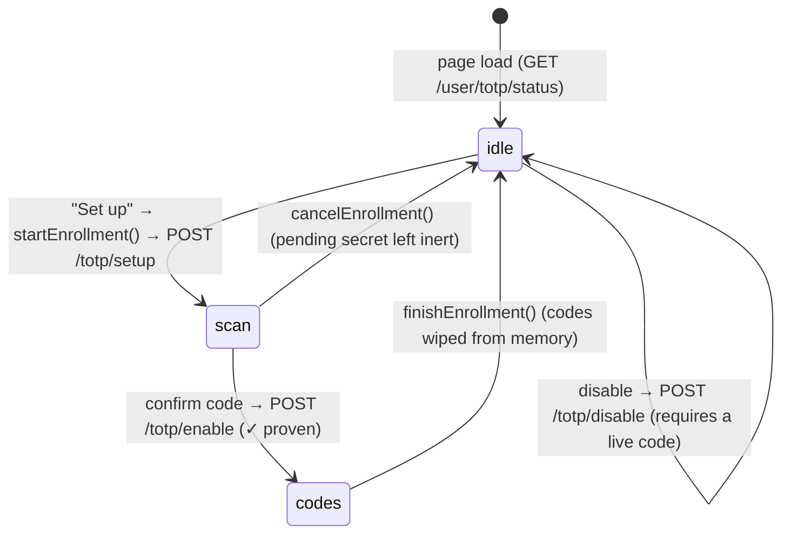
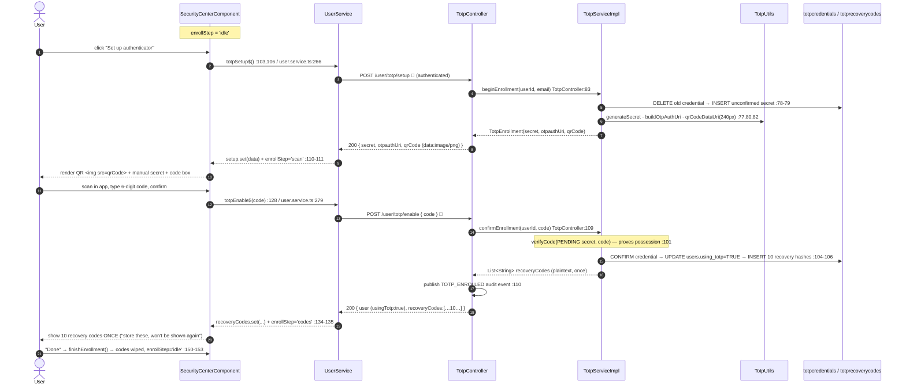
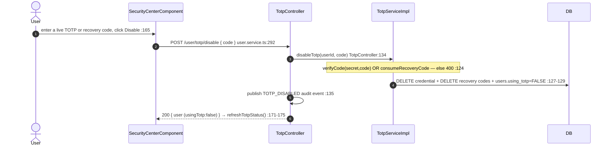

# 11 · Authenticator (TOTP) enrollment

> Assumes [`00-anatomy-of-a-request.md`](./00-anatomy-of-a-request.md). This is the **enrollment**
> half of TOTP; the **login** half (verifying a code via a challenge) is
> [`02 §C`](./02-login-and-mfa.md). Both halves share the `totpcredentials` / `totprecoverycodes`
> tables.

**Route:** `/security` → `SecurityCenterComponent` (MFA panel)
**Endpoints (all `authenticated`, not staff-gated):** `POST /user/totp/setup` · `POST /user/totp/enable`
· `POST /user/totp/disable` · `GET /user/totp/status` → `TotpController`

> **Authorization placement.** `/user/totp/**` is matched by an explicit `authenticated()` rule
> placed **before** the `POST /**` catch-all that demands `UPDATE:USER` (`SecurityConfig.java:158`).
> Securing your own second factor must not require a staff authority — a plain `ROLE_USER` reaches
> these, and every handler scopes work to the token's principal.

---

## A · The enrollment wizard (a three-state machine)

`enrollStep` is `'idle' | 'scan' | 'codes'` (`security-center.component.ts:50`):



### Setup → enable trace



### Disable trace


---

## B · Why each step is shaped this way

| Decision | Code | Why |
| --- | --- | --- |
| Setup writes an **unconfirmed** secret | `TotpServiceImpl:74-79` | Scanning a QR isn't proof; only echoing a code proves the app holds the secret. An unconfirmed secret never satisfies a login. |
| Enable validates against the **pending** secret | `:101` | This is the possession proof. Until it passes, `using_totp` stays false. |
| 10 recovery codes, hashed, shown once | `:193-203` (`RECOVERY_CODE_COUNT=10`) | Plaintext returned once (`security.interface.ts:23`); DB stores SHA-256 only — a DB leak can't reveal usable codes. |
| Disable requires a live code | `:117-131` | Stops a hijacked browser session from silently removing MFA (a downgrade attack). |
| `setup` idempotent | `:74-79` delete-then-insert | Re-clicking "Set up" issues a fresh secret rather than erroring — matches the SMS-code single-validity pattern. |

---

## C · Failure paths

| Failure | Where | User sees |
| --- | --- | --- |
| Already enabled, click Set up | `beginEnrollment` (`:74-76`) | 400 "An authenticator app is already enabled…" toast |
| Wrong code at enable | `confirmEnrollment` (`:101-103`) | 400 "That code didn't match…"; wizard stays on `scan` |
| Enable with no enrollment in progress | `:95-97` | 400 "No enrollment in progress…" |
| Wrong/again-used code at disable | `disableTotp` (`:124-126`) | 400 "Enter a current authenticator code or an unused recovery code." |
| Blank code | `TotpCodeForm` `@NotEmpty` → 400 before controller | inline validation |

---

## D · Wire-level detail

### D.1 · `POST /user/totp/setup`
```http
POST /user/totp/setup HTTP/1.1
Host: localhost:8080
Authorization: Bearer eyJ…   🔑 access token
Content-Type: application/json

{}
```
```jsonc
// 200
{ "timeStamp":"…",
  "data": { "secret": "JBSWY3DPEHPK3PXP",
            "otpauthUri": "otpauth://totp/TesseraApp:ada@example.com?secret=JBSWY3DPEHPK3PXP&issuer=TesseraApp",
            "qrCode": "data:image/png;base64,iVBORw0KGgo…" },
  "message":"Scan the QR code with your authenticator app, then confirm with a code.",
  "status":"OK","statusCode":200 }
```
QR is server-rendered at 240px (`TotpServiceImpl.java:52,82`), issuer label `TesseraApp` (`:50`).

### D.2 · `POST /user/totp/enable`  (`@Valid TotpCodeForm`: `code` `@NotEmpty`)
```http
POST /user/totp/enable    Authorization: Bearer 🔑
{ "code": "123456" }
```
```jsonc
// 200 — recoveryCodes shown EXACTLY ONCE
{ "data": { "user": { …, "usingTotp": true },
            "recoveryCodes": ["A1B2-C3D4","E5F6-G7H8", … 10 total …] },
  "message":"Authenticator app enabled! Store your recovery codes somewhere safe — they will not be shown again.",
  "status":"OK","statusCode":200 }
```

### D.3 · `POST /user/totp/disable` (`{ "code": "…" }`) → `200 { user:{ usingTotp:false } }`
### D.4 · `GET /user/totp/status` → `200 { enabled:boolean, recoveryCodesRemaining:number }`

### D.5 · SQL executed

| Step | Query constant | SQL |
| --- | --- | --- |
| setup | `DELETE_TOTP_CREDENTIAL_BY_USER_ID_QUERY` · `INSERT_TOTP_CREDENTIAL_QUERY` | `DELETE FROM totpcredentials WHERE user_id=:userId` · `INSERT INTO totpcredentials (user_id, secret) VALUES (…)` |
| enable: verify | `SELECT_TOTP_CREDENTIAL_BY_USER_ID_QUERY` | `SELECT secret, confirmed FROM totpcredentials WHERE user_id=:userId` |
| enable: confirm | `CONFIRM_TOTP_CREDENTIAL_QUERY` · `UPDATE_USER_USING_TOTP_QUERY` | `UPDATE totpcredentials SET confirmed=TRUE, confirmed_at=NOW() …` · `UPDATE users SET using_totp=:usingTotp …` |
| enable: codes | `DELETE_RECOVERY_CODES_BY_USER_ID_QUERY` · `INSERT_RECOVERY_CODE_QUERY` ×10 | `INSERT INTO totprecoverycodes (user_id, code_hash) VALUES (…)` |
| disable | (verify) + `DELETE_TOTP_CREDENTIAL…` + `DELETE_RECOVERY_CODES…` + `UPDATE_USER_USING_TOTP_QUERY` | as above, reversing state |
| status | `COUNT_UNUSED_RECOVERY_CODES_QUERY` | `SELECT COUNT(*) FROM totprecoverycodes WHERE user_id=:userId AND used_at IS NULL` |
| login consume (flow 02) | `CONSUME_RECOVERY_CODE_QUERY` | `UPDATE totprecoverycodes SET used_at=NOW() WHERE user_id=:userId AND code_hash=:codeHash AND used_at IS NULL` |

---

## Cross-links
- The login branch that verifies these codes → [`02 §C`](./02-login-and-mfa.md)
- The sessions panel sharing this page → [`12-sessions-and-devices.md`](./12-sessions-and-devices.md)
- SMS MFA toggle (also on this page) → [`10-profile-and-account.md`](./10-profile-and-account.md)
