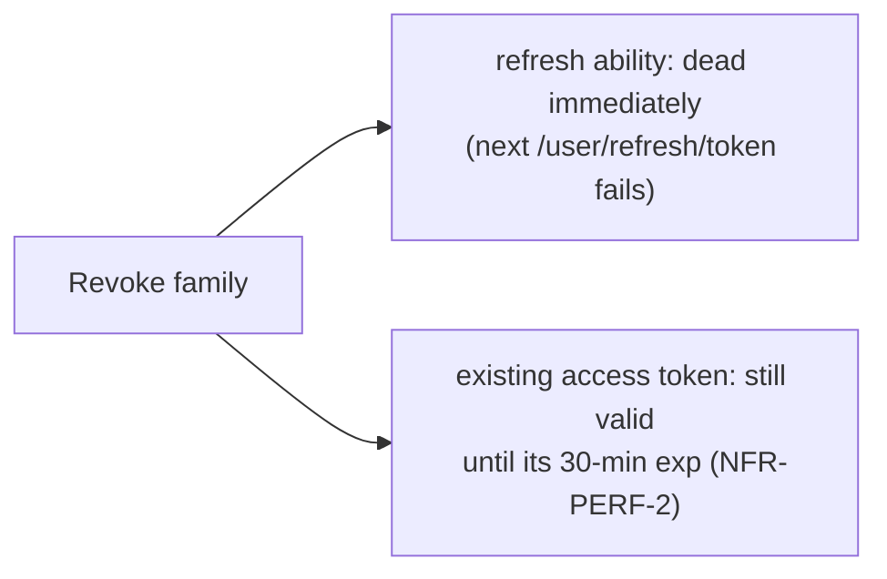

# 12 · Sessions & devices

> Assumes [`00-anatomy-of-a-request.md`](./00-anatomy-of-a-request.md) and pairs with
> [`05-token-refresh-sessions.md`](./05-token-refresh-sessions.md) (the rotation engine). This doc is
> the **user-visible** half: seeing and revoking the `refreshsessions` rows that flow 05 creates and
> rotates.

**Route:** `/security` → `SecurityCenterComponent` (Sessions & devices panel)
**Endpoints (all `authenticated`):** `GET /user/sessions` · `DELETE /user/sessions/{family}` ·
`DELETE /user/sessions` → `SessionController`

---

## A · List, revoke one, revoke all-others

```mermaid
sequenceDiagram
    autonumber
    actor U as User
    participant SC as SecurityCenterComponent
    participant SVC as UserService
    participant CTRL as SessionController
    participant TP as TokenProvider
    participant SS as SessionServiceImpl
    participant DB as refreshsessions

    Note over SC: ngOnInit → refreshSessions()  :94,292
    SC->>SVC: sessions$()  user.service.ts:314
    SVC->>CTRL: GET /user/sessions  🔑
    CTRL->>SS: listSessions(userId)  :68
    SS->>DB: SELECT live rows (revoked=F, superseded=F, expires>NOW) ORDER BY last_used_at DESC
    CTRL->>TP: getSessionFamily(myAccessToken) → currentFamily  :138
    CTRL-->>SVC: 200 { sessions:[…], currentFamily }
    SVC-->>SC: sessions.set(...) + currentFamily.set(...)  :297-299
    SC-->>U: device list; the currentFamily row badged "This device"

    U->>SC: click "Revoke" on another device  :210
    SC->>SVC: revokeSession$(family)  user.service.ts:326
    SVC->>CTRL: DELETE /user/sessions/{family}  🔑
    CTRL->>SS: revokeSession(userId, family)  :88
    SS->>DB: UPDATE revoked=TRUE WHERE family AND user_id  (0 rows ⇒ "Session not found")
    CTRL->>CTRL: publish SESSION_REVOKED audit event  :89
    CTRL-->>SC: 200 { sessions (refreshed), currentFamily }  :217-218

    U->>SC: click "Log out everywhere else"  :230
    SC->>SVC: revokeOtherSessions$()  user.service.ts:337
    SVC->>CTRL: DELETE /user/sessions  🔑
    CTRL->>SS: revokeOtherSessions(userId, currentFamily)  :111
    SS->>DB: UPDATE revoked=TRUE WHERE user_id AND family != currentFamily
    CTRL-->>SC: 200 { sessions (just this one), currentFamily }  :237-238
```

The refreshed list comes back **in the same response** as the revoke, so the panel never needs a
follow-up GET (`security-center.component.ts:216-218, 236-238`).

---

## B · What a "session" is, exactly

One row per **family** — not per token. Flow 05 rotates the `jti` within a family on every refresh,
but the family is stable, so the list shows *one* entry per logged-in device however many times it
has rotated. The list query filters to live families only:

```sql
-- SessionQuery.SELECT_ACTIVE_SESSIONS_BY_USER_QUERY
SELECT * FROM refreshsessions
WHERE user_id = :userId AND revoked = FALSE AND superseded = FALSE AND expires_at > NOW()
ORDER BY last_used_at DESC
```
`superseded = FALSE` is what excludes rotation history (old jtis kept for reuse detection) from the
device list (`SessionQuery.java:73-81`). Each row carries `device`, `ipAddress`, `createdAt`,
`lastUsedAt` ("last seen"), `expiresAt` — captured from the request at login/refresh via
`RequestUtils.getDevice/getIpAddress` (`SessionServiceImpl.java:202-209`).

### The revoke ≠ instant-logout nuance

This is the documented, deliberate trade for stateless access tokens
(`SessionController.java:77-79`). To cut a device off *instantly* in all respects, change the
password — that trips the `passwordChangedAt` kill-switch (see [`03`](./03-password-reset.md) /
[`00 §4.2`](./00-anatomy-of-a-request.md)).

---

## C · Failure paths

| Failure | Where | User sees |
| --- | --- | --- |
| Revoke a family you don't own / unknown | `revokeSession` 0 rows (`SessionServiceImpl:152-154`) | 400 "Session not found." (no leak of whether it exists for someone else) |
| Pre-M5 token (no `sid`) | `currentFamilyOrEmpty` returns "" (`SessionController:134-145`) | list shows no "This device" badge; "log out everywhere else" revokes all |
| Sessions fetch fails | `refreshSessions` error (`security-center.component.ts:301`) | error toast; rest of page intact |

---

## D · Wire-level detail

### D.1 · `GET /user/sessions`
```http
GET /user/sessions HTTP/1.1
Host: localhost:8080
Authorization: Bearer eyJ…   🔑 (its sid claim → currentFamily)
```
```jsonc
// 200
{ "timeStamp":"…",
  "data": {
    "sessions": [
      { "family":"4af2-…", "device":"Windows - Chrome - Desktop", "ipAddress":"203.0.113.5",
        "createdAt":"2026-06-14T09:00:00", "lastUsedAt":"2026-06-14T10:12:00", "expiresAt":"2026-06-19T09:00:00" },
      { "family":"9b1c-…", "device":"Android - Firefox - Mobile", "ipAddress":"198.51.100.7", … }
    ],
    "currentFamily": "4af2-…"
  },
  "message":"Active sessions retrieved.","status":"OK","statusCode":200 }
```
Field names mirror `SessionInterface` (`security.interface.ts:38-47`) — a mismatch would silently
`undefined` in Angular.

### D.2 · `DELETE /user/sessions/{family}` and `DELETE /user/sessions`
Both return the **refreshed** `{ sessions, currentFamily }` envelope. The all-others variant's
message reflects the count: `"Logged out of N other session(s)."` or
`"No other active sessions to log out of."` (`SessionController.java:120-122`).

### D.3 · SQL executed

| Action | Query constant | SQL |
| --- | --- | --- |
| list | `SELECT_ACTIVE_SESSIONS_BY_USER_QUERY` | see §B |
| revoke one | `REVOKE_FAMILY_FOR_USER_QUERY` | `UPDATE refreshsessions SET revoked=TRUE WHERE family=:family AND user_id=:userId AND revoked=FALSE` |
| revoke others | `REVOKE_OTHER_SESSIONS_QUERY` | `UPDATE refreshsessions SET revoked=TRUE WHERE user_id=:userId AND family != :family AND revoked=FALSE` |

`DELETE` is a mutation, so the SPA's `cacheInterceptor` evicts the whole HTTP cache on these calls
([`00 §2.2`](./00-anatomy-of-a-request.md)).

---

## Cross-links
- How these rows are created & rotated → [`05-token-refresh-sessions.md`](./05-token-refresh-sessions.md)
- The `sid` claim that powers "This device" → [`00 §6`](./00-anatomy-of-a-request.md)
- TOTP panel on the same page → [`11-totp-enrollment.md`](./11-totp-enrollment.md)
