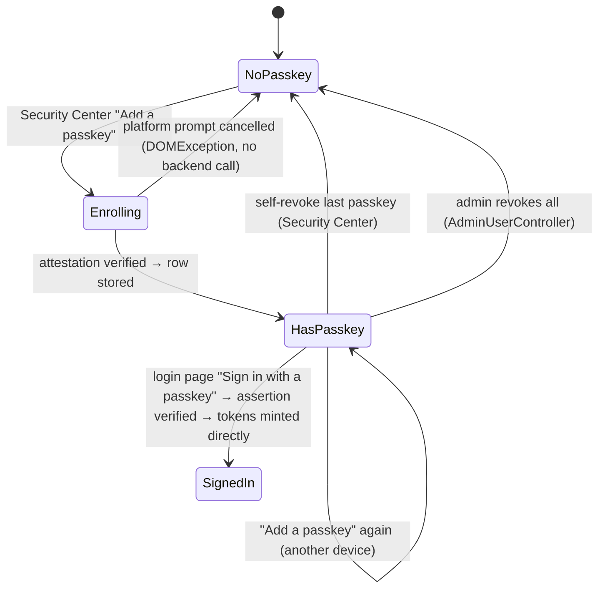
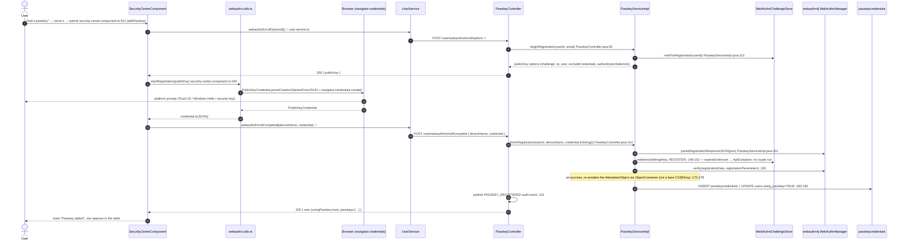
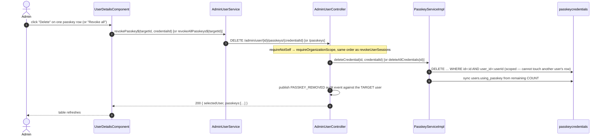

# 13 · Passkeys (WebAuthn): enrollment, usernameless login, admin revoke

> Assumes [`00-anatomy-of-a-request.md`](./00-anatomy-of-a-request.md). Built directly on
> `webauthn4j-core` rather than Spring Security's session-based `spring-security-webauthn` module —
> this app is stateless JWT, and that module assumes cookie/session auth for the ceremony state.
> Shares no tables with TOTP ([`11`](./11-totp-enrollment.md)); passkeys are a standalone credential,
> not a second factor stacked on a password.

**Routes:** `/security` → `SecurityCenterComponent` (Passkeys card, enroll + revoke) ·
`/login` → `LoginComponent` (usernameless sign-in) ·
`/users/:id` → `UserDetailsComponent` (admin revoke)

**Endpoints:**

| Method | Path | Auth |
|---|---|---|
| POST | `/user/webauthn/enroll/options` | authenticated |
| POST | `/user/webauthn/enroll/complete` | authenticated |
| GET | `/user/webauthn/list` | authenticated |
| DELETE | `/user/webauthn/{id}` | authenticated (self) |
| POST | `/user/verify/webauthn/options` | public |
| POST | `/user/verify/webauthn` | public |
| DELETE | `/admin/user/{id}/passkeys/{credentialId}` | `UPDATE:USER` |
| DELETE | `/admin/user/{id}/passkeys` | `UPDATE:USER` |

→ `PasskeyController.java` (backend) · `PasskeyServiceImpl.java` (backend) ·
`AdminUserController.java` (admin revoke)

> **Authorization placement.** `/user/webauthn/**` is matched by an explicit `authenticated()` rule
> placed **before** the `POST /**` catch-all (`SecurityConfig.java`, same line group as
> `/user/totp/**`) — securing your own passkeys must not require a staff authority.
>
> **Naming gotcha (found the hard way, see [4.21](../IMPLEMENTATION-HISTORY.md#421-a-passkey-enrollment-endpoint-401d--the-frontends-own-naming-convention-was-the-trap)).**
> The two authenticated endpoints are `enroll/options` / `enroll/complete`, not
> `register/*` — `token.interceptor.ts:86` withholds the Authorization header from any URL with
> `register` (or `verify`, `login`, `resetpassword`, `refresh`) as an exact path segment, which is
> exactly right for `/user/register` and `/user/verify/webauthn/*` but silently breaks an
> *authenticated* endpoint that happens to share the word.

---

## A · Three independent ceremonies, one shared library seam



### A.1 · Enrollment trace



### A.2 · Usernameless login trace

```mermaid
sequenceDiagram
    autonumber
    actor U as User
    participant LC as LoginComponent
    participant WU as webauthn.utils.ts
    participant BR as Browser
    participant SVC as UserService
    participant PC as PasskeyController
    participant PS as PasskeyServiceImpl
    participant CS as WebAuthnChallengeStore
    participant WM as WebAuthnManager
    participant DB as passkeycredentials
    participant SS as SessionService

    U->>LC: click "Sign in with a passkey"  🔓 no email typed  login.component.ts:154
    LC->>SVC: webauthnLoginOptions$()  🔓
    SVC->>PC: POST /user/verify/webauthn/options  🔓
    PC->>PS: beginAuthentication()  PasskeyController.java:176
    Note over PS: mintForAuthentication() — no userId; nobody is identified yet  PasskeyServiceImpl.java:237
    PS-->>PC: publicKey options (challenge, rpId, NO allowCredentials)
    PC-->>LC: 200 { publicKey }
    LC->>WU: startAuthentication(publicKey)
    WU->>BR: parseRequestOptionsFromJSON + navigator.credentials.get()
    BR-->>U: "choose a passkey" — browser lists every one it holds for this origin
    BR-->>WU: PublicKeyCredential (names its own credential id)
    WU-->>LC: credential.toJSON()
    LC->>SVC: webauthnLoginVerify$(credential)  🔓
    SVC->>PC: POST /user/verify/webauthn { credential }
    PC->>PS: finishAuthentication(credential.toString())  PasskeyController.java:198
    PS->>WM: parseAuthenticationResponseJSON(json)  :325
    PS->>CS: redeem(challengeKey, AUTHENTICATE)  :256-258
    PS->>DB: SELECT … WHERE credential_id=:credentialId  :260-262 — unknown id → SAME generic message as expired challenge (NFR-SEC-7)
    PS->>WM: verify(authenticationData, authenticationParameters)  :286  — checks the LIVE sign_count for clone detection
    PS->>DB: UPDATE sign_count, last_used_at  :293
    PC->>PC: publish PASSKEY_LOGIN audit event (NOT LOGIN_ATTEMPT_SUCCESS)  :200
    PC->>SS: issueTokenPair(principal, request)  :202 — ⚠ NO LoginRiskService call, unlike password login
    PC-->>LC: 200 { user, access_token, refresh_token }
    LC-->>U: tokens stored, navigate to '/'  login.component.ts:158-159
```

### A.3 · Admin revoke trace



---

## B · Why each step is shaped this way

| Decision | Code | Why |
| --- | --- | --- |
| `webauthn4j` used directly, not `spring-security-webauthn` | `PasskeyServiceImpl.java:42-47` | That module assumes cookie/session auth for the ceremony; this app is stateless JWT everywhere else |
| Challenge store is in-memory, not a DB table | `WebAuthnChallengeStore.java` (whole class) | Structurally identical to `ProviderLinkTicketService` — pure transient entropy with no audit value once consumed, same per-instance tradeoff already accepted for rate limits and link tickets |
| `attestation_object` stores the re-serialized whole object, not a bare public key | `:49-55`, `:172-173`, `:274-276` | Sidesteps a documented webauthn4j pain point (round-tripping an isolated `COSEKey`); re-uses the library's own most-exercised parse path instead |
| Login is usernameless/discoverable | `beginAuthentication()` `:236-246` | The point of a passkey UX — no `allowCredentials` sent, so the browser offers every passkey it holds for the origin |
| Passkey login skips `LoginRiskService` entirely | `PasskeyController.java:56-59, 202` | Same treatment `OAuth2LoginSuccessHandler` gives federated login — phishing-resistant + device-bound already, stacking step-up adds friction not security |
| `PASSKEY_LOGIN` published instead of `LOGIN_ATTEMPT_SUCCESS` | `:200` | Mirrors `FEDERATED_LOGIN` — the audit trail should record *which* method authenticated the sign-in |
| Every login failure throws one identical message | `PasskeyServiceImpl.java:57-60, 258, 267, 289` | Unlike TOTP's challenge (scoped to one known account), an unresolved passkey assertion carries no account context worth protecting differently case by case |
| Admin lever is revoke only, never "reset" | `AdminUserController` revoke endpoints' Javadoc | The private key never leaves the authenticator — revocation forcing re-enrollment is the only thing anyone (including an admin) can do |
| Enrollment paths say "enroll", not "register" | `PasskeyController.java:78-84` | `token.interceptor.ts:86` strips the auth header from any URL with `register` as a path segment — see [IMPLEMENTATION-HISTORY §4.21](../IMPLEMENTATION-HISTORY.md#421-a-passkey-enrollment-endpoint-401d--the-frontends-own-naming-convention-was-the-trap) |

---

## C · Failure paths

| Failure | Where | User sees |
| --- | --- | --- |
| Platform prompt cancelled/dismissed | Browser throws `DOMException` before any backend call | Enrollment: silent no-op, prompt just closes. Login: quiet toast, password form still there |
| Malformed/garbage credential JSON | `parseRegistration`/`parseAuthentication` catch `RuntimeException` broadly, not just `DataConversionException` — webauthn4j throws a raw `NullPointerException` on some malformed-but-valid JSON | "That passkey response could not be understood…" (enroll) / generic sign-in-expired message (login) |
| Enrollment challenge expired/unknown/wrong-purpose | `WebAuthnChallengeStore.redeem` returns empty | "This registration attempt has expired. Please try again." |
| Login challenge expired/unknown/wrong-purpose | same | "This sign-in attempt has expired. Please log in again." |
| Login: credential id not found in `passkeycredentials` | `finishAuthentication` `:263-268` | **Same message as an expired challenge** — deliberately non-distinguishing (NFR-SEC-7) |
| Login: signature/clone-detection fails | `webAuthnManager.verify` throws `VerificationException` | Same generic message again |
| Enrollment: credential id already registered (replay) | `:179-181` | "This passkey is already registered on an account." |
| `Authorization` header missing on an authenticated endpoint | `token.interceptor.ts` public-route check | `401` — see the naming gotcha above; this is the bug class to watch for on any *new* endpoint |

---

## D · Wire-level detail

### D.1 · `POST /user/webauthn/enroll/options`
```jsonc
// 200
{ "data": { "publicKey": {
    "rp": { "id": "d3911jyxcju4q4.cloudfront.net", "name": "TesseraApp" },
    "user": { "id": "NDI", "name": "ada@example.com", "displayName": "ada@example.com" },
    "challenge": "kR3f…",
    "pubKeyCredParams": [{"type":"public-key","alg":-7},{"type":"public-key","alg":-257}],
    "timeout": 120000,
    "excludeCredentials": [],
    "authenticatorSelection": {"residentKey":"required","requireResidentKey":true,"userVerification":"required"},
    "attestation": "none"
} }, "message":"Follow your device's prompt to create a passkey.", "status":"OK","statusCode":200 }
```

### D.2 · `POST /user/webauthn/enroll/complete`
```jsonc
// request
{ "deviceName": "MacBook Touch ID", "credential": { "id":"…", "rawId":"…", "type":"public-key",
  "response": { "clientDataJSON":"…", "attestationObject":"…" }, "clientExtensionResults": {} } }
// 200
{ "data": { "user": { …, "usingPasskey": true },
            "passkeys": [{ "id":7, "deviceName":"MacBook Touch ID", "transports":"internal",
                           "createdAt":"…", "lastUsedAt":null }] },
  "message":"Passkey added.", "status":"OK","statusCode":200 }
```

### D.3 · `POST /user/verify/webauthn/options` (public) → `200 { publicKey: { challenge, rpId, userVerification:"required" } }` — no `allowCredentials`

### D.4 · `POST /user/verify/webauthn` (public)
```jsonc
// request
{ "credential": { "id":"…", "rawId":"…", "type":"public-key",
  "response": { "clientDataJSON":"…", "authenticatorData":"…", "signature":"…", "userHandle":"…" },
  "clientExtensionResults": {} } }
// 200 — identical shape to /user/verify/totp's success response
{ "data": { "user": {…}, "access_token":"eyJ…", "refresh_token":"eyJ…" },
  "message":"Login successful!", "status":"OK","statusCode":200 }
```

### D.5 · `GET /user/webauthn/list` → `200 { passkeys: [...] }` · `DELETE /user/webauthn/{id}` → `200 { passkeys: [...] }`

### D.6 · SQL executed

| Step | Query constant | SQL |
| --- | --- | --- |
| enroll: exclude list + insert | `SELECT_PASSKEY_CREDENTIALS_BY_USER_ID_QUERY` · `INSERT_PASSKEY_CREDENTIAL_QUERY` | `SELECT … FROM passkeycredentials WHERE user_id=:userId ORDER BY created_at DESC` · `INSERT INTO passkeycredentials (user_id, credential_id, attestation_object, aaguid, transports, device_name) VALUES (…)` |
| enroll: duplicate check | `SELECT_PASSKEY_CREDENTIAL_BY_CREDENTIAL_ID_QUERY` | `SELECT … WHERE credential_id=:credentialId` |
| enroll: flag sync | `UPDATE_USER_USING_PASSKEY_QUERY` | `UPDATE users SET using_passkey=:usingPasskey WHERE id=:userId` |
| login: resolve account | `SELECT_PASSKEY_CREDENTIAL_BY_CREDENTIAL_ID_QUERY` | as above — the ONLY way an account is identified during a passkey login |
| login: clone-detection update | `UPDATE_PASSKEY_SIGN_COUNT_QUERY` | `UPDATE passkeycredentials SET sign_count=:signCount, last_used_at=NOW() WHERE id=:id` |
| self/admin revoke one | `DELETE_PASSKEY_CREDENTIAL_BY_ID_AND_USER_ID_QUERY` | `DELETE FROM passkeycredentials WHERE id=:id AND user_id=:userId` — same statement backs both self-service and admin revoke, scoped by whichever userId the caller supplies |
| self/admin revoke all | `DELETE_PASSKEY_CREDENTIALS_BY_USER_ID_QUERY` | `DELETE FROM passkeycredentials WHERE user_id=:userId` |
| flag re-sync after any delete | `COUNT_PASSKEY_CREDENTIALS_BY_USER_ID_QUERY` + `UPDATE_USER_USING_PASSKEY_QUERY` | `SELECT COUNT(*) …` then flip the flag only if it changed |

---

## Cross-links
- The TOTP factor this feature does **not** replace or interact with → [`11-totp-enrollment.md`](./11-totp-enrollment.md)
- Federated login, whose step-up-bypass treatment this feature copies → [`04-federated-oauth2.md`](./04-federated-oauth2.md)
- The two bugs found building this (token-interceptor segment collision, Jackson 3 package rename) → [IMPLEMENTATION-HISTORY §4.21–4.22](../IMPLEMENTATION-HISTORY.md#421-a-passkey-enrollment-endpoint-401d--the-frontends-own-naming-convention-was-the-trap)
- Sessions panel sharing the Security Center page → [`12-sessions-and-devices.md`](./12-sessions-and-devices.md)
- Admin user-detail page hosting the revoke panel → [`20-admin-users-rbac.md`](./20-admin-users-rbac.md)
