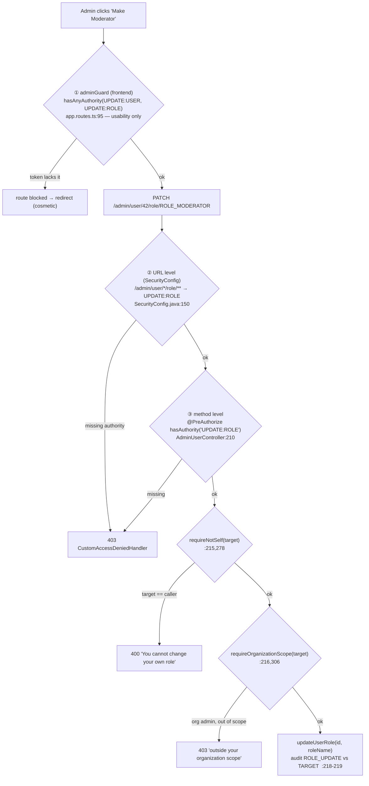
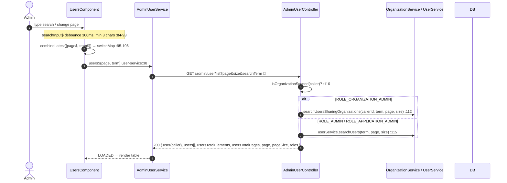
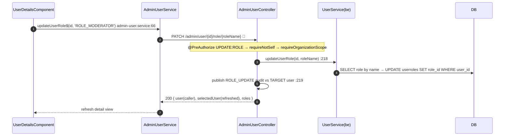
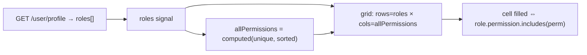

# 20 · Admin users & RBAC (directory, detail, role, settings, roles matrix)

> Assumes [`00-anatomy-of-a-request.md`](./00-anatomy-of-a-request.md). The administrative surface —
> the **only** place one user changes another's role or account state. Read alongside the flow-10
> IDOR note: this controller is how object-level authorization *should* be done.

**Routes (all `[authenticationGuard, adminGuard]`):** `/users` · `/users/:id` · `/roles`
**Endpoints (`/admin/user/**`):** `GET /list` · `GET /{id}` · `GET /{id}/events` ·
`PATCH /{id}/role/{roleName}` (UPDATE:ROLE) · `PATCH /{id}/settings` (UPDATE:USER) → `AdminUserController`

---

## A · Three layers of authorization + two structural guards



**Why three layers (FR-RBAC-2 defense-in-depth):** the frontend guard is a UX convenience that a
tampered token can defeat — but it only changes what *renders*, never what the API permits. The URL
and method checks are the real enforcement, intentionally duplicated so a routing refactor can't
silently drop the gate (`AdminUserController.java:47-54`).

**The two structural guards** (`:278-312`):
- `requireNotSelf` — an admin cannot target their own account, making self-role-elevation
  *structurally* impossible (FR-RBAC-4), not merely policy-checked.
- `requireOrganizationScope` — a `ROLE_ORGANIZATION_ADMIN` may only act on users sharing an active
  org (FR-ORG-2); out-of-scope targets get a `403` whose message names no account data (NFR-SEC-7).
  `ROLE_ADMIN` / `ROLE_APPLICATION_ADMIN` are unscoped (FR-ORG-3).

> 🟢 **Principal-as-source-of-truth.** Here the target id is a **path variable** (`@PathVariable Long id`,
> `:213`), the caller is the JWT principal, and ownership/authority are enforced server-side. The
> self-service `PATCH /user/update` historically trusted the body's `id` (an IDOR, fixed 2026-06-15 to
> source the id from the principal) — see [`10 §B`](./10-profile-and-account.md). Same app, two endpoints, opposite postures.

---

## B · User directory (list + debounced search)



`switchMap` cancels in-flight fetches so stale responses can't overwrite newer ones; `startWith(LOADING)`
flips the skeleton on each fetch (`users.component.ts:95-106`) — the same reactive idiom as the
customers list ([`30`](./30-customers.md)). The `user` key is the *calling admin* (for the navbar);
directory rows are under `users` (`AdminUserController.java:90-92`).

---

## C · Role change & account-state change



Account-state (`PATCH /{id}/settings`, `@PreAuthorize UPDATE:USER`) is identical in shape with
`@Valid SettingsForm` (`enabled`,`notLocked` both `@NotNull`) → `UPDATE_USER_SETTINGS_QUERY`
(`AdminUserController.java:244-266`). Both audit against the **target** so the action appears in *that*
user's activity history (FR-ADMIN-3/4).

> 🔭 **Planned (not built).** An admin endpoint to edit another user's *profile fields* (name, email,
> phone, …) — `PATCH /user/admin/update/{userId}`, org-scoped (`UserController.java:519`). Today
> admins change a user's **role** and **account state** only; the `Home > Users > User's Name`
> frontend skeleton already exists to wire to it. See the
> [gap register](./README.md#forecasted--not-yet-implemented-gap-register).

---

## D · Roles × Permissions matrix (read-only)

No new endpoint — `RolesMatrixComponent` reuses `GET /user/profile`, which already returns the full
roles catalogue with comma-delimited `permission` strings (`roles-matrix.component.ts:65-79`). Columns
are a `computed()` de-duplicated, sorted set of every permission across all roles (`:47-55`); each cell
is `hasPermission(role, perm)` splitting the role's `permission` string (`:90-93`). Pure client-side
projection of data already on hand.



---

## E · Failure paths

| Failure | Where | Status / message |
| --- | --- | --- |
| Missing authority | URL + `@PreAuthorize` | **403** "You don't have enough permission…" (`CustomAccessDeniedHandler`) |
| Admin targets self (role) | `requireNotSelf` (`:215`) | **400** "You cannot change your own role. Ask another administrator." |
| Admin targets self (settings) | `requireNotSelf` (`:249`) | **400** "…Use your profile settings." |
| Org admin acts out of scope | `requireOrganizationScope` (`:306-311`) | **403** "This user is outside your organization scope." |
| Tampered token grants admin UI but not authority | frontend guard passes, backend rejects | **403** at the API — UI render ≠ API permission |

---

## F · Wire-level detail

### `GET /admin/user/list?page=0&size=10&searchTerm=ada` → `200`
```jsonc
{ "data": {
    "user": { …caller UserDTO… },
    "users": [ { "id":42, "firstName":"Ada", "email":"ada@…", "roleName":"ROLE_USER", … }, … ],
    "usersTotalElements": 87, "usersTotalPages": 9, "page": 0, "pageSize": 10,
    "roles": [ { "name":"ROLE_USER", "permission":"READ:USER,UPDATE:USER,…" }, … ] },
  "message":"Users retrieved successfully.","status":"OK","statusCode":200 }
```
Flat pagination metadata — this endpoint does **not** use Spring's `Page<T>` envelope; totals come
from a JDBC count query (`admin.interface.ts:5-13`).

### `PATCH /admin/user/42/role/ROLE_MODERATOR` (empty body) → `200`
```jsonc
{ "data": { "user": { …caller… }, "selectedUser": { …id:42, roleName:"ROLE_MODERATOR"… },
            "roles": [ … ] },
  "message":"User role updated successfully.","status":"OK","statusCode":200 }
```

### SQL executed

| Action | Query constant | SQL |
| --- | --- | --- |
| list (unscoped) | `UserQuery.SELECT_USERS_PAGED_QUERY` · `COUNT_USERS_QUERY` | `SELECT * FROM users WHERE first_name LIKE :searchTerm OR … ORDER BY created_at DESC LIMIT :pageSize OFFSET :offset` |
| list (org-scoped) | `OrganizationQuery` (search/count sharing orgs) | joins through the org-membership tables |
| detail | `SELECT_USER_BY_ID_QUERY` + `EventQuery` paginated | `SELECT * FROM users WHERE id = :id` |
| role change | `RoleQuery.SELECT_ROLE_BY_NAME_QUERY` · `UPDATE_USER_ROLE_QUERY` | `SELECT * FROM roles WHERE name=:name` · `UPDATE userroles SET role_id=:roleId WHERE user_id=:userId` |
| settings | `UserQuery.UPDATE_USER_SETTINGS_QUERY` | `UPDATE users SET enabled=:enabled, non_locked=:notLocked WHERE id=:userId` |
| roles matrix | `RoleQuery.SELECT_ALL_ROLES_QUERY` (via `/user/profile`) | `SELECT * FROM roles ORDER BY id` |

---

## Cross-links
- The IDOR counter-example → [`10 §B`](./10-profile-and-account.md)
- The authority claim these checks read → [`00 §5-6`](./00-anatomy-of-a-request.md)
- The list idiom mirrored here → [`30-customers.md`](./30-customers.md)
