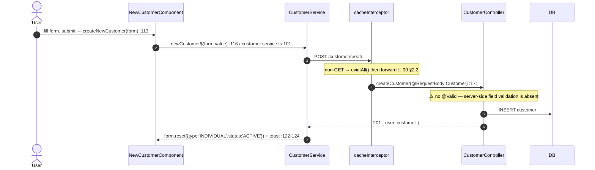
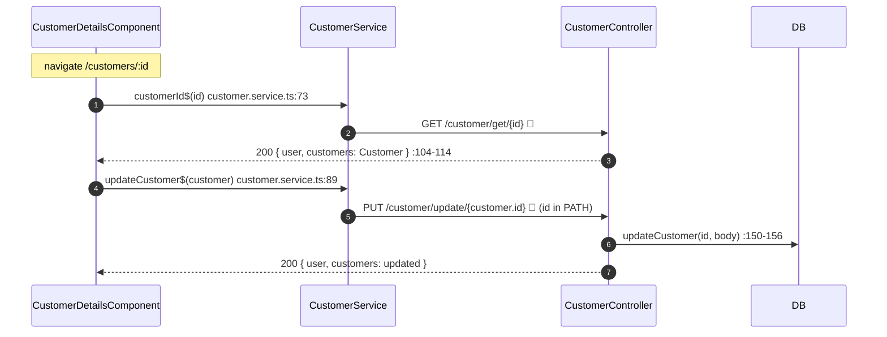

# 30 · Customers (list / search, new, details, update)

> Assumes [`00-anatomy-of-a-request.md`](./00-anatomy-of-a-request.md). The business domain. All
> `/customer/**` endpoints require a valid JWT; `GET` needs `READ:USER`/`READ:CUSTOMER`, `POST`/`PUT`
> need `UPDATE:USER`/`UPDATE:CUSTOMER` ([`00 §5`](./00-anatomy-of-a-request.md)).

**Routes:** `/customers` (list) · `/customer/new` · `/customers/:id` (details).
**Endpoints:** `GET /customer/list` · `GET /customer/search` · `GET /customer/get/{id}` ·
`POST /customer/create` · `PUT /customer/update/{id}` → `CustomerController`.

> **How the controller gets the user.** `CustomerController` uses `@AuthenticationPrincipal UserDTO user`
> (`:62`) — the `UserDTO` that `CustomAuthFilter`/`TokenProvider` installed as the `SecurityContext`
> principal — then re-fetches by email for fresh data. This is a *fourth* user-resolution pattern
> distinct from `UserController`'s three ([`02`](./02-login-and-mfa.md)).

---

## A · The shared reactive list idiom (used here, on the dashboard, and in admin)

```mermaid
sequenceDiagram
    autonumber
    actor U as User
    participant DOM as customers.component.html
    participant CMP as CustomersComponent
    participant SVC as CustomerService
    participant CACHE as cacheInterceptor
    participant CTRL as CustomerController
    participant DB as DB
    U->>DOM: type in search / click page
    DOM->>CMP: onSearchInput(term) → searchInput$.next  :135
    Note over CMP: debounce 300ms + filter(len==0 || >=3)  :101-104
    CMP->>CMP: currentSearchTerm.set + currentPage.set(0)  :107-110
    Note over CMP: signals → toObservable → combineLatest([page,term])  :73-74,112
    CMP->>SVC: switchMap → term ? searchCustomers$ : customers$  :113-114
    SVC->>CACHE: GET /customer/list?page&size (or /search?name&page&size)
    Note over CACHE: GET, cacheable → cache hit short-circuits (no token attach)  00 §2.2
    CACHE->>CTRL: (on miss) forward 🔑
    CTRL->>DB: getCustomers(page,size) + getStats()  :87-89
    CTRL-->>SVC: 200 { user, page: Page<Customer>, stats }
    SVC-->>CMP: map → { LOADED, appData } ; startWith LOADING ; catchError ERROR  :115-122
    CMP->>DOM: customersState.set(state) → render table
```

`switchMap` cancels any in-flight request when a newer page/term arrives, so a slow earlier response
can never overwrite a newer one (`customers.component.ts:112-125`). The **exact same** shape powers
the [dashboard](./32-dashboard.md) and the [admin directory](./20-admin-users-rbac.md) — only the
service call differs.

### Pagination envelope (Spring `Page<T>`)
Customer pages use Spring Boot 3.3+'s nested `page` metadata object, mirrored by
`PageInterface<T>` (`appstates.interface.ts:64-72`): `{ content: Customer[], page: { size, number,
totalElements, totalPages } }`. The component reads `data.page.page.totalPages` for bounds checks
(`home.component.ts:141`).

---

## B · Create a customer



> ⚠️ Like registration ([`01 §A`](./01-register-and-verify.md)), `createCustomer` binds a raw
> `@RequestBody Customer` with **no `@Valid`** (`CustomerController.java:171`). Field validation is
> client-side only; a direct API call bypasses it. The form's defaults (`type:'INDIVIDUAL'`,
> `status:'ACTIVE'`) come from `new-customer.component.ts:122`.

Because `POST` is a mutation, `cacheInterceptor.evictAll()` fires, so the next visit to the customer
list re-fetches fresh ([`00 §2.2`](./00-anatomy-of-a-request.md)).

---

## C · Details & update



> 🟢 **IDOR-safe (contrast with flow 10).** The update id is a `@PathVariable customerId`
> (`CustomerController.java:150-151`); the service ignores any id in the body. This is the pattern
> `PATCH /user/update` *should* follow — see [`10 §B`](./10-profile-and-account.md).

---

## D · Failure paths

| Failure | Where | User sees |
| --- | --- | --- |
| Missing READ/UPDATE:CUSTOMER authority | SecurityConfig `GET/POST/PUT /**` | 403 (`CustomAccessDeniedHandler`) |
| Not authenticated / expired token | `CustomAuthenticationEntryPoint` | 401 → interceptor silent refresh ([`00 §7.2`](./00-anatomy-of-a-request.md)) |
| Search term < 3 chars | client-side `filter` | request simply not sent (`customers.component.ts:104`) |
| Server error on create/update | `GlobalExceptionHandler` | error toast; form stays visible (`isLoading` flips, state stays LOADED) |

---

## E · Wire-level detail

### `GET /customer/list?page=0&size=20` → `200`
```jsonc
{ "data": {
    "user": { …UserDTO… },
    "page": { "content": [ { "id":7, "name":"Acme Co", "email":"ops@acme.io",
                             "type":"INDIVIDUAL", "status":"ACTIVE", "address":"…", "phone":"…" }, … ],
              "page": { "size":20, "number":0, "totalElements":42, "totalPages":3 } },
    "stats": { "totalCustomers":42, "totalInvoices":118, "totalBilled":250400 } },
  "message":"Customers retrieved successfully!","status":"OK","statusCode":200 }
```
(Customer field names are representative — see `customer.interface.ts` for the contract.)

### `POST /customer/create` → `201`
```http
POST /customer/create    Authorization: Bearer 🔑
{ "name":"Acme Co", "email":"ops@acme.io", "type":"INDIVIDUAL", "status":"ACTIVE", "address":"…", "phone":"…" }
```
→ `{ "data": { "user", "customer": { …created… } }, "message":"Customer has been created!", "statusCode":201 }`

### SQL executed

| Action | Source | SQL (representative) |
| --- | --- | --- |
| list / search | `CustomerService` (`CustomerRepo`) | `SELECT * FROM customer … LIMIT/OFFSET` (+ `WHERE name LIKE` for search) |
| stats | `CustomerQuery.STATS_QUERY` | `SELECT c.total_customers, i.total_invoices, inv.total_billed FROM (SELECT COUNT(*)…customer) c, (SELECT COUNT(*)…invoice) i, (SELECT ROUND(SUM(totalAmount))…invoice) inv` |
| get one | `CustomerRepo` | `SELECT * FROM customer WHERE id = :id` |
| create | `CustomerRepo` | `INSERT INTO customer (…) VALUES (…)` |
| update | `CustomerRepo` | `UPDATE customer SET … WHERE id = :id` |

---

## Cross-links
- The dashboard that reuses `customers$` + stats + report download → [`31-invoices.md`](./31-invoices.md) · [`32-dashboard.md`](./32-dashboard.md)
- The same list idiom in admin → [`20-admin-users-rbac.md`](./20-admin-users-rbac.md)
- The interceptor/cache/authz machinery → [`00-anatomy-of-a-request.md`](./00-anatomy-of-a-request.md)
