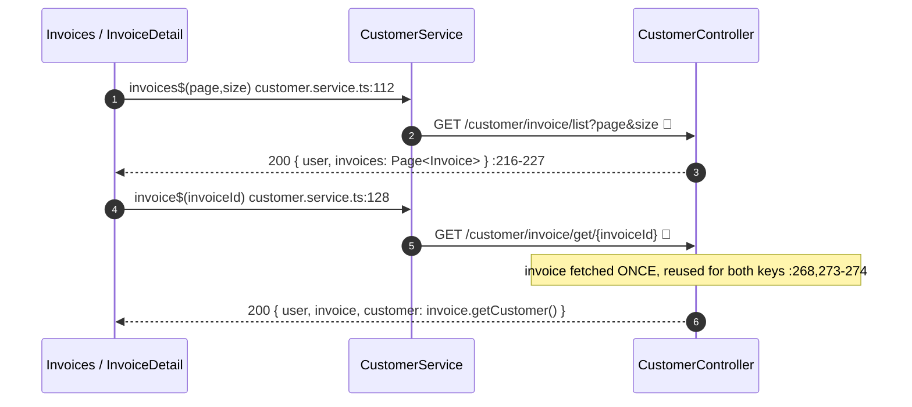

# 31 · Invoices (list, new, detail)

> Assumes [`00-anatomy-of-a-request.md`](./00-anatomy-of-a-request.md) and the shared list idiom from
> [`30 §A`](./30-customers.md). This doc covers the invoice-specific parts: the multi-line service
> builder and customer-linking.

**Routes:** `/invoices` · `/invoice/new` · `/invoice/:id/:invoiceNumber`.
**Endpoints:** `GET /customer/invoice/list` · `GET /customer/invoice/new` ·
`POST /customer/invoice/addtocustomer/{customerId}` · `GET /customer/invoice/get/{invoiceId}` →
`CustomerController`.

---

## A · New invoice — two-dropdown form + line items

The new-invoice form needs **two** server-provided lists before the user can fill it in, so a single
`GET /customer/invoice/new` returns the user, the full customer list (customer dropdown), and the
services catalog (line-item dropdown) in one shot (`CustomerController.java:239-251`).

```mermaid
sequenceDiagram
    autonumber
    actor U as User
    participant CMP as NewInvoiceComponent
    participant SVC as CustomerService
    participant CTRL as CustomerController
    participant DB as DB
    Note over CMP: ngOnInit
    CMP->>SVC: newInvoice$()  :119 / customer.service.ts:139
    SVC->>CTRL: GET /customer/invoice/new  🔑
    CTRL-->>SVC: 200 { user, customers[], availableServices[] }  :244-246
    SVC-->>CMP: availableServices cached; customer dropdown populated  :124
    U->>CMP: pick service in a line → onServiceSelected(i, id)  :102
    Note over CMP: copies {name, price} from catalog into serviceLines[i]  :103-107
    U->>CMP: addServiceLine() / removeServiceLine(i)  :75,87
    U->>CMP: submit → createNewInvoice(form)  :142
    CMP->>SVC: addInvoiceToCustomer$(form.customerId, { ...form, services: serviceLines })  :147
    SVC->>CTRL: POST /customer/invoice/addtocustomer/{customerId}  🔑 (id in PATH)
    Note over CACHE: POST → cacheInterceptor.evictAll()
    CTRL->>DB: addInvoiceToCustomer(customerId, invoice)  :291
    CTRL-->>SVC: 200 { user, customers (refreshed) }
    SVC-->>CMP: form.reset({status:'PENDING'}) + serviceLines=[{name:'',price:0}] + toast  :152-156
```

### The line-item builder
`serviceLines: InvoiceLineItem[]` lives **outside** the `NgForm` (`new-invoice.component.ts:47`) so
the form's validity check stays on scalar fields while the dynamic rows are managed imperatively:
- `addServiceLine()` pushes `{ name:'', price:0 }` (`:75-77`)
- `removeServiceLine(i)` splices (the remove button only renders when ≥2 lines, so the last can't be
  deleted) (`:87-89`)
- `onServiceSelected(i, serviceId)` looks the catalog entry up by `+serviceId` (DOM gives a string)
  and copies `name`+`price` into the row (`:102-108`)

On submit the lines are merged into the payload as `services` (`:146`); the `customerId` form field
becomes the **path variable**, the rest becomes the body — so the invoice is created *and* linked in
one call.

> 🔭 **Planned (not built).** Linking a *standalone* invoice to a customer after the fact
> (`PUT /customer/invoice/{invoiceId}/addtocustomer/{customerId}`, `CustomerController.java:183`) and
> **draft invoices** (nullable `customer`, `Invoice.java:80`). Today every invoice is created already
> linked to a customer. See the [gap register](./README.md#forecasted--not-yet-implemented-gap-register).

---

## B · List & detail



The detail endpoint resolves the invoice a single time and derives the `customer` payload from
`invoice.getCustomer()` rather than a second query (`CustomerController.java:266-279`) — one DB
round-trip serves all three response keys.

---

## C · Failure paths

| Failure | Where | User sees |
| --- | --- | --- |
| Missing READ/UPDATE:CUSTOMER authority | SecurityConfig | 403 |
| Token expired mid-session | entry point → interceptor | silent refresh + retry ([`00 §7.2`](./00-anatomy-of-a-request.md)) |
| No customer selected on new-invoice | `customerId` path var would be `undefined` | request fails; surfaced as error toast |
| Server error on create | `GlobalExceptionHandler` | error toast; form stays (`new-invoice.component.ts:159-162`) |

---

## D · Wire-level detail

### `GET /customer/invoice/new` → `200`
```jsonc
{ "data": { "user": { … }, "customers": [ { "id":7, "name":"Acme Co", … }, … ],
            "availableServices": [ { "id":1, "name":"Consulting", "price":150 }, … ] },
  "message":"New invoice page reached and Customers have been retrieved!","status":"OK","statusCode":200 }
```

### `POST /customer/invoice/addtocustomer/7` → `200`
```http
POST /customer/invoice/addtocustomer/7    Authorization: Bearer 🔑
{ "invoiceNumber":"INV-1042", "status":"PENDING", "invoiceDate":"2026-06-14",
  "services":[ { "name":"Consulting", "price":150 }, { "name":"Hosting", "price":40 } ] }
```
→ `{ "data": { "user", "customers": [ …refreshed… ] }, "message":"Invoice added to customer for Customer with ID: 7!" }`
(Invoice field names representative — see `invoice.interface.ts`.)

### SQL executed

| Action | Source | SQL (representative) |
| --- | --- | --- |
| list | `CustomerRepo` | `SELECT * FROM invoice … LIMIT/OFFSET` |
| new-invoice data | `CustomerService.getCustomers()` + `getServices()` | `SELECT * FROM customer` · `SELECT * FROM services` |
| create + link | `CustomerRepo` | `INSERT INTO invoice (…, customer_id) VALUES (…)` |
| detail | `CustomerRepo` | `SELECT * FROM invoice WHERE id = :id` (+ joined customer) |

---

## Cross-links
- The shared list idiom & pagination envelope → [`30 §A`](./30-customers.md)
- Stats that count these invoices → [`32-dashboard.md`](./32-dashboard.md)
- XLSX invoice export (progress-streamed) → [`32 §B`](./32-dashboard.md)
