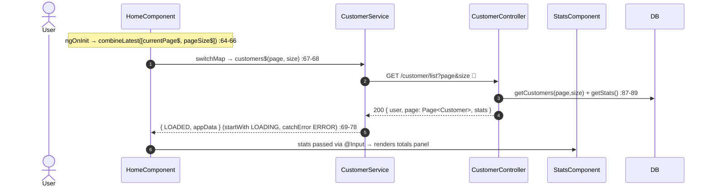
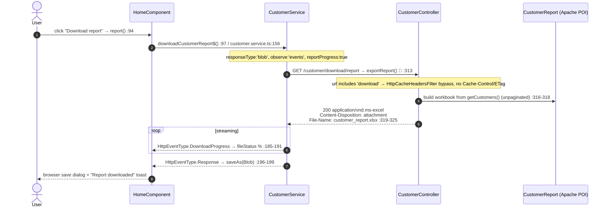

# 32 · Home dashboard & stats (+ XLSX report download)

> Assumes [`00-anatomy-of-a-request.md`](./00-anatomy-of-a-request.md) and the list idiom from
> [`30 §A`](./30-customers.md). The post-login landing page (`/`, `authenticationGuard`).

**Route:** `/` → `HomeComponent`. **Endpoints:** `GET /customer/list` (customers + stats) ·
`GET /customer/download/report` (XLSX) → `CustomerController`.

---

## A · Loading the dashboard

The home page reuses the customers list idiom verbatim, but keyed on **page + pageSize** (it adds a
page-size selector) instead of a search term:



`changePageSize(size)` resets `currentPage` to 0 so the user can't request a now-out-of-range page
(`home.component.ts:155-158`); `goToPage` double-guards bounds against
`data.page.page.totalPages` (`:140-143`) on top of the template's `[disabled]` button bindings.

### Stats
`StatsComponent` receives the `stats` object via `@Input` (the dashboard already fetched it
alongside the list, so no separate call). The numbers come from one aggregate query:
```sql
-- CustomerQuery.STATS_QUERY
SELECT c.total_customers, i.total_invoices, inv.total_billed
FROM (SELECT COUNT(*) total_customers FROM customer) c,
     (SELECT COUNT(*) total_invoices FROM invoice) i,
     (SELECT ROUND(SUM(totalAmount)) total_billed FROM invoice) inv
```
Inline subqueries (not JOINs) because there's no natural key between the two aggregates
(`CustomerQuery.java:10-19`). A standalone `GET /customer/stats` endpoint also exists
(`stats$`, currently unused — the dashboard prefers the bundled copy, `customer.service.ts:36-47`).

---

## B · XLSX report download (progress-streamed binary)

This is the one flow that leaves the JSON envelope behind:



Three spine details converge here:
1. **`File-Name` is readable** only because CORS **exposes** it (`SecurityConfig.java:233`) — without
   that, the browser would strip the header.
2. **Not cached** — `HttpCacheHeadersFilter` skips any URL containing `download`, so a large blob
   never gets `Cache-Control`/`ETag` and the browser never buffers it as a candidate for reuse.
3. **Progress** — `reportProgress:true` + `observe:'events'` make `HttpClient` emit
   `DownloadProgress` events; `reportProgress()` maps them to a `%` signal and the final `Response`
   event to `saveAs` (file-saver) (`home.component.ts:183-200`). The invoice report
   (`GET /customer/invoice/download/report`) works identically.

---

## C · Failure paths

| Failure | Where | User sees |
| --- | --- | --- |
| Not authenticated | `authenticationGuard` → `/login`; API → 401 | redirect / silent refresh |
| Missing READ:CUSTOMER/USER | SecurityConfig `GET /**` | 403 |
| Out-of-range page | `goToPage` guard + `[disabled]` buttons | navigation ignored (`home.component.ts:140-143`) |
| Download error | `report()` `catchError` | error toast; table stays visible (`:105-108`) |

---

## D · Wire-level detail

### `GET /customer/list?page=0&size=20` → `200`
Same envelope as [`30 §E`](./30-customers.md): `{ user, page: Page<Customer>, stats: { totalCustomers,
totalInvoices, totalBilled } }`.

### `GET /customer/download/report` → `200` (binary)
```http
HTTP/1.1 200 OK
Content-Type: application/vnd.ms-excel
Content-Disposition: attachment; filename=customer_report.xlsx
File-Name: customer_report.xlsx              ← readable thanks to CORS exposedHeaders
Access-Control-Expose-Headers: …, File-Name

<XLSX binary body>
```

### SQL executed

| Action | Source | SQL |
| --- | --- | --- |
| list | `CustomerRepo` | `SELECT * FROM customer … LIMIT/OFFSET` |
| stats | `CustomerQuery.STATS_QUERY` | aggregate subqueries (above) |
| report | `CustomerService.getCustomers()` (unpaginated) | `SELECT * FROM customer` → Apache POI workbook |

---

## Cross-links
- The list idiom & pagination envelope → [`30 §A`](./30-customers.md)
- The CORS `exposedHeaders` that make `File-Name` readable → [`00 §3`](./00-anatomy-of-a-request.md)
- Invoices counted in the stats → [`31-invoices.md`](./31-invoices.md)
