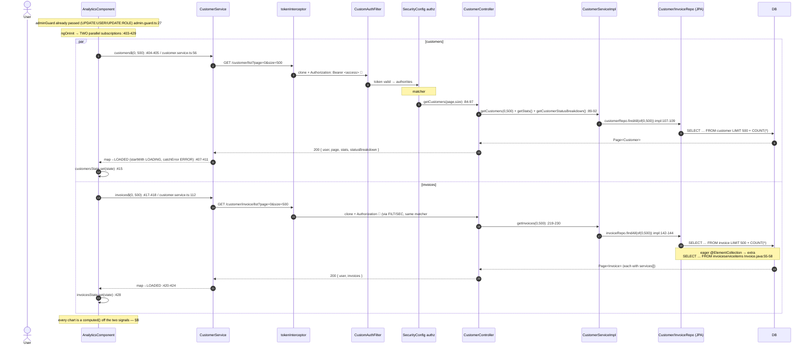
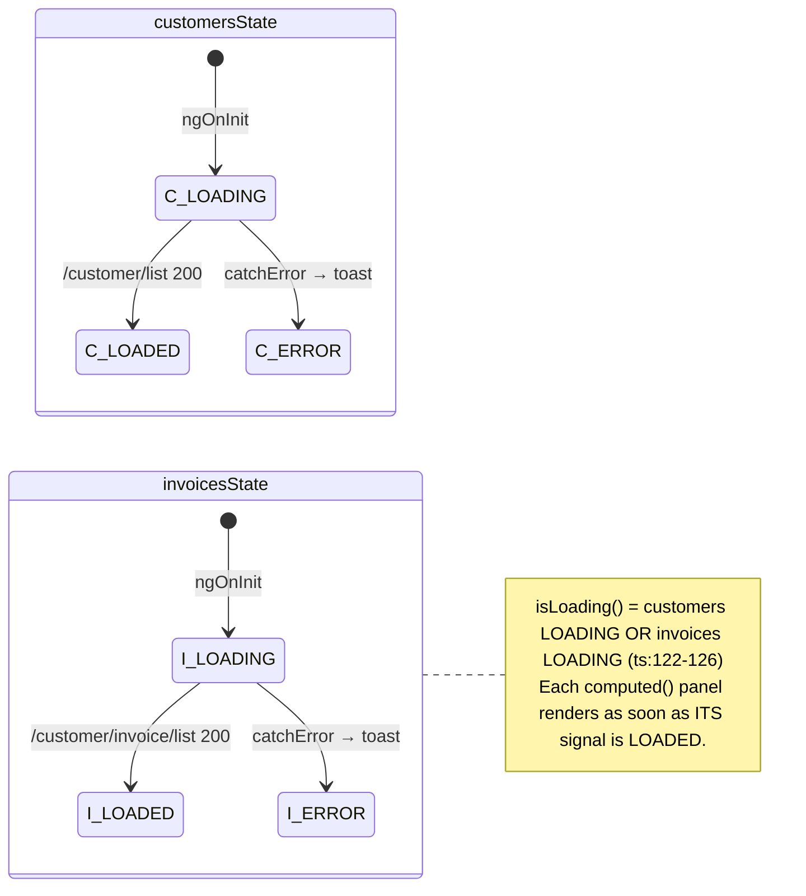

# 33 · Analytics Hub (admin-only)

> Assumes you've read [`00-anatomy-of-a-request.md`](./00-anatomy-of-a-request.md). This doc only
> calls out where the Analytics Hub diverges from the shared interceptor/filter machinery, and
> leans on the list idiom already documented in [`30 §A`](./30-customers.md) and the dashboard's
> stats handling in [`32-dashboard.md`](./32-dashboard.md).

**Route:** `/analytics` → `AnalyticsComponent` (`tesseraapp/src/app/features/analytics/analytics/analytics.component.ts`, `.html`)
**Guards:** `[authenticationGuard, adminGuard]` (`app.routes.ts:134-141`)
**Primary endpoints:** `GET /customer/list?page=0&size=500` · `GET /customer/invoice/list?page=0&size=500` → `CustomerController`

The Analytics Hub is a **pure client-side derivation**. There is **no `/analytics` endpoint** — the
component fetches one large page of customers and one large page of invoices, then computes every
KPI, trend line, donut, and bar in Angular `computed()` signals. Both backend GETs are the same ones
the dashboard ([`32`](./32-dashboard.md)) and invoices list ([`31`](./31-invoices.md)) already use;
the hub just asks for a bigger page (`size=500`) and throws away most of what the dashboard reads.

| What loads | `data` key consumed | UI outcome |
| --- | --- | --- |
| `GET /customer/list` returns `page` of customers | `appData.data.page.content` (`ts:115-117`) | growth/acquisition/status/type visuals |
| `GET /customer/invoice/list` returns `invoices` page | `appData.data.invoices.content` (`ts:118-120`) | revenue/collection/stacked-status/service-util visuals |
| Either call still `LOADING` | `isLoading()` true (`ts:122-126`) | skeleton/placeholder copy in each panel |
| Either call errors | `notification.onError` + that signal → `ERROR` (`ts:409-412 / 422-425`) | toast; the other half of the page still renders |
| `< 2` months of activity | `trendPoints().length < 2` (`html:84`) | "Not enough data yet" message in place of the trend chart |

> **Gotcha (silent undercount).** Both fetches are capped at `size=500` (`ts:405, 418`). Every chart
> is computed off only the rows that came back, so once customers or invoices exceed 500 the hub
> quietly undercounts. There is no pagination control here — the page size *is* the dataset.

---

## A · Loading the hub

### What the user does

1. Opens the **Admin ▸ Analytics Hub** navbar link (`navbar.component.html:92`), rendered only when
   `canManageUsers` is true (`navbar.component.html:62`), or navigates straight to `/analytics`.
2. `adminGuard` runs first: it requires `hasAnyAuthority('UPDATE:USER', 'UPDATE:ROLE')`
   (`admin.guard.ts:27`) — anonymous users are sent to `/login`, authenticated-but-not-staff users
   are bounced to `/` (`admin.guard.ts:24-30`).
3. `AnalyticsComponent.ngOnInit()` fires **two independent** service calls in parallel
   (`ts:403-429`) — not a `combineLatest`; each owns its own signal and resolves on its own.

### The full trace



Each subscription uses `takeUntilDestroyed(this.destroyRef)` (`ts:413, 426`), so neither needs a
manual `ngOnDestroy`. The component is `ChangeDetectionStrategy.OnPush` (`ts:94`); a `signal.set(...)`
is what triggers re-render, and every derived value is a `computed()` that recomputes only when its
source signal changes.

---

## B · Everything is computed in the browser

No value on this page comes from a dedicated analytics query. Each visual is a `computed()` that reads
`customers()` / `invoices()` and reshapes them. The two raw signals:

| Signal | Source | Reads |
| --- | --- | --- |
| `user()` | `ts:111-113` | `customersState().appData?.data?.user` |
| `customers()` | `ts:115-117` | `customersState().appData?.data?.page?.content ?? []` |
| `invoices()` | `ts:118-120` | `invoicesState().appData?.data?.invoices?.content ?? []` |

The visuals derived from them:

| Visual (template) | Computed signal | Logic | Source |
| --- | --- | --- | --- |
| KPI — Customer Growth (MoM) | `momCustomerGrowth` | `(curr-prev)/prev` over last 2 months of `monthlyCustomerData` | `ts:133-139` |
| KPI — Revenue Growth (MoM) | `momRevenueGrowth` | same, over `monthlyInvoiceData.revenue` | `ts:142-148` |
| KPI — Collection Rate | `collectionRate` | `PAID / total` invoices in the loaded page | `ts:150-155` |
| KPI — Pending Pipeline | `pendingPipelineValue` | `Σ totalAmount` where `status === 'PENDING'` | `ts:157-161` |
| Dual-area trend chart | `trendPoints` + `customer/revenueLinePath` + `…AreaPath` | last **10** months; each series normalised independently so neither flattens the other | `ts:220-285` |
| Customer status donut | `customerStatusSegments` + `customerTotal` | `GROUP BY status` **in JS** over the loaded customers | `ts:333-362` |
| Customer type split | `customerTypeSplit` | `GROUP BY type` in JS, sorted desc | `ts:366-377` |
| Customer acquisition bars | `acquisitionBars` | last **8** months of `monthlyCustomerData` | `ts:314-322` |
| Stacked invoice-status bars | `stackedBars` | last **8** months, PAID/PENDING/OVERDUE/other per month | `ts:289-310` |
| Service utilisation top-10 | `serviceUtil` | iterate each `inv.services[]` line item, count + sum `price`, sort by frequency | `ts:381-397` |

Monthly grouping is done in JS off `createdAt` (customers, `ts:165-183`) and `invoiceDate` (invoices,
`ts:187-215`), keyed `YYYY-MM` and `slice(-12)` before any chart further trims to 10 or 8.

> **The donut diverges from the dashboard — on purpose to note, by accident in effect.** The home
> dashboard's status donut uses the backend's whole-table `statusBreakdown` map so it stays accurate
> beyond the loaded page (see [`32 §Stats`](./32-dashboard.md) and `CustomerQuery.CUSTOMER_STATUS_BREAKDOWN_QUERY`).
> The Analytics Hub **ignores** that map and recomputes the donut from `customers()` — the loaded
> page only (`ts:333-338`). So the same `/customer/list` response carries an accurate breakdown that
> this page throws away, then derives a page-bounded one instead. If a diagram/doc and the code
> disagree, **the code wins** — and the code computes client-side here.

---

## C · Admin gating is frontend-only

| Layer | Control | Authority required | Source |
| --- | --- | --- | --- |
| Route | `adminGuard` | `UPDATE:USER` **or** `UPDATE:ROLE` | `admin.guard.ts:27` |
| Navbar visibility | `canManageUsers` flag | same staff authorities | `navbar.component.html:62` |
| In-page button toggle | `isAdmin` | `UPDATE:USER` / `UPDATE:ROLE` / `DELETE:USER` | `ts:128` |
| **Backend data** | `SecurityConfig` matcher #12 | **`READ:USER` or `READ:CUSTOMER`** | `SecurityConfig.java:160` |

> ⚠️ **The "admin-only" badge stops at the router.** Neither `/customer/list` nor
> `/customer/invoice/list` matches an `/admin/**` rule. They fall through to the broad
> `requestMatchers(GET, "/**").hasAnyAuthority("READ:USER","READ:CUSTOMER")` catch-all
> (`SecurityConfig.java:160`), so **any** authenticated user with a read authority can call them
> directly and receive the same system-wide data — the `adminGuard` only changes what *renders*
> (per NFR-SEC-4, `admin.guard.ts:14-16`). There is no server-side admin double-check on the data
> behind this page. Treat the hub as an admin *convenience surface*, not an access-control boundary;
> the data it shows is not actually admin-scoped. See [`../GUIDE.md` §7](../GUIDE.md#7-security-model).

Also note `isAdmin` (`ts:128`) is a **different** authority set from the route guard: it adds
`DELETE:USER` and only toggles the in-header "Billing Overview" button (`html:14-18`), nothing more.

---

## D · Failure paths

| Failure | Where | User sees |
| --- | --- | --- |
| Not authenticated | `adminGuard` → `/login` (`admin.guard.ts:24`); API → 401 | redirect / silent refresh ([`00 §7.2`](./00-anatomy-of-a-request.md#72-frontend-401--silent-refresh--retry)) |
| Authenticated, not staff | `adminGuard` → `/` (`admin.guard.ts:30`) | bounced home before any fetch |
| `GET /customer/list` errors | `catchError` → `customersState = ERROR` (`ts:409-411`) | toast; invoice-side panels still render |
| `GET /customer/invoice/list` errors | `catchError` → `invoicesState = ERROR` (`ts:422-424`) | toast; customer-side panels still render |
| Missing `READ:*` on the API | `SecurityConfig` `GET /**` → `CustomAccessDeniedHandler` | 403 envelope → toast |
| `< 2` months of data | `trendPoints().length < 2` (`html:84`) | "Not enough data yet — needs at least 2 months of activity." |
| Empty sub-dataset | each panel's `@if (…length)` / `@empty` (`html:151,219,250,288`) | per-panel "No … data yet." |

Because the two states are independent, a failure on one call leaves the other half of the dashboard
fully functional — there is no single page-level `ERROR` screen.

---

## E · The dual DataState machine

The hub holds **two** `GlobalStateInterface` signals, not one (`ts:104-109`). `isLoading()` is the OR
of both (`ts:122-126`); each panel renders against the slice of data it needs once that slice arrives.



---

## F · Wire-level detail

### F.1 · The requests on the wire

```http
GET /customer/list?page=0&size=500 HTTP/1.1          ← customer.service.ts:56-60
Host: localhost:8080                                  ← environment.apiUrl (environment.ts)
Authorization: Bearer <access_token>                  ← attached by tokenInterceptor (token.interceptor.ts:79) 🔑
Accept: application/json
```

```http
GET /customer/invoice/list?page=0&size=500 HTTP/1.1  ← customer.service.ts:112-115
Host: localhost:8080
Authorization: Bearer <access_token>                  🔑
Accept: application/json
```

Neither URL is in `HttpCacheHeadersFilter`'s bypass list, so both responses carry `Cache-Control:
private, no-cache` + an ETag. A later navigation back to `/analytics` (no intervening mutation)
still makes a real request — `no-cache` means "always revalidate," not "skip the network" — but
gets back an empty `304 Not Modified` rather than the full payload, since nothing has changed. See
[`00 §2.3`](./00-anatomy-of-a-request.md#23-response-caching-backend-driven-not-an-interceptor).

### F.2 · Request bodies & validation

**None.** Both calls are `GET` with no body, so there is no `@Valid` binding on this flow. The only
inputs are the query params, bound on the controller as
`@RequestParam Optional<Integer> page, @RequestParam Optional<Integer> size` (`CustomerController.java:85, 220`),
defaulting to `0` / `20` when absent (`page.orElse(0)`, `size.orElse(20)`) — though the component
always supplies `0` / `500` explicitly.

### F.3 · Success responses

Both are the standard `HttpResponse` envelope (`model/HttpResponse.java`); only the `data` map differs.

**Call 1 — `GET /customer/list` → `200`** (`CustomerController.java:84-97`):

```jsonc
{
  "timeStamp": "12:14:53.882",
  "statusCode": 200,
  "status": "OK",
  "message": "Customers retrieved successfully!",
  "data": {
    "user": { "id": 1, "email": "admin@tessera.dev", "authorities": "READ:USER,UPDATE:USER,…" },
    "page": {                                    // ← the ONLY key Analytics reads (ts:115-117)
      "content": [
        { "id": 7, "customerName": "Acme Corp", "type": "BUSINESS",
          "status": "ACTIVE", "createdAt": "2026-03-02T00:00:00Z" }
        // … up to 500
      ],
      "page": { "size": 500, "number": 0, "totalElements": 42, "totalPages": 1 }
    },
    "stats": { "totalCustomers": 42, "totalInvoices": 88, "totalBilled": 251400 }, // ← computed, then IGNORED here
    "statusBreakdown": { "ACTIVE": 30, "PENDING": 7, "INACTIVE": 5 }               // ← computed, then IGNORED here (§B)
  }
}
```

**Call 2 — `GET /customer/invoice/list` → `200`** (`CustomerController.java:219-230`):

```jsonc
{
  "timeStamp": "12:14:53.991",
  "statusCode": 200,
  "status": "OK",
  "message": "All Invoices retrieved successfully!",
  "data": {
    "user": { "id": 1, "email": "admin@tessera.dev" },
    "invoices": {                                // ← the ONLY key Analytics reads (ts:118-120)
      "content": [
        { "id": 3, "invoiceNumber": "A3F9KQ2B", "status": "PAID",
          "totalAmount": 1200.0, "invoiceDate": "2026-04-11T00:00:00Z",
          "services": [                          // ← eager @ElementCollection → drives serviceUtil (ts:381-397)
            { "name": "Hosting", "price": 200.0 },
            { "name": "Support", "price": 1000.0 }
          ] }
        // … up to 500
      ],
      "page": { "size": 500, "number": 0, "totalElements": 88, "totalPages": 1 }
    }
  }
}
```

The `customer` field of each invoice is `@JsonIgnore`d to avoid a circular `Customer ⇄ Invoice`
serialization (`Invoice.java:89-92`); the hub never needs it.

### F.4 · Error response

A failure is the same envelope with a `reason`, e.g. an expired token on `/customer/list`:

```jsonc
{
  "timeStamp": "12:15:01.004",
  "statusCode": 401,
  "status": "UNAUTHORIZED",
  "reason": "I don't think you are logged in :( Please login to access this resource!",
  "message": "…"
}
```

`CustomerService.handleError` lifts `error.error.reason` into the thrown `Error`
(`customer.service.ts:198-199`); the component's `catchError` passes it to
`notification.onError(error)` and sets that signal to `ERROR` (`ts:409-411 / 422-424`).

### F.5 · SQL executed

| Step | Query source | SQL (Hibernate-generated unless noted) |
| --- | --- | --- |
| customers page | `customerRepo.findAll(of(0,500))` (`impl:107-109`) | `SELECT … FROM customer LIMIT 500 OFFSET 0` + `SELECT COUNT(*) FROM customer` |
| invoices page | `invoiceRepo.findAll(of(0,500))` (`impl:142-144`) | `SELECT … FROM invoice LIMIT 500 OFFSET 0` + `SELECT COUNT(*) FROM invoice` |
| invoice line items (eager) | `@ElementCollection(EAGER)` (`Invoice.java:55-58`) | `SELECT … FROM invoiceserviceitems WHERE invoice_id = ?` (per invoice) |
| stats — **computed, unused by UI** | `CustomerQuery.STATS_QUERY` (`CustomerQuery.java:18-19`) via `NamedParameterJdbcTemplate` (`impl:197-199`) | `SELECT c.total_customers, i.total_invoices, inv.total_billed FROM (SELECT COUNT(*) total_customers FROM customer) c, (SELECT COUNT(*) total_invoices FROM invoice) i, (SELECT ROUND(SUM(totalAmount)) total_billed FROM invoice) inv` |
| statusBreakdown — **computed, unused by UI** | `CustomerQuery.CUSTOMER_STATUS_BREAKDOWN_QUERY` (`CustomerQuery.java:30-31`) (`impl:211-220`) | `SELECT status, COUNT(*) AS count FROM customer GROUP BY status ORDER BY count DESC` |

> The bottom two rows run on **every** `/customer/list` call (`CustomerController.java:89-92`) — so the
> hub pays for the stats + status aggregations on the database and then discards both, recomputing
> equivalent figures client-side (§B). Customer/invoice/services access is Spring Data JPA
> (`CustomerRepo`/`InvoiceRepo` are interface-only, Hibernate writes the SQL); only the two aggregate
> constants are hand-written native SQL.

### F.6 · Response headers

Plain JSON — no special exposed headers (the hub never downloads a report, unlike
[`32 §B`](./32-dashboard.md#b--xlsx-report-download-progress-streamed-binary)):

```http
HTTP/1.1 200 OK
Content-Type: application/json
Access-Control-Allow-Origin: http://localhost:4200
```

If the backend mints a fresh access token it would surface in the CORS-exposed `Authorization` /
`Jwt-Token` headers ([`00 §3`](./00-anatomy-of-a-request.md#3-the-wire-cors-preflight--headers)), but
this flow does not rotate tokens.

---

## Cross-links

- The shared request spine (interceptors → filter → authz → UI) → [`00-anatomy-of-a-request.md`](./00-anatomy-of-a-request.md)
- The matcher table that makes these GETs `READ:*`-not-admin → [`00 §5`](./00-anatomy-of-a-request.md#5-authorization-the-matcher-table)
- The dashboard that *does* use `statusBreakdown` and shares both endpoints → [`32-dashboard.md`](./32-dashboard.md)
- The list idiom & pagination envelope this hub reuses → [`30 §A`](./30-customers.md)
- The invoice page + `services[]` line items the service-utilisation chart aggregates → [`31-invoices.md`](./31-invoices.md)
- Why frontend admin gates are usability-only, not a security boundary → [`../GUIDE.md` §7](../GUIDE.md#7-security-model)
