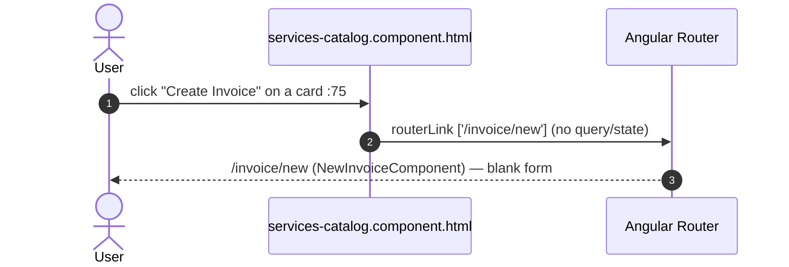

# 35 · Services & Apps catalog (browse the catalog)

> Assumes [`00-anatomy-of-a-request.md`](./00-anatomy-of-a-request.md). A read-only browse page for
> **all authenticated users** — it reuses the new-invoice endpoint rather than adding any backend of
> its own, so most of the machinery is the [`31-invoices.md`](./31-invoices.md) new-invoice plumbing
> seen from a different angle.

**Route:** `/services` → `ServicesCatalogComponent`
(`tesseraapp/src/app/features/services/services-catalog/services-catalog.component.ts`, `.html`).
Guard: `[authenticationGuard]` only — **no** `adminGuard` (`app.routes.ts:124-131`).
**Endpoint:** `GET /customer/invoice/new` → `CustomerController#newInvoice` (`CustomerController.java:242-254`).
No dedicated services endpoint exists — the page is a typed read of the `availableServices` key that
the new-invoice form already returns.

> **Where it surfaces.** Navbar → always-visible **Services** dropdown → "Service Catalog"
> (`navbar.component.html:53`). Unlike Billing/Analytics (which live in the `@if (canManageUsers)`
> Admin dropdown, `navbar.component.html:62`), this link renders for every signed-in user.

The component holds one signal `pageState` and derives everything from it via `computed()`:

| `DataState` | `pageState` carries | UI outcome |
| --- | --- | --- |
| `LOADING` | `dataState` only | 6 shimmer skeleton cards (`html:28-36`) |
| `LOADED` + `services().length > 0` | `appData.data.availableServices` | summary line + service-card grid (`html:48-81`) |
| `LOADED` + empty catalog | `availableServices = []` | empty-state panel (`html:82-88`) |
| `ERROR` | `error` string | red `alert-danger` **and** an error toast (`html:39-44`, `ts:79-82`) |

---

## A · Loading the catalog

A single fire-and-forget fetch on init — no pagination, no search, no page-size selector (it is a
flat catalog, not a paged list like [`30 §A`](./30-customers.md)):

```mermaid
sequenceDiagram
    autonumber
    actor U as User
    participant DOM as services-catalog.component.html
    participant CMP as ServicesCatalogComponent
    participant SVC as CustomerService
    participant CACHE as cacheInterceptor
    participant TOK as tokenInterceptor
    participant CTRL as CustomerController
    participant SRV as CustomerServiceImpl
    participant REPO as ServicesRepo (JPA)
    participant DB as DB
    U->>DOM: navigate /services (navbar → Service Catalog  :53)
    Note over CMP: ngOnInit → newInvoice$()  :73-75
    CMP->>SVC: newInvoice$()  customer.service.ts:139-142
    SVC->>CACHE: GET /customer/invoice/new
    Note over CACHE: GET, url has no bypass token → cacheable<br/>hit short-circuits (no token attach)  cache.interceptor.ts
    CACHE->>TOK: (on miss) forward
    Note over TOK: not a public route → attach Bearer 🔑  token.interceptor.ts
    TOK->>CTRL: GET /customer/invoice/new  🔑
    CTRL->>SRV: getServices() + getCustomers()  :248-249
    SRV->>REPO: servicesRepo.findAll()  CustomerServiceImpl:189-191
    REPO->>DB: SELECT … FROM `Services`  (Hibernate-generated)
    CTRL-->>SVC: 200 { user, customers, availableServices }
    SVC-->>CMP: map → { LOADED, appData } ; startWith LOADING ; catchError ERROR  :77-83
    CMP->>DOM: pageState.set(state) → render grid  :85
```

### What the user does
1. Clicks **Services → Service Catalog** in the navbar (`navbar.component.html:53`), landing on `/services`.
2. Sees skeleton cards while `pageState` is `LOADING` (the `startWith` emission, `ts:78`).
3. The grid paints once the response maps to `LOADED` (`ts:77`).

> **Gotcha — it over-fetches.** `GET /customer/invoice/new` returns **both** `customers` (the full
> unpaginated list, `CustomerController.java:248`) **and** `availableServices` (`:249`). The catalog
> reads only `availableServices` (`ts:62-64`) and discards `customers` entirely — there is no
> services-only endpoint, so the page pays for the customer list it never uses. The server message is
> likewise inherited verbatim: `"New invoice page reached and Customers have been retrieved!"`
> (`CustomerController.java:250`), which reads oddly on a catalog page.

> **Cache sharing.** Because the key is the bare URL `/customer/invoice/new`, the catalog and the
> [New Invoice](./31-invoices.md) page share **one** cache entry. Visiting one warms the other; any
> mutation (`POST /customer/create`, `POST /customer/invoice/addtocustomer/{id}`, …) calls
> `cacheInterceptor.evictAll()` and the next catalog visit re-fetches fresh ([`00 §2.2`](./00-anatomy-of-a-request.md)).

---

## B · What gets rendered

Everything on screen is a `computed()` off the one signal — no second request, no client-side
aggregation beyond a single sum:

| Derived value | Source | Used for |
| --- | --- | --- |
| `user()` | `pageState().appData?.data?.user` (`ts:59-61`) | `<app-navbar [user]>` |
| `services()` | `availableServices ?? []` (`ts:62-64`) | the card grid / empty-state switch |
| `catalogTotal()` | `services().reduce((s, svc) => s + (svc.price ?? 0), 0)` (`ts:67-69`) | "Catalog value: $…" summary (`html:54-56`) |
| `isAdmin` | `userService.hasAnyAuthority('UPDATE:USER','UPDATE:ROLE','DELETE:USER')` (`ts:71`) | toggles a **Billing Overview** shortcut button only (`html:16-20`) |

Each service renders one `<article class="sc-svc-card">` (`html:60-80`) keyed on `svc.id`, showing
`name`, `description` (or an "No description provided." fallback, `html:69-71`), the `price` via
`| number:'1.2-2'`, and a **Create Invoice** CTA. `isAdmin` is purely cosmetic here — it never gates
data, only whether the header shows the Billing shortcut; the catalog itself is identical for every
role.

---

## C · The "Create Invoice" CTA

Both the header **New Invoice** button (`html:21-24`) and each card's **Create Invoice** button
(`html:75-77`) are plain `[routerLink]="['/invoice/new']"` navigations — no service id is passed:



> ❌ **Pre-selection is not wired.** The component docstring (`ts:26-37`) promises a new invoice
> "pre-selected for a service," but the template links to `/invoice/new` with **no** service id in the
> path, query string, or router state — the new-invoice form opens blank. The CTA is navigation only;
> wiring the selected `svc.id` through to `NewInvoiceComponent` is open work. (If the doc and the code
> disagree, **the code wins** — the doc/docstring should be fixed.)

---

## D · Failure paths

| Failure | Where | User sees |
| --- | --- | --- |
| Not authenticated / expired token | `authenticationGuard` → `/login`; API → 401 | redirect, or interceptor silent refresh ([`00 §7.2`](./00-anatomy-of-a-request.md)) |
| Authenticated but lacks `READ:USER`/`READ:CUSTOMER` | backend `requestMatchers(GET, "/**")` (`SecurityConfig.java:160`) | 403 → `catchError` → red alert + error toast (`ts:79-82`) |
| Server error (DB down, etc.) | `GlobalExceptionHandler` → `error.error.reason` | error toast + alert; no partial grid |
| Empty catalog (no `Services` rows) | `services().length === 0` | empty-state panel, not an error (`html:82-88`) |

> ⚠️ **Guard vs. endpoint authority mismatch.** The `/services` **route** requires only
> authentication (`app.routes.ts:124-131`), but the **data** it pulls goes through the broad
> `GET /**` rule that demands `READ:USER` **or** `READ:CUSTOMER` (`SecurityConfig.java:160`). A
> hypothetical authenticated role carrying neither READ authority would pass the guard, reach the page,
> then receive a 403 and land in the `ERROR` state. In practice every shipped role grants a READ
> authority, so this is latent rather than observed — but the route guard and the endpoint's required
> authority are **not** the same boundary.

---

## E · Wire-level detail

### Request — `GET /customer/invoice/new`
```http
GET /customer/invoice/new HTTP/1.1          ← environment.apiUrl (environment.ts) + path
Host: localhost:8080
Authorization: Bearer eyJ… 🔑                ← attached by tokenInterceptor (protected route)
Accept: application/json
```
No request body, no query params — the catalog is a flat GET.

### Response — `200 OK`
The `HttpResponse` envelope (`{ timeStamp, statusCode, status, message, data }`); the catalog only
reads `data.availableServices` and `data.user`:

```jsonc
{
  "data": {
    "user": { /* …UserDTO… */ },
    "customers": [ /* full unpaginated list — IGNORED by this page */ ],
    "availableServices": [
      { "id": 1, "name": "Web Development",
        "description": "Custom web application build", "price": 4500.00 },
      { "id": 2, "name": "Consulting", "price": 250.00 }   // description optional
    ]
  },
  "message": "New invoice page reached and Customers have been retrieved!",  // inherited verbatim
  "status": "OK",
  "statusCode": 200
}
```
(`Services` field shape — `id` / `name` / `description?` / `price` — matches `services.interface.ts`
and the `Services` JPA entity, `model/Services.java:38-57`. `@JsonInclude(NON_DEFAULT)` means a `0.0`
price or absent description is omitted from the JSON.)

### Error — `403` (missing READ authority)
```jsonc
{ "timeStamp": "…", "reason": "You do not have permission to access this resource",
  "status": "FORBIDDEN", "statusCode": 403 }
```
The SPA surfaces `error.error.reason` (`customer.service.ts:198-199`) through `notification.onError`
and sets `dataState: ERROR`.

### SQL executed

| Step | Source | SQL |
| --- | --- | --- |
| services | `CustomerServiceImpl#getServices` → `ServicesRepo.findAll()` (`:189-191`) | `SELECT s.id, s.name, s.description, s.price FROM ` `Services` ` s` (Hibernate-generated; **not** a `CustomerQuery` constant) |
| customers (over-fetch) | `CustomerServiceImpl#getCustomers()` no-arg → `CustomerRepo.findAll()` (`:115-117`) | `SELECT * FROM customer` (fetched, then discarded by the catalog) |

The `Services` table is hand-defined in `schema.sql:203-210` (`id` PK auto-increment, `name`,
`description`, `price float(53)`); rows are seeded out-of-band (admin/DB), so a fresh install shows
the empty state until services exist.

---

## Cross-links
- The endpoint this page borrows (the real new-invoice form that uses **both** keys) → [`31-invoices.md`](./31-invoices.md)
- The interceptor/cache/token machinery every hop rides → [`00-anatomy-of-a-request.md`](./00-anatomy-of-a-request.md)
- The admin-only siblings reusing the same `/customer/**` GETs (Billing, Analytics) → [`32-dashboard.md`](./32-dashboard.md)
- The list idiom this page deliberately does *not* use (paging/search) → [`30 §A`](./30-customers.md)
- Static endpoint catalog & schema → [`../GUIDE.md` §8](../GUIDE.md#8-api-reference) · [`../GUIDE.md` §9](../GUIDE.md#9-database)
